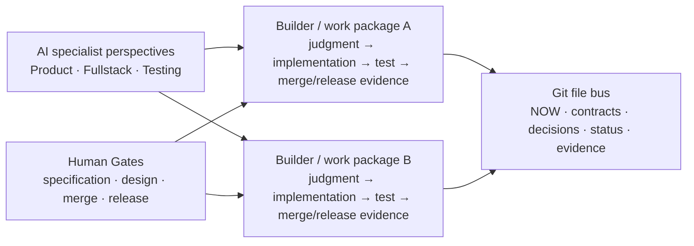

# BuildBeat

[简体中文](README.md) | **English**

**Keep humans and AI sessions aligned around the same delivery facts.**

BuildBeat (formerly Solobaton) is a **file-first, human-gated engineering-delivery protocol and scaffold** for humans and AI sessions. Its Git-based file bus, human Gates, and verifiable evidence keep long-running work synchronized, controlled, and auditable across repositories and AI contexts. It does not create agents, manage models, model team roles, or provide an agent runtime.

> **Information moves through files, not through a human messenger. Done requires evidence. Humans approve specification, design, merge, and release.**

Requirements, boards, contracts, decisions, status, and verification evidence live in Git-managed files. A session can be closed or replaced without taking the project's working context with it.

BuildBeat began with one person coordinating four AI sessions across a complex, multi-iteration product. That is its origin, not an audience limit. One Builder can use it, or several Builders can share one Git project and close separate requirement/work packages end to end.

> **Language note:** `SKILL.md`, the scaffold templates, and script output are currently Chinese-first. The delivery protocol is language-independent, and a project can translate its generated scaffold during bootstrap.

## The problem it solves

When several AI coding sessions work on one project, code generation is rarely the hardest part. Delivery state is:

- Session A keeps working against an old interface after session B changed it.
- The builder copy-pastes context between sessions and becomes the message bus.
- An agent says “done” without a test, commit, or live evidence.
- A session hands work back after one document or commit and waits to be told “continue.”
- Every reversible draft choice interrupts the builder until real stage Gates disappear in confirmation noise.
- Current progress, production version, and decisions are copied into several documents and begin to contradict one another.

BuildBeat reduces those problems to four pillars:

1. **End-to-end work packages:** one Builder owns product judgment, implementation, testing, merge, and release evidence for a requirement/feature package. Product, Fullstack, and Testing are optional AI perspectives, not mandatory human-role handoffs.
2. **File bus:** `NOW → board → contracts → status`; handoffs do not depend on chat memory.
3. **Human at the Gate:** specification, design, merge, and release cannot be crossed automatically.
4. **Evidence-based done:** completion requires a commit hash and verifiable evidence. No evidence means not done.

## Start in five minutes

### Recommended: guided bootstrap

Keep this repository at any stable local path, or place it in a local skill directory currently supported by your AI coding tool. Ask the session to read [`SKILL.md`](SKILL.md), then say:

> Use BuildBeat to scaffold collaboration for my project.

It inspects the code and configuration first, identifying repositories, deploy units, UI surfaces, and contract boundaries. It asks only three or four simple questions that cannot be answered from the project, shows one confirmation screen, then generates a scaffold filled with project facts and runs its self-check.

> Do not apply the new-project template directly to a large existing codebase. Use the **brownfield takeover ritual** in `SKILL.md` §8.5: survey the system, draw the old/new boundary, establish minimum verification, and use the compact `pm/scripts/` layout so BuildBeat does not collide with the project's own `scripts/` directory.

### Claude Code plugin: BuildBeat repository

This repository contains a standalone Claude Code marketplace package. Once installed, `/buildbeat:buildbeat` routes to the same canonical [`SKILL.md`](SKILL.md). It can be installed from a local checkout in isolation:

```text
/plugin marketplace add /absolute/path/to/BuildBeat
/plugin install buildbeat@buildbeat-plugins
/buildbeat:buildbeat
```

For GitHub installation, use `/plugin marketplace add HaiYangBG1/BuildBeat`. The plugin carries the Skill, templates, example, and reference documentation without exposing the npm CLI's top-level `bin/` to Claude Code. Project writes remain bounded by the CLI version, its confirmation screen, and human Gates. See [`plugins/buildbeat/README.md`](plugins/buildbeat/README.md) for the packaging boundary.

### CLI: the scoped BuildBeat package carries the bounded lifecycle

The canonical npm distribution ID is `@haiyangbg/buildbeat`; the unscoped `buildbeat` name is owned by another project and is not claimed here. Read the exact `@latest` version back from the official registry before use; for reproducibility, substitute that recorded version in later commands:

```bash
npm view @haiyangbg/buildbeat@latest version
npx --yes --package=@haiyangbg/buildbeat@latest buildbeat doctor /path/to/project
npx --yes --package=@haiyangbg/buildbeat@latest buildbeat init /path/to/project --dry-run
npx --yes --package=@haiyangbg/buildbeat@latest buildbeat adopt /path/to/project --dry-run --json
npx --yes --package=@haiyangbg/buildbeat@latest buildbeat upgrade /path/to/project --dry-run --json
```

For regular use, manage an explicit global CLI installation:

```bash
npm install --global @haiyangbg/buildbeat@latest
buildbeat doctor /path/to/project
npm install --global @haiyangbg/buildbeat@latest  # update the CLI package
npm uninstall --global @haiyangbg/buildbeat       # remove only the global CLI package
```

Package-manager install, update, and removal operations manage only the **CLI package and executables**; they never create, upgrade, or delete a project's scaffold. `doctor` is read-only. `init/adopt` show the complete plan and write only after clean-Git, collision, blocker, and confirmation checks. `upgrade` accepts only a canonical schema 2 baseline and performs manifest/hash-based mechanical changes with zero writes on unresolved conflict. `diff/uninstall` and workflow-command expansion remain frozen. `buildbeat` is canonical; the `solobaton` executable remains only as a compatibility alias. See [`docs/CLI.md`](docs/CLI.md) for the complete contract.

`1.20.0` is the merged Phase 0–3 version: bounded Wave 1 `init/adopt` writes, schema-2-only `upgrade`, stronger Gate/evidence joins, multi-repository drift, and scan-boundary reporting. `--force` still cannot overwrite project-owned content or unsafe paths, and a major transition separately requires `--major`. A source checkout, Git tag, and npm artifact remain different evidence surfaces; use [`docs/RELEASING.md`](docs/RELEASING.md) plus the matching GitHub Release and registry readback for release and pilot status.

Copied v1.16 legacy projects must not hand-author, copy, or rename a manifest to fabricate schema 2 ownership. Continue with manual CHANGELOG-based maintenance by default; if mechanical upgrades are genuinely required, use the [v1.16 legacy migration guide](docs/LEGACY-V1.16-MIGRATION.md) to rebuild the baseline under review on a dedicated Git branch.

The old `solobaton@latest` package stays on the legacy read-only v0 capability and points users to this scoped package; it does not gain project writes or upgrades. A write-enabled first-screen command must use `@haiyangbg/buildbeat`, still shows its plan first, and remains subject to Git, collision, ownership, and human-Gate boundaries.

### Manual installation

Use this path only when you already understand the templates:

```bash
git clone https://github.com/HaiYangBG1/BuildBeat.git
rsync -a --exclude '/standards/' --exclude '/pm/adr/' "BuildBeat/templates/" /path/to/new-project/
cd /path/to/new-project
```

This default path preserves the hidden `.claude/` tree but does not generate optional `standards/` or `pm/adr/`. Those project-owned libraries still ship in the source repository. Copy and render one only when the Bootstrap confirmation explicitly enables it or a real decision meets the ADR criteria; absence is valid.

You must then:

1. replace every `<placeholder>` in every copied file;
2. merge `gitignore.template` into the project's `.gitignore`;
3. configure real test commands in `verify-status.sh`;
4. run `bash scripts/bus-check.sh` and inspect every capability boundary;
5. install the pre-commit guard in the meta repo and in each code sub-repo:

```bash
cp scripts/pre-commit.sh .git/hooks/pre-commit
chmod +x .git/hooks/pre-commit
```

Installing [`gitleaks`](https://github.com/gitleaks/gitleaks) is strongly recommended. Without it, the remaining pre-commit checks still run, but secret scanning degrades to a warning instead of a blocking gate. Git hooks are not part of ordinary Git history; install them again after a fresh clone, or explicitly configure a versioned `core.hooksPath`.

## Daily operation

Start by claiming one independently acceptable work package from the board; the same Builder owns it end to end. Product, Fullstack, and Testing sessions may provide parallel specialist perspectives inside that package, but they are not mandatory handoffs between human roles. With several Builders, each claims a different work package and shares final facts through Git.

```text
You are the Product perspective for the current work package. Clarify requirements, board state, and decision facts. Start.
```

```text
You are the Fullstack perspective for the current work package. Own implementation, contracts, and the deployment candidate. Start.
```

```text
You are the Testing perspective for the current work package. Own black-box acceptance, E2E, and evidence. Verify the current candidate.
```

At the start of every session, synchronize the repository and run the guardrail:

```bash
git pull
bash scripts/bus-check.sh
```

Synchronize every sub-repo separately in a multi-repo project. Run `bus-check.sh` again before changing a contract, running a migration, deploying, or taking another irreversible action.

Common commands:

```bash
bash scripts/bus-check.sh --format=json  # emits schema 1 JSON without hiding warnings or unverified scope
bash scripts/bus-check.sh --strict       # exits non-zero on any conflict/error finding
bash scripts/verify-status.sh --run       # runs configured project suites and records the latest green result
bash scripts/design-preview.sh 1          # opens the real clickable prototype before Gate 2 for UI work
```

## Core mechanisms

- **Work packages:** keep moving toward one independently acceptable user outcome instead of handing back after one file, commit, or reviewer result.
- **Three approval levels:** `STOP_NOW` for authorization, frozen semantics, and irreversible actions; `BATCH_AT_GATE` for reversible choices; `NO_APPROVAL` for derived in-scope work.
- **Three tracks:** fast, standard, and heavy tracks select process weight by risk rather than applying every ceremony to every change.
- **Single sources of truth:** `NOW.md` stays a thin pointer, while contracts, decisions, status, and live queries each have one authoritative entry point.
- **Review-ready gate:** launch one independent milestone reviewer only after the candidate is stable, worktrees are clean, L3 evidence is green, and there are no known pending fixes.
- **Machine guardrails:** `bus-check --strict`, pre-commit, gitleaks, and project tests turn deterministic rules into executable checks.
- **Multi-repository drift:** a multi-repo project explicitly joins each sub-repository CHANGELOG, contract-version source, and local deployment-baseline app at the contract entry point. Definite mismatches block; missing repositories or sources stay unverified instead of being inferred from prose.
- **Optional standards and ADRs:** STACK/CODE/REVIEW/DESIGN are not generated by default. When present, their declarations, Rule IDs, and Draft/Confirmed state are checked. A Confirmed STACK also gets a read-only comparison between its explicit baseline and observed Node, lockfile, and Docker FROM facts; incomplete scope stays unverified. Only durable, hard-to-reverse decisions need ADRs, whose Status and Superseded chain are validated.
- **Production-state evidence:** after a project supplies `live-status.sh` and `live-config.sh`, BuildBeat can compare deployment-platform configuration with a baseline. It does not automatically prove that a running container loaded the latest configuration.
- **Brownfield takeover:** establish system boundaries and minimum verification before applying the full bus to new territory; do not rewrite unknown legacy behavior.

The complete rules, bootstrap, and takeover procedure live in [`SKILL.md`](SKILL.md). Real failure modes and their design rationale live in [`lessons.md`](lessons.md).

## Operating model



Each work package closes vertically instead of becoming a Product→Engineering→Testing human-role pipeline. Humans do not relay context between sessions; they make judgments that cannot be delegated, while ordinary facts, archiving, status updates, and reversible implementation inside an approved boundary continue autonomously.

## Applicability

Recommended for projects that:

- have at least two repositories or deploy units;
- will evolve for several weeks or longer;
- have one or more Builders coordinating multiple AI contexts and closing separate work packages end to end;
- need stable handoffs between several AI coding sessions;
- value verifiable delivery records without introducing a complex agent runtime.

Not recommended for:

- small single-repo changes;
- one-off scripts;
- work expected to finish within a week;
- projects with no verification capability and no intent to establish a minimum test suite first.

Known boundaries: the human remains the final decision-maker. The protocol raises confidence that an agreed goal was delivered correctly; it does not guarantee that the product direction was correct. Automatic rule loading and skill directories also differ between AI coding tools, so compatibility claims should follow each tool's current documentation and real tests.

Current non-goals: multi-user accounts, roles and permissions, or an organization administration surface; telemetry collection, team-performance scoring, or a metrics dashboard. The BuildBeat CLI does not collect or upload project usage data. These are not unfinished maintenance items. Any future proposal needs a separate product milestone with explicit requirements, data definitions, privacy/authorization governance, and an acceptance Gate.

## Installed project layout

```text
<project-root>/
├── AGENTS.md                       # session routing, bus rules, and red lines
├── CLAUDE.md                       # compatibility pointer; never duplicates the rules
├── ARCHITECTURE.md                 # system facts and sub-project index
├── contracts/PROTOCOL.md           # cross-boundary contract entry point
├── pm/
│   ├── NOW.md                      # thin pointer to the current iteration
│   ├── <iteration>-board.md
│   ├── decisions.md
│   ├── status/
│   ├── changes/
│   ├── adr/                         # optional durable technical decisions and supersession links
│   └── archive/<iteration>/evidence/
├── standards/                      # optional STACK/CODE/REVIEW; DESIGN for UI projects
├── scripts/
│   ├── bus-check.sh
│   ├── verify-status.sh
│   ├── drift-check.sh
│   ├── design-preview.sh
│   └── pre-commit.sh
├── .claude/agents/reviewer.md      # read-only milestone / risk-delta / closure review
├── 指挥台.md                        # one-page operator card
└── BUILDBEAT.md                    # installed BuildBeat version and upgrade record
```

The compact brownfield layout moves the scripts, operator card, and version marker into `pm/`. Optional `standards/` and `pm/adr/` are not part of the default scaffold. See `SKILL.md` §3/§8 for the complete rules.

## Capabilities and dependencies

| Capability | Dependency | When missing |
|---|---|---|
| File bus and basic checks | Git, Bash | The core workflow cannot run |
| Real-render design preview | Python 3 | The bundled preview script cannot run |
| Blocking secret scan | gitleaks | Degrades to a warning; do not claim a secret gate exists |
| Production-config drift | `jq`, a SHA tool, project `live-config.sh` | Explicitly skipped; no production-state conclusion |
| Live-version query | project `live-status.sh` and platform CLI | Explicitly unconfigured; documentation is not treated as live truth |
| L3 test evidence | real `SUITES` in project `verify-status.sh` | Reports unconfigured; cannot claim automation is green |
| CLI inspection/scaffolding/mechanical upgrade | Node.js 20+, the npm registry, or this source checkout | Legacy npm v0 remains read-only; scoped BuildBeat 1.20 has completed a genuine schema 2 version-increment pilot, while registry-artifact availability still requires independent readback; project uninstall remains frozen, and the Skill/manual equivalent stays supported |

Skill-only, legacy npm v0, and scoped BuildBeat 1.20 are distinct availability surfaces; the source checkout, registry artifact, and real project must also be verified separately. `doctor`, `init/adopt`, and `upgrade` own different responsibilities. See the bilingual [BuildBeat capability matrix](docs/CAPABILITY-MATRIX.md) and the [v1.20 real-project pilot](docs/PHASE4-V1.20-PILOT-2026-08-25.md).

## Continue reading

- [`SKILL.md`](SKILL.md): the single complete entry point for the methodology and bootstrap;
- [`example/`](example/): the protocol teaching snapshot of a fictional project after one completed iteration (executable scripts still reference the template SSOT);
- [`lessons.md`](lessons.md): real anti-patterns, root causes, and fixes;
- [`docs/ROADMAP.md`](docs/ROADMAP.md): the new product direction, design principles, and the CLI execution amendment effective on 2026-08-24;
- [`docs/EXECUTION-PLAN.md`](docs/EXECUTION-PLAN.md): the current phased work packages, dependencies, acceptance criteria, and frozen boundaries;
- [`docs/CLI-STRATEGY-2026-08.md`](docs/CLI-STRATEGY-2026-08.md): the official-source CLI comparison and its evidence limits;
- [`docs/CHECKS.md`](docs/CHECKS.md): file-bus invariants, Gate/evidence tokens, finding codes, and strict-mode semantics;
- [`docs/CLI.md`](docs/CLI.md): command boundaries, file ownership, manifest, mechanical upgrade, and manual-removal contract;
- [`docs/CAPABILITY-MATRIX.md`](docs/CAPABILITY-MATRIX.md): bilingual capability and interoperability mapping across Skill-only, legacy npm v0, and scoped BuildBeat 1.20;
- [`docs/LEGACY-V1.16-MIGRATION.md`](docs/LEGACY-V1.16-MIGRATION.md): safe paths for a copied v1.16 project to remain manually managed or rebuild a schema 2 baseline under review (Chinese);
- [`docs/CLI-PILOT-2026-08-23.md`](docs/CLI-PILOT-2026-08-23.md): read-only CLI v0 evidence from three real brownfield projects and the write-boundary decision;
- [`docs/PHASE1-PILOT-2026-08-24.md`](docs/PHASE1-PILOT-2026-08-24.md): the read-only Phase 1 file-bus pilot across the example, an active multi-repo projection, and a real single-repo code tree;
- [`docs/PHASE2-PILOT-2026-08-25.md`](docs/PHASE2-PILOT-2026-08-25.md): the three real-directory Wave 1 write paths, Tide preservation hashes, UI-detection feedback, and final local Git/hook/hash evidence;
- [`docs/PHASE2-BUILDBEAT-PILOT-2026-08-25.md`](docs/PHASE2-BUILDBEAT-PILOT-2026-08-25.md): the fresh BuildBeat canonical namespace regression, Tide preservation recheck, and Gate3 closure evidence;
- [`docs/PHASE4-V1.20-PILOT-2026-08-25.md`](docs/PHASE4-V1.20-PILOT-2026-08-25.md): the genuine schema 2 version-increment upgrade, project-ownership preservation, and read-only real multi-repository refresh;
- [`docs/PHASE4-STABILITY-AUDIT-2026-08-25.md`](docs/PHASE4-STABILITY-AUDIT-2026-08-25.md): the status, evidence boundary, and still-open release blocker for all 12 roadmap §15 hard gates (Chinese);
- [`docs/RELEASING.md`](docs/RELEASING.md): npm release Gates, verification, and the Trusted Publishing migration;
- [`CONTRIBUTING.md`](CONTRIBUTING.md): contribution, verification, and pull-request boundaries;
- [`SECURITY.md`](SECURITY.md): supported versions and the private vulnerability-reporting channel;
- [`CHANGELOG.md`](CHANGELOG.md): version history and upgrade instructions for copied projects.

## Contributing

Issues and pull requests are welcome. See [`CONTRIBUTING.md`](CONTRIBUTING.md) for the complete submission rules. Do not open a public issue for an undisclosed vulnerability; report it privately through [`SECURITY.md`](SECURITY.md). A change to workflow semantics should update `SKILL.md`, affected templates, both READMEs, the example, and the changelog. Explain:

1. which real failure mode the change addresses;
2. how to reproduce it;
3. which automated checks show that it did not regress existing behavior.

Run at least:

```bash
bash -n templates/scripts/*.sh tests/*.sh
npm test
npm run test:scripts
npm run test:skill-only
npm run check:docs
npm run pack:check
git diff --check
```

## License

[MIT](LICENSE) © 2026 HaiYangBG
