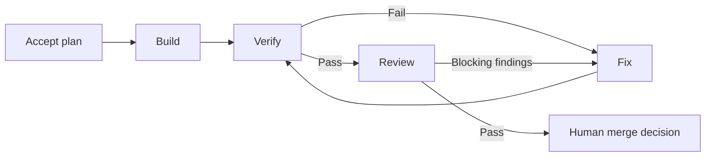

# BuildBeat

[简体中文](README.md) | **English**

**Switch sessions. Keep building.**
Context in files. Collaboration through Git. Work keeps moving.

BuildBeat is a Git-based AI delivery workflow for humans and AI sessions. Goals, plans, decisions, and delivery records stay in the project, providing a basis for continuing when models, tools, sessions, or the person doing the work change. A build, verify, review, and fix loop moves execution forward; progress and evidence are read back by the kernel from Git and real commands, never taken from a session's own account; key decisions remain human.

[User guides (Chinese)](docs/v2/guide/README.md) · [Session handoffs](docs/v2/guide/11-session-handoff.en.md) · [npm](https://www.npmjs.com/package/@haiyangbg/buildbeat) · [CI](https://github.com/HaiYangBG1/BuildBeat/actions/workflows/ci.yml) · [MIT](LICENSE)

## Let go of that irreplaceable chat

You should not have to preserve an ever-growing chat because it holds the only working context for your project. Open a fresh session when context fills up. Switch models or tools when you need to. Hand work to a teammate who can read the progress and next step from project files. Goals, constraints, plans, decisions, and delivery records belong in the filesystem, where the next session can find them without the old conversation.

This is an **illustrative interaction** in a configured project, not a recorded test run:

| Moment | What you say | What the session does |
|---|---|---|
| Session A: begin | “Add date filtering to exports. Plan it first.” | Reads project constraints and writes the goal and plan into a Work; starts execution after acceptance |
| Before leaving | “Save decisions and unfinished work; I am closing this session.” | Updates project records, checks run state and uncommitted changes, and identifies the next step |
| A new session takes over | “Read the project's BuildBeat entry point and continue date filtering.” | Reads the Work, Git, and run ledger to identify completed work, unverified results, decisions, and blockers |
| Continue | “Continue under the accepted plan.” | Proceeds, handles recovery, or waits for a decision according to the actual state; brings evidence to the merge decision |

You can open the next session yourself or hand work to someone else with project access. When changing people or machines, synchronize records and candidates and check the original Run environment.

**Once the necessary context is saved, you can close or delete the old chat.** Unsaved discussion does not become project memory automatically. Keep the project, candidate branches, and required runtime files when removing chats. See [session handoffs](docs/v2/guide/11-session-handoff.en.md).

## Context lives in the project

Git manages project facts that need to last. Local files hold execution state. BuildBeat reads those facts to report progress, instead of asking every session to maintain another estimate of what happened.

| Files and directories | What they hold | How they are used |
|---|---|---|
| `AGENTS.md`, project standards, and contracts | Entry points, constraints, perspectives, and write boundaries | A new session starts here, then reads the files relevant to its task |
| `delivery/work/<ID>/` | Goals, plans, configuration, decisions, review adjudications, and terminal run records | Version in Git as the basis for continuing the same work |
| `.buildbeat/runtime/` | In-flight events, checkpoints, locks, and raw logs | Local and excluded from Git; needed to recover an active Run |
| `.buildbeat/worktrees/` | Each Run's isolated working tree | Preserves candidate code and the working state; keep it when clearing chats |

Filesystem storage does not mean every file belongs in Git. Secrets stay in a protected local environment. Terminal records retain evidence digests and references; retain raw logs separately when the project requires them. See the [evidence guide (Chinese)](docs/v2/guide/06-evidence-guide.md).

## Different ways to continue the same work

The project files carry the context needed to continue. A fresh session with BuildBeat loaded can read the same goals, decisions, and current state. Execution Workers connect through commands; model selection and authentication belong to the chosen AI tool.

- **Across sessions:** close an old chat and continue the same Work with a fresh context.
- **Across tools and models:** load the Skill in the target tool, configure its command and output contract, and reuse project records.
- **Across people:** someone with project access can synchronize context, candidates, and required evidence, then continue within their responsibility and authorization. Existing valid decisions remain in effect.
- **Across time and place:** sync committed project files and prepare another machine to take over. An ordinary Git clone does not migrate an active Run's runtime state or worktree.

**Taking over anytime and anywhere starts with accessible records, a working environment, and appropriate permissions.** Whether you continue yourself or hand work to someone else, start from project files without carrying the old chat transcript. Git supplies version control and collaboration; repository hosting and execution platforms control access.

Different tools can read and write the protocol. Running the Loop also requires a compatible adapter, permissions, and environment. Existing real Worker evidence covers `codex exec`, with deterministic tests for script Workers. Having a CLI alone does not establish that another tool is verified. See the [capability matrix](docs/CAPABILITY-MATRIX.md) and [adapter guide](docs/v2/guide/04-adapter-guide.md) (Chinese).

## Multiple perspectives, one shared objective

**End-to-end work packages** are the unit of collaboration. One Builder owns a user-level outcome and calls on three AI perspectives — product, full-stack, and testing — as needed. Several Builders can own separate work packages or hand over the same package. Record who is currently taking it forward, what is done, and the next step to avoid duplicate execution.

| Perspective | Reads when taking over | Produces |
|---|---|---|
| Product | Goals, constraints, and existing decisions | Scope, a plan, and acceptance criteria |
| Full-stack (incl. operations) | The accepted plan, contracts, and environment facts | Candidate code and implementation records |
| Testing | Acceptance criteria and the candidate | Actual test results, coverage, and gaps |

These are available AI perspectives, not mandatory human-role handoffs or a requirement to open three chats. Review is not a session perspective: it is the read-only reviewer built into the Run, described in the next section. One person or several people can use these perspectives as needed. Shared facts move through project files, and each perspective respects its write boundaries. The current single-repository active-Run lock is local. Multiple perspectives or Git clones do not provide cross-machine execution coordination. Check the original execution environment before handing over the same Work to avoid duplicate starts.

## Put the work in a Loop

After the required plan acceptance, `buildbeat-v2` calls configured Workers in an isolated Git worktree to implement, verify, review, and fix the change. Review is performed by a fresh-context, read-only reviewer worker; any write to the worktree is caught by a before/after snapshot comparison and recorded as a failure.



The diagram shows normal and repair paths. Risk presets, finding triage, infrastructure failures, and budgets can introduce additional waits.

- **Completion has evidence:** candidates are read back from Git, and test conclusions come from actual commands. An AI's “done” does not replace verification.
- **Approval has a subject:** decisions bind to a candidate, plan, and evidence. Changes can make an earlier approval stale.
- **Interruption has a recovery path:** the Runner can resume from its ledger. An interrupted step may run again; a dirty worktree requires a decision first.
- **Loops have limits:** budgets, repeated failures, and infrastructure problems become explicit pending actions. Notifications are configurable.

The merge decision means the candidate is ready for a merge. A human or a separately authorized tool performs merge, push, and deployment outside the Runner. The `release-readback` workflow can record release checks and observations. Runtime checks and host isolation have distinct scopes; see [security and permission boundaries (Chinese)](docs/v2/guide/09-security-boundaries.md).

## Start your first handoff

You need Node.js ≥ 20, Git, Bash, and an installed, authenticated AI coding tool.

**1. Install the runtime.** Stable packages use `@latest`. The package includes the `buildbeat-v2` runtime and the `buildbeat` v1 lifecycle commands.

```bash
npm view @haiyangbg/buildbeat@latest version
npm install --global @haiyangbg/buildbeat@latest
```

> The envelope templates the quickstart uses (`templates/v2/envelope/`) ship with the package since 2.0.1; see the [CHANGELOG](CHANGELOG.md) for what each version contains.

**2. Load the entry point.** Download or clone this repository, ask your AI tool to read its [`SKILL.md`](SKILL.md), and say this in the target project:

> Set up BuildBeat for this project. Inspect the code and existing constraints first, then prepare v2 context and execution configuration for the first piece of work.

The session inspects the project and prepares a goal, plan, verification commands, and Worker configuration. Execution starts after your acceptance. See the [quickstart](docs/v2/guide/01-quickstart.md), or the [migration guide](docs/v2/guide/08-migration-v1.md) for an existing v1 project (Chinese).

**3. Try a handoff.** Once work records are saved, close the old session and open one without its chat history. Or synchronize the records and candidate so another authorized teammate can take over with their own tool:

> Read the project's BuildBeat entry point, inspect progress and pending decisions, explain the next step, and continue within the existing authorization.

Check the goal, candidate, verification results, and next step it reads back. Follow the [session handoff guide](docs/v2/guide/11-session-handoff.en.md).

<details>
<summary>Claude Code plugin installation</summary>

The plugin loads the Skill and reference material. Install the runtime separately.

```text
/plugin marketplace add HaiYangBG1/BuildBeat
/plugin install buildbeat@buildbeat-plugins
/buildbeat:buildbeat
```

To install from source, replace the marketplace address with this checkout's absolute path. See the [plugin guide](plugins/buildbeat/README.md) for cache boundaries and installation checks.

</details>

<details>
<summary>v1 lifecycle and former names</summary>

`buildbeat doctor` checks a v1 scaffold; `init/adopt/upgrade` manage its lifecycle. They do not generate or migrate a complete v2 Work.

```bash
npx --yes --package=@haiyangbg/buildbeat@latest buildbeat doctor /path/to/project
```

See the [CLI reference](docs/CLI.md). BuildBeat was formerly Solobaton; the `solobaton` executable remains a compatibility alias. The historical example is in [example/](example/README.md) (Chinese).

</details>

## Everyday use and applicability

Once configured, talk to the session directly:

| What you need | What you can say |
|---|---|
| A new session or teammate to take over | “Sync project records, read the entry point, and continue this work.” |
| Progress | “What is done, what remains, and who moves next?” |
| A decision | “What needs my decision? Show the evidence with it.” |
| Recovery | “Is this run stuck? Inspect the state and handle recovery.” |
| A fresh session | “Save the necessary context and check which work is still running.” |

BuildBeat fits ongoing projects with frequent AI context changes, specialist collaboration, and a need for verifiable delivery records. Individuals can keep their own work moving; teams can hand work over through shared records. One-off scripts and very small changes usually do not need the full workflow. The project should have real verification commands, or establish minimum verification first.

Teams collaborate through a shared Git repository and project agreements. BuildBeat does not provide multi-user accounts, roles and permissions. It does not collect or upload project usage data and has no telemetry collection. Configured AI tools and notification services have their own data practices. More examples are in the [conversation guide (Chinese)](docs/v2/guide/00-how-to-talk.md).

## Learn more and contribute

- [Documentation index](docs/README.md): current guides, specifications, and historical records (Chinese).
- [Capability matrix](docs/CAPABILITY-MATRIX.md): manual protocol, v1 CLI, v2 runtime, plugin, and verification scope (Chinese).
- [Session handoffs](docs/v2/guide/11-session-handoff.en.md) · [Run recovery](docs/v2/guide/10-recovery.md) · [Approval and triage](docs/v2/guide/07-approval-guide.md) (last two in Chinese).
- [Skill](SKILL.md): how a session uses BuildBeat; [lessons](lessons.md): the real incidents behind its mechanisms (Chinese).
- [CHANGELOG](CHANGELOG.md) (Chinese) · [Contributing](CONTRIBUTING.md) · [MIT license](LICENSE).
