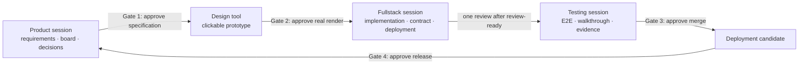

# Solobaton

[简体中文](README.md) | **English**

**One Builder, one baton, an orchestra of AI sessions.**

Solobaton is a **file-first, human-gated AI software-delivery protocol and scaffold** for solo builders. It does not create agents, manage models, or provide an agent runtime. It coordinates independent AI coding sessions around shared context, write boundaries, contract changes, completion evidence, and human authorization.

> **Information moves through files, not through a human messenger. Done requires evidence. Humans approve specification, design, merge, and release.**

Requirements, boards, contracts, decisions, status, and verification evidence live in Git-managed files. A session can be closed or replaced without taking the project's working context with it.

Solobaton was distilled from a real product developed across multiple iterations: one person coordinating four AI sessions across a frontend, BFF, multiple backend services, a gateway, and auditing. Failures encountered in that work became explicit rules, templates, and Shell guardrails.

> **Language note:** `SKILL.md`, the scaffold templates, and script output are currently Chinese-first. The delivery protocol is language-independent, and a project can translate its generated scaffold during bootstrap.

## The problem it solves

When several AI coding sessions work on one project, code generation is rarely the hardest part. Delivery state is:

- Session A keeps working against an old interface after session B changed it.
- The builder copy-pastes context between sessions and becomes the message bus.
- An agent says “done” without a test, commit, or live evidence.
- A session hands work back after one document or commit and waits to be told “continue.”
- Every reversible draft choice interrupts the builder until real stage Gates disappear in confirmation noise.
- Current progress, production version, and decisions are copied into several documents and begin to contradict one another.

Solobaton reduces those problems to four pillars:

1. **Independent sessions:** Product, Fullstack, and Testing are the default domains, each with an explicit write boundary.
2. **File bus:** `NOW → board → contracts → status`; handoffs do not depend on chat memory.
3. **Human at the Gate:** specification, design, merge, and release cannot be crossed automatically.
4. **Evidence-based done:** completion requires a commit hash and verifiable evidence. No evidence means not done.

## Start in five minutes

### Recommended: guided bootstrap

Keep this repository at any stable local path, or place it in a local skill directory currently supported by your AI coding tool. Ask the session to read [`SKILL.md`](SKILL.md), then say:

> Use Solobaton to scaffold collaboration for my project.

It inspects the code and configuration first, identifying repositories, deploy units, UI surfaces, and contract boundaries. It asks only three or four simple questions that cannot be answered from the project, shows one confirmation screen, then generates a scaffold filled with project facts and runs its self-check.

> Do not apply the new-project template directly to a large existing codebase. Use the **brownfield takeover ritual** in `SKILL.md` §8.5: survey the system, draw the old/new boundary, establish minimum verification, and use the compact `pm/scripts/` layout so Solobaton does not collide with the project's own `scripts/` directory.

### CLI v0 preview: inspect first, write nothing

v1.16 adds a zero-third-party-runtime-dependency CLI for Node.js 20+. This release turns deterministic project inspection and lifecycle planning into a machine interface; it is not published to npm yet and does not write an installation:

```bash
node bin/solobaton.js doctor /path/to/project
node bin/solobaton.js init /path/to/project --dry-run
node bin/solobaton.js adopt /path/to/project --dry-run --json
```

`doctor` checks an existing scaffold's layout, version, critical files, placeholders, hook, and dependency degradation. `init/adopt --dry-run` plan the default or compact layout. Omitting `--dry-run` is explicitly rejected without creating any file. The CLI does not replace the Skill's code-aware reasoning, minimal questions, or confirmation screen; see [`docs/CLI.md`](docs/CLI.md) for the complete boundary. Do not advertise `npx solobaton` until npm publication has been independently verified.

### Manual installation

Use this path only when you already understand the templates:

```bash
git clone https://github.com/HaiYangBG1/solobaton.git
cp -R "solobaton/templates/." /path/to/new-project/
cd /path/to/new-project
```

You must then:

1. replace every `<placeholder>` in every copied file;
2. merge `gitignore.template` into the project's `.gitignore`;
3. configure real test commands in `verify-status.sh`;
4. run `bash scripts/bus-check.sh` and inspect every capability boundary;
5. install the pre-commit guard in the meta repo and in each code sub-repo:

```bash
cp scripts/pre-commit.sh .git/hooks/pre-commit
chmod +x .git/hooks/pre-commit
```

Installing [`gitleaks`](https://github.com/gitleaks/gitleaks) is strongly recommended. Without it, the remaining pre-commit checks still run, but secret scanning degrades to a warning instead of a blocking gate. Git hooks are not part of ordinary Git history; install them again after a fresh clone, or explicitly configure a versioned `core.hooksPath`.

## Daily operation

The first time you open the three sessions, declare their roles:

```text
You are the Product session. Own requirements, the board, and decisions. Start.
```

```text
You are the Fullstack session. Own implementation, contracts, and deployment. Start the work package assigned to you on the board.
```

```text
You are the Testing session. Own black-box acceptance, E2E, and evidence. Verify the current candidate.
```

At the start of every session, synchronize the repository and run the guardrail:

```bash
git pull
bash scripts/bus-check.sh
```

Synchronize every sub-repo separately in a multi-repo project. Run `bus-check.sh` again before changing a contract, running a migration, deploying, or taking another irreversible action.

Common commands:

```bash
bash scripts/bus-check.sh --strict       # exits non-zero on confirmed rot, ghost hashes, or drift
bash scripts/verify-status.sh --run       # runs configured project suites and records the latest green result
bash scripts/design-preview.sh 1          # opens the real clickable prototype before Gate 2 for UI work
```

## Core mechanisms

- **Work packages:** keep moving toward one independently acceptable user outcome instead of handing back after one file, commit, or reviewer result.
- **Three approval levels:** `STOP_NOW` for authorization, frozen semantics, and irreversible actions; `BATCH_AT_GATE` for reversible choices; `NO_APPROVAL` for derived in-scope work.
- **Three tracks:** fast, standard, and heavy tracks select process weight by risk rather than applying every ceremony to every change.
- **Single sources of truth:** `NOW.md` stays a thin pointer, while contracts, decisions, status, and live queries each have one authoritative entry point.
- **Review-ready gate:** launch one independent milestone reviewer only after the candidate is stable, worktrees are clean, L3 evidence is green, and there are no known pending fixes.
- **Machine guardrails:** `bus-check --strict`, pre-commit, gitleaks, and project tests turn deterministic rules into executable checks.
- **Production-state evidence:** after a project supplies `live-status.sh` and `live-config.sh`, Solobaton can compare deployment-platform configuration with a baseline. It does not automatically prove that a running container loaded the latest configuration.
- **Brownfield takeover:** establish system boundaries and minimum verification before applying the full bus to new territory; do not rewrite unknown legacy behavior.

The complete rules, bootstrap, and takeover procedure live in [`SKILL.md`](SKILL.md). Real failure modes and their design rationale live in [`lessons.md`](lessons.md).

## Operating model



The human does not relay context between sessions. The human makes judgments that cannot be delegated, while ordinary facts, archiving, status updates, and reversible implementation inside an approved boundary continue autonomously.

## Applicability

Recommended for projects that:

- have at least two repositories or deploy units;
- will evolve for several weeks or longer;
- have one builder wearing product, development, testing, and operations hats;
- need stable handoffs between several AI coding sessions;
- value verifiable delivery records without introducing a complex agent runtime.

Not recommended for:

- small single-repo changes;
- one-off scripts;
- work expected to finish within a week;
- projects with no verification capability and no intent to establish a minimum test suite first.

Known boundaries: the human remains the final decision-maker. The protocol raises confidence that an agreed goal was delivered correctly; it does not guarantee that the product direction was correct. Automatic rule loading and skill directories also differ between AI coding tools, so compatibility claims should follow each tool's current documentation and real tests.

## Installed project layout

```text
<project-root>/
├── AGENTS.md                       # session routing, bus rules, and red lines
├── CLAUDE.md                       # compatibility pointer; never duplicates the rules
├── ARCHITECTURE.md                 # system facts and sub-project index
├── contracts/PROTOCOL.md           # cross-boundary contract entry point
├── pm/
│   ├── NOW.md                      # thin pointer to the current iteration
│   ├── <iteration>-board.md
│   ├── decisions.md
│   ├── status/
│   ├── changes/
│   └── archive/<iteration>/evidence/
├── scripts/
│   ├── bus-check.sh
│   ├── verify-status.sh
│   ├── drift-check.sh
│   ├── design-preview.sh
│   └── pre-commit.sh
├── .claude/agents/reviewer.md      # read-only milestone / risk-delta / closure review
├── 指挥台.md                        # one-page operator card
└── SOLOBATON.md                    # installed Solobaton version and upgrade record
```

The compact brownfield layout moves the scripts, operator card, and version marker into `pm/`. See `SKILL.md` §3 for the complete rules.

## Capabilities and dependencies

| Capability | Dependency | When missing |
|---|---|---|
| File bus and basic checks | Git, Bash | The core workflow cannot run |
| Real-render design preview | Python 3 | The bundled preview script cannot run |
| Blocking secret scan | gitleaks | Degrades to a warning; do not claim a secret gate exists |
| Production-config drift | `jq`, a SHA tool, project `live-config.sh` | Explicitly skipped; no production-state conclusion |
| Live-version query | project `live-status.sh` and platform CLI | Explicitly unconfigured; documentation is not treated as live truth |
| L3 test evidence | real `SUITES` in project `verify-status.sh` | Reports unconfigured; cannot claim automation is green |
| CLI v0 inspection/planning | Node.js 20+ and this source checkout | Fall back to the Skill/manual path; write, upgrade, and uninstall are not enabled yet |

## Continue reading

- [`SKILL.md`](SKILL.md): the single complete entry point for the methodology and bootstrap;
- [`example/`](example/): the full file snapshot of a fictional project after one iteration;
- [`lessons.md`](lessons.md): real anti-patterns, root causes, and fixes;
- [`docs/CLI.md`](docs/CLI.md): lifecycle, file ownership, manifest, and safe upgrade/uninstall contract;
- [`CHANGELOG.md`](CHANGELOG.md): version history and upgrade instructions for copied projects.

## Contributing

Issues and pull requests are welcome. A change to workflow semantics should update `SKILL.md`, affected templates, both READMEs, the example, and the changelog. Explain:

1. which real failure mode the change addresses;
2. how to reproduce it;
3. which automated checks show that it did not regress existing behavior.

Run at least:

```bash
bash -n templates/scripts/*.sh tests/*.sh
bash tests/test-scripts.sh
bash tests/check-docs.sh
npm test
npm run pack:check
git diff --check
```

## License

[MIT](LICENSE) © 2026 HaiYangBG
