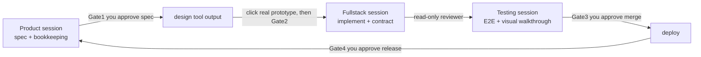

# Solobaton — One Builder, One Baton, an Orchestra of AI Sessions

[简体中文](README.md) | **English**

> Everything crammed into one AI chat session, getting muddier the longer it runs? Afraid to open a new session because you'd lose context and have to explain everything again? Syncing sessions by copy-pasting between them yourself?
> Solobaton's answer: one person conducting N parallel AI sessions, shipping mid-to-large projects like a small team — a **methodology** (how to collaborate without chaos) plus **scaffolding** (copy-and-go file templates and scripts).
> Distilled from a real project across many iterations: one person conducting 4 AI sessions, taking an internal product (frontend / BFF / multiple backend services / gateway / audit) from zero through 30+ production releases — hitting the potholes, fixing them, then hardening each one into a mechanism.

> **Language note**: the skill body (`SKILL.md`), templates, and script output are currently Chinese-first. The methodology itself is language-agnostic — when bootstrapping, just ask your agent to translate the scaffold as it fills it in.

---

## 1. What problem does it solve

**First, the single-session trap — most people building with AI look like this:**

- **Held hostage by one chat window**: everything happens in one session; you dare not open a new one — afraid of losing context, afraid you can't re-explain it all.
- **One session does all the work**: the longer it runs, the more scattered its attention (context rot); hit the context ceiling and forced compression forgets what mattered; tasks queue up single-file because parallel work would collide.
- **You are the sync layer**: copy-pasting between sessions, while agents stall mid-task waiting for you to supply context.

**And once you do open multiple sessions (Claude Code / Cursor / etc.), five new problems hit:**

| Pain | Typical symptom |
|---|---|
| **Information gaps** | Session A doesn't know B already changed the API, and builds against the old version |
| **Human message bus** | You shuttle "backend said… frontend beware…" between sessions; you are the bottleneck |
| **Fake done / missed checks** | A session says "done" without verifying; acceptance relies on your eyeballs and always misses |
| **Doc rot** | "Current version / current progress" written in five docs, three of them contradicting each other |
| **Rework spiral** | You approve a static design mock, see the real implementation, reverse yourself, and a whole UI layer gets redone |

The bus's answer: **information moves through files, not through your mouth; "done" requires evidence; decision points require a human; facts that rot live in exactly one place.** Once context is externalized into files, **every session becomes disposable** — crashed, full, closed? Open a new one, run the kickoff script, and it's back at full strength. That is what makes you unafraid to run N sessions.

> Jargon warning: "bus / SSOT / Gate / domain" can be confusing at first sight — §9 has a plain-language glossary.

## 2. How to use it

**Step 1 · Install the skill**: copy or symlink `solobaton/` into `~/.claude/skills/` (Claude Code) or `~/.cursor/skills/` (Cursor). Without installing, you can also just say: "Follow `solobaton/SKILL.md` and scaffold collaboration for my project."

**Step 2 · Start with one sentence** (guided bootstrap, see SKILL.md §8). Tell any session:

> "Use Solobaton to scaffold collaboration for my project."

It **inspects your code first** (repo count / deploy platform / UI or not / contract boundaries — all self-checked, never asked), then asks you only three or four non-technical questions (a few days or long-term? / anyone else working with you? / default "Product / Fullstack / Testing" roles or custom? / who has final say on UI?), shows one confirmation screen, then generates a scaffold with **every placeholder already filled**, self-checks with bus-check, and hands it over. Projects outside the applicability boundary (§7) get talked out of it — no ceremony for ceremony's sake.

**Manual path** (works without installing the skill):

```bash
# Copy the scaffold (the trailing /. is required — it brings the hidden .claude/ along), then replace <placeholders>
cp -R "solobaton/templates/." <project-root>/
bash scripts/bus-check.sh
```

### A worked example

Say you're building a "web expense tracker": one frontend repo, one backend repo, long-term iteration.

1. **Scaffold (once)**: say "Use Solobaton to scaffold collaboration for my project." It discovers the two repos, notices there's a UI, and asks only three things: long-term? just you? default Product/Fullstack/Testing split? You answer, nod at the summary screen, done.
2. **Daily work**: open three sessions, one per domain. **In each session's first message, assign the role**:
   - To **Product**: "You are Product — you break down requirements, keep the board, log decisions. Break down the 'monthly report' feature." → It writes the spec, updates the board, waits for your call (⛔Gate1)
   - To **Fullstack**: "You are Fullstack — you implement and ship. 'Monthly report' on the board is yours, go." → It runs bus-check to sync up, reads board and contract, implements, leaves a commit hash + evidence
   - To **Testing**: "You are Testing — you verify and find faults. Accept 'monthly report'." → It runs E2E, walks the UI against design screenshots, files bugs with side-by-side images

   After that, no more role-setting — just say "go / X on the board is yours / accept X".
3. **You only make the calls**: spec, design (approved only after clicking a real rendered prototype), merge, release — four gates need your nod, and every decision is logged automatically. Information flows through files; **you are not the messenger, and you never fear closing a session**.

> The full file snapshot of this fictional project after one iteration lives in [`example/`](example/) — see exactly what every template looks like once filled in.

## 3. Core ideas: four pillars

1. **True multi-session isolation** — each "domain" is an independent session (own cwd, own context, writes only its own files). Naturally resistant to context rot; naturally enforces "writer ≠ reviewer".
2. **Human at the Gate** — spec / design / merge / release are four decision points that a human must approve, **never auto-crossed**. The human is metronome and judge, not messenger.
3. **File bus** — all hand-offs go through repo files: `NOW.md` (pointer) → board → contract → per-domain status. Any session picks up its own context at kickoff; you never relay.
4. **Evidence-based done** — any claim of "done" must carry a commit hash + verifiable evidence (test command / `file:line` / live check / screenshot). **No evidence = not done.**

## 4. What it looks like running



Day to day you say three sentences: "go", "X on the board is yours", "accept X". Every session starts by running `bus-check.sh` — one screen showing: current iteration, contract version, last three decisions, per-domain progress, sub-repo sync, **actual live version** (queried from the platform, never trusted from docs), **production drift** (platform-side env fingerprints / image tag ↔ git vs. baseline). Sample output (excerpt, translated — the script currently prints Chinese; project setup in [`example/`](example/)):

```text
════════ Collaboration bus · kickoff sync (bus-check) ════════
✅ meta repo in sync with remote

── sub-repos ⇄ remote ──
  ✅ jz-web         HEAD 7be04d2  ahead 0 / behind 0
  ⚠️  jz-api         HEAD a3f21c9  ahead 1 / behind 0

── current iteration / board (pm/NOW.md) ──
Iteration 1 (core flows + monthly report) · standard track

── coordination-layer rot check ──
  ✅ NOW thin, boards archived, status files lean

── contract (contracts/PROTOCOL.md) ──
Contract snapshot corresponds to: v0.2.0 (released 2026-06-20)

── latest decisions (pm/decisions.md, last 3) ──
  | 2026-06-20 | Iteration 1 accepted, release approved (Gate4); CSV export moved to It.2 …
  | 2026-06-18 | Gate3 merge approved: monthly report (reviewer P1 fixed & re-verified) …
  | 2026-06-15 | Gate2 passed on real render: bar chart over line; single column on mobile …

── live status ──
  jz-api   v0.2.0
  jz-web   v0.2.0

── production drift ──
  ✅ jz-api           config/image == baseline (tag 0.2.0)
  —— no drift
```

## 5. The four mechanisms worth stealing

- **Single point of truth (rule ⑨)**: live version, human decisions, iteration switch — the three fastest-rotting facts each have exactly one place of record/query; everywhere else holds pointers. A decision lands in `decisions.md` first, then fans out; unfinished write-backs stay visible as debt.
- **Gate2 real-render approval (rule ⑩)**: design sign-off must happen on a **clickable prototype in a browser** — static mocks and screenshots don't count. Tuition paid for this rule: a redesign shipped and was overturned within 2 days, entirely because approval had been given on static boards.
- **Iteration-switch compression ritual**: every iteration ends with forced archiving of the board, truncation of status files, and a reset of NOW; evidence artifacts (walkthrough shots / E2E reports) are written into `pm/archive/<iteration>/evidence/` the moment they're produced — zero moving at switch time. Without this ritual, coordination docs turn into an unread scroll within three weeks — so bus-check ships a **coordination-layer rot check**: a bloated NOW, a stale board lingering in pm/, or an oversized status file triggers red warnings at kickoff (a ritual without a guardrail is no ritual at all).
- **Production drift detection**: platform-side env/secrets and images live outside git; one console edit creates a second source of truth. Fingerprint them (🔴 sha256 fingerprints only, never values) and anchor image tags to git tags; bus-check compares against the baseline at every kickoff and prints red warnings — surfacing "config changed but never redeployed" and "live image not found in git" before you touch anything.

## 6. Repository layout

```
solobaton/
├── SKILL.md       # methodology body for agents: domain model / ten rules / 4 gates + 3 tracks /
│                  #   three rituals / red lines / guided bootstrap (inspect → few questions → generate)
├── lessons.md     # 14 anti-patterns (symptom → root cause → cure), every one happened for real
├── README.md      # Chinese intro (this file's original)
├── README.en.md   # this file
├── CHANGELOG.md   # version history
├── example/       # teaching sandbox: a fictional project's full file snapshot after one iteration
└── templates/     # copy to a new project root, replace <placeholders>, run
    ├── CLAUDE.md              # session routing + ten rules (auto-loaded by every session)
    ├── Agent.md               # full-stack overview skeleton (credentials: location only, never values)
    ├── 指挥台.md               # one-page operator card for the human
    ├── pm/                    # Product-domain coordination: NOW pointer / board / decision log / per-domain status / change proposals
    ├── contracts/PROTOCOL.md  # the single entry point for cross-boundary contracts
    ├── .claude/agents/reviewer.md   # read-only review-gate subagent (writer ≠ reviewer)
    └── scripts/               # bus-check.sh (kickoff guard) + drift-check.sh (production drift)
                               #   + design-preview.sh (real render)
```

## 7. Applicability (the honest version)

- **Good fit**: ≥2 repos or deploy units, multi-iteration, one person wearing PM/dev/test/ops hats, AI sessions that need to hand work to each other.
- **Bad fit**: single-repo small tasks, one-off scripts, anything wrapping up within a week — just run one session; the bus would be pure ceremony.
- **Known limits**: the human remains the orchestration bottleneck (a feature, not a bug — human judgment is this playbook's moat); the process guarantees "built right", not "building the right thing" — topic selection still relies on your own discipline against a risk list (lessons.md #8).

## 8. The ten rules at a glance

| # | Rule | One-liner |
|---|---|---|
| ① | Single board pointer | The entry is always NOW.md; switching iterations edits one place; board filenames never hard-coded elsewhere |
| ② | Contracts land in files, not in chat | Change PROTOCOL.md before code; independently verify the other side's protocol claims before trusting |
| ③ | Hand-offs ride on commits | Status lines carry hashes; downstream reads the repo to know progress |
| ④ | Kickoff guard | Run bus-check at kickoff; **run it again before any irreversible action** |
| ⑤ | Three tracks | Fast / standard / heavy — don't kill a chicken with a cleaver |
| ⑥ | Review gate | Before acceptance a reviewer checks 4-way consistency; done = hash + evidence |
| ⑦ | Proposals + split status | Cross-domain changes go through delta proposals; each domain writes only its own status file |
| ⑧ | Visual issues need images | UI bugs require implementation-vs-design screenshots side by side; words alone aren't evidence |
| ⑨ | Single point of truth | Live version only by live query; decisions only in decisions.md; iteration switch requires compression |
| ⑩ | Gate2 real render | Design approval happens on a clickable prototype; static mocks don't count |

## 9. Plain-language glossary

> One line each, grouped as collaboration mechanics / files & roles / engineering terms.

### Collaboration mechanics

| Term | Plain meaning |
|---|---|
| File bus | Borrowed from "message bus": sessions never relay through you; information lives in agreed repo files, read on demand |
| SSOT / single point of truth | A fact is recorded in exactly one place; everywhere else points to it — prevents contradictory copies |
| Gate (the four Gates) | Checkpoints — spec / design / merge / release — that a human must approve; AI may not auto-cross |
| Three tracks | Process weight matched to change size: fast (small fix) / standard (one feature) / heavy (contract-touching) |
| Review gate | Before acceptance, a read-only reviewer agent checks implementation / design / contract / spec against each other |
| Writer ≠ reviewer | The session that wrote the code must not be the one reviewing it — self-review always passes |
| Evidence-based done | "Done" requires commit hash + verifiable evidence (test command / file:line / screenshot), otherwise not done |
| Human in the loop | Key decisions require a human; no fully automatic closed loop |
| Decision / decision log | You make the call; the log (pm/decisions.md) is the single ledger where every call is recorded |
| Iteration / switch | An iteration ≈ a sprint; switching = closing this one and opening the next, always with archiving |
| Compression ritual | The fixed steps at iteration switch — archive docs, truncate status files — so coordination docs never rot |
| Kickoff guard | The script you must run before working (bus-check.sh): one screen of progress / contract / decisions / live status |

### Files & roles

| Term | Plain meaning |
|---|---|
| Domain | One unit of division of labor = one independent AI session (e.g. Product / Fullstack / Testing) |
| meta repo / sub-repo | meta repo = the git repo holding coordination files; sub-repos = each codebase's own git repo |
| Contract (PROTOCOL) | Cross-repo / cross-service interface agreements; sole registry is contracts/PROTOCOL.md |
| Thin pointer | NOW.md only says "which iteration, which files to read" — a bookmark, not a notebook |
| Board | The current iteration's work table: who does what, how far along, what's stuck |
| Delta proposal | For big changes, first a file listing what changes (added/modified/removed), approved before work starts |
| reviewer / subagent | A temporary read-only review agent spawned by a session — reviews and leaves, never edits code |
| Debt entry | An unfinished item parked on the board; whoever claims it clears it |

### Engineering terms

| Term | Plain meaning |
|---|---|
| Context rot | A long-running session's memory distorts and attention scatters; answers drift off target |
| Production drift | What actually runs in production no longer matches what git records (e.g. console env edit, no redeploy) |
| Fingerprint (sha256) | Content hashed into a fixed-length string: any change flips the fingerprint, without exposing the content |
| E2E | End-to-end test: walk a feature like a real user, not just unit-test a function |
| Walkthrough | Screen-by-screen human comparison of implementation vs. design, with screenshots |
| Four states | Every screen must handle: loading / empty / error / mobile |
| Real render | A prototype that opens and clicks in a browser — as opposed to a static image |
| UI meta-annotation | Developer-facing text leaking into the visible UI (data caveats / mock markers / debug info) |
| WIP | Work in progress: changes written but not committed |
| Ghost hash | A commit hash recorded in a status doc that doesn't exist in git — the "done" was imagined |
| stale | Working from outdated information (the decision changed; you didn't know) |
| BFF | Backend for Frontend: a middle layer aggregating data for the frontend |
| cwd | A session's working directory — where the session "stands" in the project |
| CHANGELOG | Version log; "Keep a Changelog" is the common convention (reverse order, per-version sections) |
| hook / Stop hook | Scripts auto-triggered by events; a Stop hook runs when a session finishes a turn |

---

*Version history: [CHANGELOG.md](CHANGELOG.md). When future projects hit new potholes, feed them back into lessons.md — this skill applies its own rules to itself: lessons are recorded in exactly one place, versions in exactly one place.*
