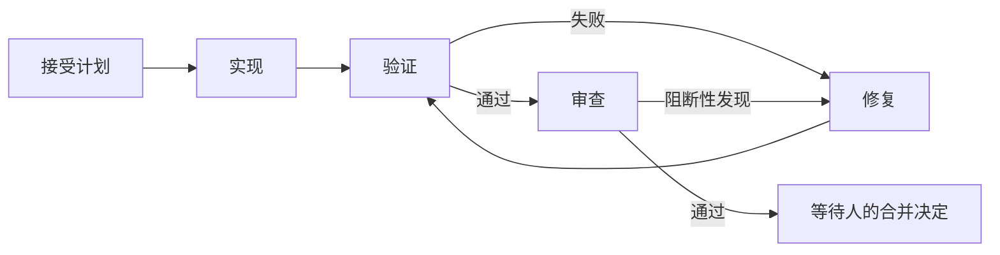

# BuildBeat

**简体中文** | [English](README.en.md)

**会话随时换，项目接着干。**
上下文存进文件，协作围绕 Git，工作持续推进。

BuildBeat 是以 Git 和项目文件为基础的 AI 交付工作流，面向人和 AI 会话。目标、计划、决定与交付记录保存在项目里，换模型、换工具、换会话，或换一个人接手，都有继续工作的依据。Loop 推进实现、验证、审查与修复；进度和证据由内核从 Git 与真实命令回读，不靠会话自述；关键决定由人掌握。

[使用指南](docs/v2/guide/README.md) · [跨会话接续](docs/v2/guide/11-session-handoff.md) · [npm](https://www.npmjs.com/package/@haiyangbg/buildbeat) · [CI](https://github.com/HaiYangBG1/BuildBeat/actions/workflows/ci.yml) · [MIT](LICENSE)

## 告别祖传上下文

不用再抱着一个越来越长的“祖传会话”不放。上下文满了，开个新会话；想换模型或工具，从项目记录接着做；今天交给同事，接手的人也能从文件了解进度和下一步。目标、约束、计划、决定和交付记录都应落在文件系统中，新会话不必依赖旧聊天历史来判断下一步。

下面是已配置项目的**使用情景示意**，不是一次实测运行记录：

| 时刻 | 你说什么 | 会话做什么 |
|---|---|---|
| 会话 A：开始 | “给导出功能加日期筛选，先定计划。” | 读取项目约束，把目标与计划写入 Work；接受后启动执行 |
| 准备离开 | “把决定和未完成事项落盘，我要关闭这个会话。” | 补齐项目记录，核对运行状态与未提交改动，说明下一步 |
| 新会话接手 | “读取项目的 BuildBeat 入口，接着做日期筛选。” | 读取 Work、Git 与运行台账，查清已完成、未验证、待批和阻塞 |
| 继续推进 | “按当前已接受的计划继续。” | 根据实况继续执行、处理恢复或等待决定，带证据停在合并决定前 |

新会话可以由自己打开，也可以交给另一位有项目权限的人；换人或换机器时，同步记录与候选，并核对原 Run 的执行环境。

**关键上下文落盘后，旧聊天可以关闭或删除。** 未保存的讨论不会自动变成项目记忆；删除聊天时应保留项目、候选分支和所需运行文件。具体步骤见 [跨会话接续](docs/v2/guide/11-session-handoff.md)。

## 上下文就在项目里

Git 管理需要长期保留的项目事实；本机文件保存运行中的状态。BuildBeat 读取这些事实来回答“做到哪了”，而不是让每个会话重新写一份进度猜测。

| 文件与目录 | 保存什么 | 怎样使用 |
|---|---|---|
| `AGENTS.md`、项目规范与契约 | 项目入口、约束、角色和写入边界 | 新会话从入口读取，按任务深入相关文件 |
| `delivery/work/<ID>/` | 目标、计划、配置、决定、审查裁决与终态运行记录 | 纳入 Git，作为同一项工作的接续依据 |
| `.buildbeat/runtime/` | 在途事件、检查点、锁与原始日志 | 留在本机，不进 Git；恢复活动 Run 时需要 |
| `.buildbeat/worktrees/` | Run 的隔离工作树 | 保留候选代码与现场，不作为聊天缓存清理 |

落在文件系统不等于每个文件都应该提交到 Git。秘密留在受保护的本地环境中；终态记录保存证据摘要和引用，原始日志需要按项目要求另行保留。详见 [证据指南](docs/v2/guide/06-evidence-guide.md)。

## 换个方式，继续同一项工作

继续工作所需的上下文由项目文件承载。装载了 BuildBeat 的新会话可以读取同一份目标、决定和当前状态；负责执行的 Worker 通过命令接入，模型选择与鉴权由所用 AI 工具处理。

- **跨会话**：关闭旧聊天，用干净上下文接续同一个 Work。
- **跨工具与模型**：按目标工具的方式加载 Skill、配置执行命令和输出合同，复用项目记录。
- **跨人接手**：有项目访问权限的人，同步上下文、候选与必要证据后，可以在职责和授权范围内继续；有效的既有决定继续保留。
- **跨时间与地点**：同步已提交的项目文件后，可在准备好环境的另一台机器重新接手；活动 Run 的运行状态和工作树不会随普通 Git clone 自动迁移。

**随时随地接手的基础，是记录可达、环境可用、权限明确。** 自己继续或交给别人，都从项目文件开始，无需携带旧聊天全文。Git 提供协作与版本管理，访问权限沿用仓库托管和执行平台的设置。

协议可由不同工具读写；具体工具能否直接执行 Loop，要看适配、权限和环境。现有真实 Worker 证据覆盖 `codex exec`，脚本 Worker 有确定性测试；其他工具不能仅因有 CLI 就算已验证。见 [能力矩阵](docs/CAPABILITY-MATRIX.md) 与 [Adapter 指南](docs/v2/guide/04-adapter-guide.md)。

## 多个角色，共同推进一项工作

**端到端工作包**是协作单元。一个 Builder 对一个用户级结果负责，按需要调用产品、全栈、测试三个 AI 视角；多个 Builder 可以分别拥有不同工作包，也可以交接同一工作包；交接时写清当前负责推进的人、已完成事项和下一步，避免重复执行。

| 会话视角 | 接手时读取什么 | 产出什么 |
|---|---|---|
| 产品 | 目标、约束与既有决定 | 可接受的范围、计划与验收条件 |
| 全栈（含运维） | 已接受计划、契约与环境事实 | 候选代码与实现记录 |
| 测试 | 验收条件与候选 | 实际测试结果、覆盖范围与缺口 |

这些是可调用的专业视角，不是人类岗位接力的固定流程，也不要求固定开三个会话。审查不是会话视角：它是 Run 内置的只读 reviewer，见下一节。一个人或多个人都可以按需要调用这些视角。共同事实通过项目文件传递，各视角遵守自己的写入边界。当前单仓活动 Run 锁在本地生效；多角色或多个 Git 副本不等于有跨机器的运行协调。同一工作包交接前应核对原执行环境，避免双方重复启动。

## 让工作进入 Loop

接受所需计划后，`buildbeat` 在隔离 Git worktree 中调用配置好的 Worker，推进实现、验证、审查与修复。审查由一个不带上下文、只读的 reviewer worker 执行，任何工作树写入都会被前后快照比对捕获并按失败落账。



图示为正常与修复路径；风险预设、发现分诊、故障和预算可能增加等待点。

- **完成有证据**：候选提交由 Git 回读，测试结论来自实际命令；AI 的“已完成”不能代替验证。
- **批准有对象**：批准绑定具体候选、计划与证据；对象变了，旧批准会失效。
- **中断有去向**：Runner 可按台账恢复；中断步骤可能重跑，脏工作树会先请求处理。
- **循环有止损**：预算、重复失败与基础设施故障形成明确的待处理事项；可配置通知。

合并决定表示候选具备合并条件。合并、推送和部署由人或另行授权的工具在 Runner 之外执行；上线后可用 `release-readback` 保存回读与观察记录。执行检查与宿主隔离各有范围，见 [安全与权限边界](docs/v2/guide/09-security-boundaries.md)。

## 开始你的第一次接力

需要 Node.js ≥ 20、Git、Bash，以及已安装并完成鉴权的 AI 编程工具。

**1. 安装运行时。** 稳定发布包使用 `@latest`，可执行文件只有一个：`buildbeat`。

```bash
npm view @haiyangbg/buildbeat@latest version
npm install --global @haiyangbg/buildbeat@latest
```

> 快速开始用到的信封模板（`templates/v2/envelope/`）随包分发；版本与内容对照见 [CHANGELOG](CHANGELOG.md)。

**2. 让会话加载入口。** 下载或检出本仓，让你的 AI 工具读取其中的 [`SKILL.md`](SKILL.md)，然后在目标项目中说：

> 用 BuildBeat 接管这个项目。先检查代码和现有约束，为第一项工作准备上下文与运行配置。

会话先检查项目，补齐目标、计划、验证命令和执行配置；你接受后再启动。完整步骤见 [快速开始](docs/v2/guide/01-quickstart.md)；填好之后长什么样，看 [示例项目](example/README.md)。

**3. 试一次接力。** 在工作记录落盘后关闭旧会话，打开一个没有旧聊天历史的新会话；也可以同步记录与候选，让另一位有权限的成员用自己的工具接手：

> 读取项目的 BuildBeat 入口，查看当前进度和待批事项，告诉我下一步，然后在已有授权范围内继续。

核对它读出的目标、候选、验证结果和下一步，再继续。见 [跨会话接续指南](docs/v2/guide/11-session-handoff.md)。

<details>
<summary>Claude Code 插件安装</summary>

插件负责加载 Skill 与参考资料，运行时需要另行安装。

```text
/plugin marketplace add HaiYangBG1/BuildBeat
/plugin install buildbeat@buildbeat-plugins
/buildbeat:buildbeat
```

本地源码安装可把 marketplace 地址换成本仓绝对路径。缓存与安装检查见 [插件说明](plugins/buildbeat/README.md)。

</details>

## 日常使用与适用范围

完成配置后，直接在会话里说：

| 你想做什么 | 可以怎么说 |
|---|---|
| 新会话或新成员接手 | “同步项目记录，读取入口，继续这个工作。” |
| 查进度 | “已经做了什么，还差什么，下一步该谁？” |
| 处理决定 | “有什么需要我拍板？把证据一起给我。” |
| 排查中断 | “这次运行卡住了吗？核对现场后处理恢复。” |
| 准备换会话 | “把关键上下文落盘，核对哪些工作还在运行。” |

BuildBeat 适合持续迭代、经常切换 AI 上下文、需要多角色协作与可核验交付记录的项目。个人可以连续推进自己的工作，团队也可以通过共享记录接力。一次性脚本和很小的修改通常无需完整工作流。项目应有真实验证命令，或先建立最小验证能力。

团队协作使用共享 Git 仓库与项目约定。BuildBeat 不提供独立的多人账号、角色/权限管理；不采集或上传项目使用数据，没有遥测采集。你配置的 AI 工具和通知服务有各自的数据处理方式。更完整的日常话术见 [用户指南](docs/v2/guide/00-how-to-talk.md)。

## 深入了解与贡献

- [文档总入口](docs/README.md)：当前指南、规范与历史记录。
- [能力矩阵](docs/CAPABILITY-MATRIX.md)：手工协议、运行时与插件的能力和验证范围。
- [跨会话接续](docs/v2/guide/11-session-handoff.md) · [运行恢复](docs/v2/guide/10-recovery.md) · [批准与分诊](docs/v2/guide/07-approval-guide.md)。
- [Skill](SKILL.md)：会话如何使用 BuildBeat；[lessons](lessons.md)：机制背后的真实事故。
- [CHANGELOG](CHANGELOG.md) · [贡献指南](CONTRIBUTING.md) · [MIT 许可](LICENSE)。
