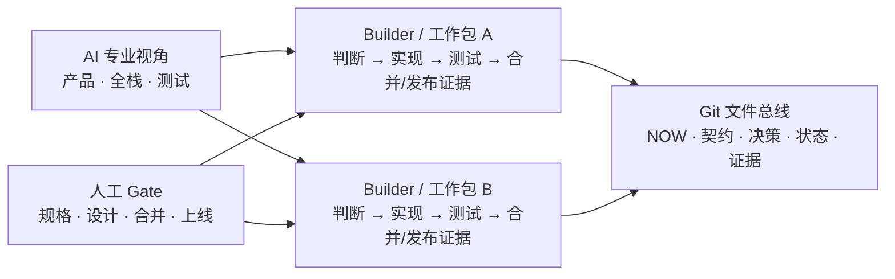

# BuildBeat

**简体中文** | [English](README.en.md)

**让人和 AI 会话围绕同一组项目事实完成交付。**

BuildBeat（旧称 Solobaton）是一套面向人和 AI 会话的、**file-first、human-gated 工程交付协议与脚手架**。它通过 Git 中的文件总线、人工 Gate 和可验证证据，让项目在长期迭代、多个仓库和多个 AI 上下文之间保持同步、可控、可核验。它不负责创建 Agent、管理模型、建模团队岗位或提供运行时编排。

> **信息走文件，不走人嘴。完成必须有证据。规格、设计、合并和上线由人拍板。**

需求、看板、契约、决策、状态和验证证据都落在 Git 管理的文件中。会话可以关闭或替换，项目上下文不会跟着聊天窗口消失。

BuildBeat 最初蒸馏自一个人指挥 4 个 AI 会话、持续多期交付复杂产品的实践；这说明了方法的来源，不限定使用人数。一个 Builder 可以使用，多个 Builder 也可以共享同一 Git 项目并按需求/工作包分别闭环。

## 解决什么问题

当一个项目同时打开多个 AI Coding 会话，最容易失控的不是代码生成，而是交付状态：

- A 会话不知道 B 已经改了接口，继续基于旧上下文工作；
- 人在会话之间复制粘贴，自己变成消息总线；
- Agent 声称“完成”，却没有测试、commit 或线上证据；
- 一个子文档或 commit 完成后，会话过早停下等人说“继续”；
- 草案中的每个小选择都打断人，真正的阶段 Gate 被确认噪音淹没；
- 当前进度、线上版本和决策被重复写进多个文档，逐渐互相矛盾。

BuildBeat 把这些问题收敛成四个支柱：

1. **端到端工作包**：一个 Builder 对一个需求/功能工作包的产品判断、实现、测试、合并与发布证据负责；产品、全栈、测试是可调用的 AI 专业视角，不是人类岗位接力。
2. **文件总线**：`NOW → 看板 → contracts → status`，交接不依赖聊天记忆。
3. **人在 Gate**：规格、设计、合并、上线四个关键决策不允许自动跨过。
4. **证据制完成**：完成必须带 commit hash 和可核验证据；无证据，不算完成。

## 5 分钟开始

### 推荐：引导式 Bootstrap

把本仓库放到本机任意稳定位置，或放进 AI Coding 工具当前支持的本地 skill 目录。然后让会话读取 [`SKILL.md`](SKILL.md)，并说：

> 用 BuildBeat 给我的项目搭协作骨架。

它会先自己检查代码和配置，识别仓库数量、部署单元、UI 和契约边界；只问 3–4 个无法从项目中查到的简单问题；给出一屏确认后，再生成已经填好项目事实的骨架并运行自检。

> 已经存在大量代码的项目不要直接套新项目模板。使用 `SKILL.md` §8.5 的**存量接管仪式**：先摸底、划新旧边界、补最小验证能力，再采用 `pm/scripts/` 紧凑布局，避免撞上原项目自己的 `scripts/`。

### Claude Code 插件：本地源码候选

本仓现在提供独立的 Claude Code marketplace 包，安装后以 `/buildbeat:buildbeat` 路由同一份 canonical [`SKILL.md`](SKILL.md)。当前本地源码候选可从 checkout 隔离试用：

```text
/plugin marketplace add /absolute/path/to/solobaton
/plugin install buildbeat@buildbeat-plugins
/buildbeat:buildbeat
```

候选合并到 GitHub 默认分支后，第一条仍使用当前仓库地址 `/plugin marketplace add HaiYangBG1/solobaton`；远端仓库改名是独立外部动作。插件只携带 Skill、模板、示例和参考文档，不把 npm CLI 的顶层 `bin/` 暴露进 Claude Code；是否对项目执行写入仍受当前 CLI 发布状态、确认屏和人工 Gate 约束。完整打包边界见 [`plugins/buildbeat/README.md`](plugins/buildbeat/README.md)。

### CLI：npm v0 仍只读，本地源码候选已含 Wave 1/2

v1.16 新增零第三方运行时依赖的 Node.js 20+ CLI；从 `solobaton@1.16.1` 起通过 npm 正式分发。该 npm 包名是 BuildBeat 的 legacy distribution ID：未加 scope 的 `buildbeat` 已被其他项目占用，本仓不会冒用。面向已发布 v0 的执行示例继续使用 `solobaton@latest`，避免把尚未发布的 BuildBeat 命令写成可用事实：

```bash
npm view solobaton@latest version  # 需要复现时，先记录这个精确版本并用它替换 @latest
npx --yes solobaton@latest doctor /path/to/project
npx --yes solobaton@latest init /path/to/project --dry-run
npx --yes solobaton@latest adopt /path/to/project --dry-run --json
```

需要长期使用时，可以显式管理全局 CLI：

```bash
npm install --global solobaton@latest  # 安装 registry 当前版本
solobaton doctor /path/to/project
npm install --global solobaton@latest  # 更新 CLI 包
npm uninstall --global solobaton       # 移除全局 CLI
```

这里的安装、更新、移除只管理 **legacy CLI 包和 `solobaton` 可执行文件**，不会创建、升级或删除项目里的协作骨架。`doctor` 检查已有骨架的布局、版本、关键文件、占位符、Hook 与依赖降级；`init/adopt --dry-run` 分别规划默认/紧凑布局。省略 `--dry-run` 会明确拒绝且不创建任何文件，`solobaton upgrade/uninstall` 仍未开放。当前源码候选的 canonical 命令是 `buildbeat doctor`，本地入口为 `node bin/buildbeat.js ...`；`bin/solobaton.js` 只保留为兼容别名。完整契约见 [`docs/CLI.md`](docs/CLI.md)。

Phase 0–2 已形成本地源仓基线提交 `b062f25`，但未推送、未发布。当前 checkout 在 Wave 1 `init/adopt` 受控写入之外，已完成 Phase 3 源码范围：schema-2-only 机械 `upgrade`、Gate/证据强关联、多仓漂移与扫描边界报告。`upgrade` 同 major 按 manifest/hash 替换未改的 managed 文件，冲突默认零写，`--force` 也永不覆盖 project-owned 内容或不安全路径；跨 major 另需 `--major`。这些增量已通过一次性 Git/文件系统沙箱回归，但真实版本增量 upgrade 与 WP3.3/WP3.4 真实环境刷新尚未完成，也未进入 npm。WP2.7 legacy namespace 与 WP2.8 BuildBeat canonical namespace 的既有试点仍只证明各自当时的本地边界。

已拷出的 v1.16 legacy 项目不得手写、复制或重命名 manifest 来伪造 schema 2 所有权。默认继续按 CHANGELOG 手工维护；如果确需进入机械升级，按 [v1.16 legacy 迁移指南](docs/LEGACY-V1.16-MIGRATION.md) 在专用 Git 分支受控重建基线。

> 因此，写入式首屏命令 `npx --yes --package=solobaton@latest buildbeat init my-project` 目前刻意不作为可用入口展示；仍须稳定候选进入远端默认分支、获得发布授权并完成官方 registry 回读后才会激活。

### 手动安装

只建议在你已经理解模板含义时使用：

```bash
git clone https://github.com/HaiYangBG1/solobaton.git
rsync -a --exclude '/standards/' --exclude '/pm/adr/' "solobaton/templates/" /path/to/new-project/
cd /path/to/new-project
```

上面的默认路径保留隐藏 `.claude/`，但不生成可选的 `standards/` 与 `pm/adr/`。它们仍作为 project-owned 模板随源仓提供：只有在 Bootstrap 一屏确认中明确启用相应规范，或真实决定命中 ADR 判据时，才单独复制并按项目事实填写；缺失是合法状态。

接着必须：

1. 逐文件替换所有 `<占位符>`；
2. 将 `gitignore.template` 的规则合并进项目 `.gitignore`；
3. 为 `verify-status.sh` 配置真实测试命令；
4. 运行 `bash scripts/bus-check.sh`，确认骨架指针和能力边界；
5. 在 meta 仓和每个代码子仓分别安装 pre-commit 护栏：

```bash
cp scripts/pre-commit.sh .git/hooks/pre-commit
chmod +x .git/hooks/pre-commit
```

强烈建议同时安装 [`gitleaks`](https://github.com/gitleaks/gitleaks)。未安装时，pre-commit 仍会运行其它检查，但 Secret 扫描会降级成警告而不是阻断。Git hooks 不进入普通 Git 历史，新 clone 后需要重新安装，或显式配置版本化的 `core.hooksPath`。

## 日常怎么运行

先从看板认领一个可独立验收的工作包；同一个 Builder 对它端到端负责。需要并行专业视角时，可以打开产品、全栈、测试会话，但它们是该工作包内的 AI 视角，不是三个人类岗位的强制交接。多个 Builder 协作时，各自认领不同工作包并通过 Git 共享最终事实。

```text
你是当前工作包的产品视角，负责澄清需求、看板和决策事实。开工。
```

```text
你是当前工作包的全栈视角，负责实现、契约和部署候选。开工。
```

```text
你是当前工作包的测试视角，负责黑盒验收、E2E 和证据。验收当前候选。
```

每个会话开工先同步代码，再运行护栏：

```bash
git pull
bash scripts/bus-check.sh
```

多仓项目要在各子仓分别同步。修改契约、执行 migration、部署等不可逆动作前，再运行一次 `bus-check.sh`。

常用命令：

```bash
bash scripts/bus-check.sh --format=json  # 输出 schema 1 JSON；warning/unverified 不会被吞掉
bash scripts/bus-check.sh --strict       # 任一 conflict/error finding 会非零退出
bash scripts/verify-status.sh --run       # 跑项目配置的真实测试套件并记录最近全绿
bash scripts/design-preview.sh 1          # 有 UI 时，Gate2 前打开真实可点原型
```

## 核心机制

- **工作包**：按一个可验收的用户级结果持续推进，不因单个文件、commit 或 reviewer 返回而提前结束。
- **三级审批**：`STOP_NOW` 处理越权、冻结语义和不可逆动作；`BATCH_AT_GATE` 集中可逆取舍；`NO_APPROVAL` 自主完成派生工作。
- **三轨制**：快轨、标准轨、重轨按风险选择流程重量，小事不上全套仪式。
- **单点事实**：`NOW.md` 只做薄指针，契约、决策、状态和线上查询各有唯一入口。
- **review-ready 核查门**：候选稳定、工作树干净、L3 证据已绿且没有已知待修项后，才启动一次独立 milestone reviewer。
- **机器护栏**：`bus-check --strict`、pre-commit、gitleaks 和项目测试把确定性规则变成可执行检查。
- **多仓漂移**：多仓项目在契约入口显式绑定各子仓 CHANGELOG、契约版本来源和本地部署基线 app；确定不一致才阻塞，缺仓或缺来源保持 unverified，不猜自然语言。
- **可选规范与 ADR**：STACK/CODE/REVIEW/DESIGN 默认不生成；存在时检查三行声明、Rule ID 和 Draft/Confirmed 状态。Confirmed STACK 还只读比对显式基线与 Node、lockfile、Docker FROM 事实，无法覆盖时保持 unverified。长期难回退决定才建 ADR，并校验 Status 与 Superseded 链。
- **生产状态证据**：项目接入 `live-status.sh` / `live-config.sh` 后，可检查部署平台配置与基线的漂移；它不自动证明运行中容器已经加载最新配置。
- **存量接管**：先建立系统边界和最小验证能力，再把新地盘纳入完整总线，避免直接重写未知遗留行为。

完整规则、Bootstrap 和接管流程见 [`SKILL.md`](SKILL.md)；真实失败模式和设计理由见 [`lessons.md`](lessons.md)。

## 运转模型



每个工作包都纵向闭环，不按人类职能切成产品→研发→测试流水线。人不负责在会话之间搬运上下文，只负责不能委托的判断；普通事实、归档、状态回写和已授权范围内的可逆实现继续自动推进。

## 适用边界

推荐用于：

- 至少 2 个仓库或部署单元；
- 会持续迭代数周或更久；
- 一个或多个 Builder 需要分别驾驭多个 AI 上下文，并按工作包端到端闭环；
- 多个 AI Coding 会话需要稳定交接；
- 项目重视可核验记录，但不希望引入复杂 Agent Runtime。

不建议用于：

- 单仓小任务；
- 一次性脚本；
- 一周内即可收尾的工作；
- 没有验证能力、又不准备先补最小测试的项目。

已知边界：人仍是最终决策者；流程提高“按已定目标正确交付”的可信度，不保证产品方向本身正确。自动加载规则和 skill 目录也因 AI Coding 工具而异，正式宣称兼容前应以对应工具的当前文档和实测为准。

当前非目标：多人账号、角色/权限和组织管理后台；遥测采集、团队效能评分或指标仪表盘。BuildBeat CLI 不采集或上传项目使用数据。这些不是未完成的维护项；若未来立项，必须单独定义需求、数据口径、隐私/权限治理和验收 Gate。

## 安装后的项目结构

```text
<项目根>/
├── AGENTS.md                       # 会话路由、总线规则和红线
├── CLAUDE.md                       # 兼容指针，不复制规则正文
├── ARCHITECTURE.md                 # 系统事实和子项目索引
├── contracts/PROTOCOL.md           # 跨边界契约入口
├── pm/
│   ├── NOW.md                      # 当前期薄指针
│   ├── <期>-看板.md
│   ├── decisions.md
│   ├── status/
│   ├── changes/
│   ├── adr/                         # 可选；长期技术决定与替代链
│   └── archive/<期>/evidence/
├── standards/                      # 可选；STACK/CODE/REVIEW，UI 项目可加 DESIGN
├── scripts/
│   ├── bus-check.sh
│   ├── verify-status.sh
│   ├── drift-check.sh
│   ├── design-preview.sh
│   └── pre-commit.sh
├── .claude/agents/reviewer.md      # 只读 milestone / risk-delta / closure 核查
├── 指挥台.md                        # 给人的一页操作卡
└── BUILDBEAT.md                    # 所用 BuildBeat 版本与升级记录
```

存量项目的紧凑布局会把脚本、指挥台和版本标记放进 `pm/`。`standards/` 与 `pm/adr/` 两个可选目录不属于默认骨架；具体规则见 `SKILL.md` §3/§8。

## 能力与依赖

| 能力 | 依赖 | 缺失时 |
|---|---|---|
| 文件总线和基础检查 | Git、Bash | 无法使用核心流程 |
| 真渲染设计预览 | Python 3 | 不能使用自带预览脚本 |
| Secret 提交阻断 | gitleaks | 降级为警告，不能声称 Secret gate 已建立 |
| 生产配置漂移 | `jq`、SHA 工具、项目 `live-config.sh` | 明确跳过，不能外推生产状态 |
| 线上版本查询 | 项目 `live-status.sh` 和平台 CLI | 明确未配置，不引用文档版本冒充线上事实 |
| L3 测试证据 | 项目填写 `verify-status.sh` 的 `SUITES` | 只能报告未配置，不能声称自动化测试已绿 |
| CLI 检查/脚手架/机械升级 | Node.js 20+、npm registry 或本仓库源码 | npm 已发布 v0 仍只读；本地源码已实现 Wave 1 写入与 Phase 3 schema 2 机械升级/检查增强，但升级尚无独立真实版本增量试点、未推送、未发布；项目 uninstall 继续冻结，Skill/手动等价路径始终保留 |

Skill-only、已发布 npm v0 和当前本地源码候选是三个不同可用面；`doctor`、`init/adopt`、`upgrade` 也不承担相同责任。完整对照和双向互操作证据见 [BuildBeat 能力矩阵](docs/CAPABILITY-MATRIX.md)。

## 继续阅读

- [`SKILL.md`](SKILL.md)：方法论与 Bootstrap 的唯一完整入口；
- [`example/`](example/)：虚构「简账」项目一期收尾的协议教学快照（可执行脚本仍引用模板 SSOT）；
- [`lessons.md`](lessons.md)：真实反模式、根因与解法；
- [`docs/ROADMAP.md`](docs/ROADMAP.md)：新版产品方向、设计原则与 2026-08-24 生效的 CLI 执行修订；
- [`docs/EXECUTION-PLAN.md`](docs/EXECUTION-PLAN.md)：当前分阶段工作包、依赖、验收和冻结边界；
- [`docs/CLI-STRATEGY-2026-08.md`](docs/CLI-STRATEGY-2026-08.md)：基于官方来源的 CLI 策略对照与证据边界；
- [`docs/CHECKS.md`](docs/CHECKS.md)：文件总线不变量、Gate/证据令牌、finding code 与严格模式规格；
- [`docs/CLI.md`](docs/CLI.md)：CLI 命令边界、文件所有权、manifest、机械升级和手动移除合同；
- [`docs/CAPABILITY-MATRIX.md`](docs/CAPABILITY-MATRIX.md)：Skill-only、已发布 npm v0 与本地源码候选的双语能力/互操作对照；
- [`docs/LEGACY-V1.16-MIGRATION.md`](docs/LEGACY-V1.16-MIGRATION.md)：v1.16 拷出项目继续手工维护或受控重建 schema 2 基线的安全路径；
- [`docs/CLI-PILOT-2026-08-23.md`](docs/CLI-PILOT-2026-08-23.md)：三个真实存量项目的 CLI v0 只读试点与写入边界决策；
- [`docs/PHASE1-PILOT-2026-08-24.md`](docs/PHASE1-PILOT-2026-08-24.md)：Phase 1 文件总线在 example、活跃多仓投影和真实单仓代码树上的只读试点；
- [`docs/PHASE2-PILOT-2026-08-25.md`](docs/PHASE2-PILOT-2026-08-25.md)：Wave 1 三条真实目录写路径、Tide 保护摘要、UI 探测反馈与最终本地 Git/Hook/hash 证据；
- [`docs/PHASE2-BUILDBEAT-PILOT-2026-08-25.md`](docs/PHASE2-BUILDBEAT-PILOT-2026-08-25.md)：BuildBeat canonical namespace 的新真实目录回归、Tide 保护复核与 Gate3 关闭证据；
- [`docs/PHASE4-STABILITY-AUDIT-2026-08-25.md`](docs/PHASE4-STABILITY-AUDIT-2026-08-25.md)：演进书 §15 的 12 条硬门槛现状、证据边界与未关闭发布阻塞；
- [`docs/RELEASING.md`](docs/RELEASING.md)：npm 发布 Gate、验证与 Trusted Publishing 迁移；
- [`CONTRIBUTING.md`](CONTRIBUTING.md)：贡献、验证和 PR 边界；
- [`SECURITY.md`](SECURITY.md)：支持版本与私密漏洞报告通道；
- [`CHANGELOG.md`](CHANGELOG.md)：版本历史和拷出项目升级说明。

## 贡献

欢迎 Issue 和 Pull Request。完整提交规则见 [`CONTRIBUTING.md`](CONTRIBUTING.md)；未公开漏洞请勿发公开 Issue，按 [`SECURITY.md`](SECURITY.md) 私密报告。修改流程语义时，请同时更新 `SKILL.md`、相关模板、中文/英文 README、示例和 CHANGELOG，并说明：

1. 解决了哪个真实失败模式；
2. 如何复现；
3. 哪些自动化检查证明没有回归。

提交前至少运行：

```bash
bash -n templates/scripts/*.sh tests/*.sh
npm test
npm run test:scripts
npm run test:skill-only
npm run check:docs
npm run pack:check
git diff --check
```

## License

[MIT](LICENSE) © 2026 HaiYangBG
