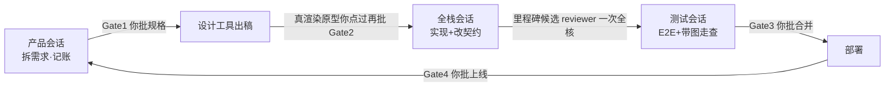

# Solobaton —— 一个 Builder,一根指挥棒,一支 AI 会话乐团(Builder 协作总线 · 技能介绍)

**简体中文** | [English](README.en.md)

> 所有活儿都塞在一个 AI 会话里,越聊越糊?想开新会话,又怕上下文丢失、怕再解释一遍?会话之间同步,全靠你复制粘贴?
> Solobaton 的答案:一个人指挥 N 个并行 AI 会话,像一支小团队一样交付中大型项目——**方法论**(怎么协作不乱)+ **脚手架**(拷贝即用的文件模板与脚本)。
> 蒸馏自一个真实跑了多期迭代的项目:单人指挥 4 个 AI 会话,把含前端/BFF/多个后端服务/网关/审计的内部产品从零迭代、上线 30+ 次,踩坑、修坑、再把坑位固化成机制。

---

## 1. 它解决什么问题

**先看单会话困局——用 AI 做项目的人,大多是这个样子:**

- **被一个聊天窗口"绑架"**:什么都在一个会话里聊,不敢开新会话——怕上下文丢失,怕再解释一遍还解释不清。
- **一个会话干所有活**:聊得越久注意力越散、答非所问(上下文腐烂);触顶被迫压缩,该记得的全忘;任务只能排队等,不敢并发,怕互相冲突。
- **信息同步靠人肉**:你在会话之间来回复制粘贴,agent 干到一半停下来问你要上下文。

**就算鼓起勇气开了多个会话(Claude Code / Cursor 等),又会撞上新的七件事:**

| 痛点 | 典型症状 |
|---|---|
| **信息差** | A 会话不知道 B 已经改了接口,在旧版本上干活 |
| **人肉总线** | 你不停在会话间复制粘贴"后端说……前端你注意……",自己成了瓶颈 |
| **假完成 / 漏验** | 会话说"做完了",实际没验;验收靠你肉眼,必漏 |
| **过早结束** | 交了一份文档、做完一个子任务就把接力棒还给你,安全范围内剩下的工作要你反复说“继续” |
| **审批疲劳** | 14 条验收条件被包装成 14 个独立决策,草案每变一次就打断人,真正的 Gate 反而淹没在确认请求里 |
| **文档腐烂** | "当前版本/当前进度"写在五个文档里,三个互相矛盾 |
| **返工螺旋** | 你对着静态设计稿拍了板,见到真实现又推翻,整层 UI 重做 |

这套总线的回答:**信息走文件不走人嘴、完成必须带证据、执行按用户级工作包持续推进、审批只留给真实取舍与 Gate、会腐烂的事实只放一处。** 上下文外置到文件之后,**任何会话都是可抛弃的**——崩了、满了、关了,新开一个跑一遍开工脚本就原地满血;这就是你敢开 N 个会话的底气。

> 行话密集预警:「总线 / SSOT / Gate / 域」这些词第一次见容易懵,§9 有白话对照表。

## 2. 怎么用

**第 1 步 · 装技能**:把 `solobaton/` 复制或软链到 `~/.claude/skills/`(Claude Code)或 `~/.cursor/skills/`(Cursor);不装也可以直接说——「按 `solobaton/SKILL.md` 给我搭协作骨架」。

**第 2 步 · 一句话起步**(引导式 Bootstrap,详见 SKILL.md §8)。对任意会话说:

> 「用 Solobaton 给我的项目搭协作骨架」

它会**先自己看代码**摸清项目(几个仓 / 部署平台 / 有无 UI / 契约边界都自查,不拿这些烦你),只问你三四个不需要技术背景的问题(做几天还是长期做 / 还有谁一起干 / 分工用默认的「产品/全栈/测试」还是自己定 / 界面谁说了算),一屏确认后生成一套**占位符已填好**的骨架,跑 bus-check 自检后交付;不符合适用边界(§7)的项目会被直接劝退,不硬上总线。

> 项目**已经存在、有一堆存量代码**?不走 Bootstrap,走**接管仪式**(SKILL.md §8.5):先摸底、划新旧边界(新地盘走全套总线,老地盘只维护)、第 0 期强制补最小测试套件——没有测试,后面所有验收关卡都在空转。骨架这时用**紧凑布局**:护栏脚本落 `pm/scripts/` 而不是根 `scripts/`(存量项目根几乎必有自己的 `scripts/`),项目根只多一个 `pm/` 目录,协调层的边界一眼可辨。

**手动路径**(不装技能也能用):

```bash
# 拷贝脚手架(`/.` 结尾才带上隐藏的 .claude/),然后逐文件替换 <占位符>
cp -R "solobaton/templates/." <新项目根>/
bash scripts/bus-check.sh
# 装机器闸(meta 仓与各代码子仓,每仓一次):gitleaks 拦凭据 + bus-check --strict 拦腐烂/幽灵 hash
cp scripts/pre-commit.sh .git/hooks/pre-commit && chmod +x .git/hooks/pre-commit
```

### 举个例子

假设你要做一个「网页记账应用」:前端、后端各一个仓,打算长期迭代。

1. **搭骨架(一次性)**:说「用 Solobaton 给我的项目搭协作骨架」。它自己扫出两个仓、发现有 UI,只问你三件事:长期做吗?就你一个人?分工用默认的产品/全栈/测试吗?你答完、对着汇总屏点个头,骨架生成完毕。
2. **日常干活**:开三个会话,每个认领一个域。**每个会话第一次对话,先一句话设定角色**:
   - 对**产品**会话:「你是产品,负责拆需求、管看板、记决策。先把"月度报表"功能拆一下」→ 它写需求、更看板,等你拍板(⛔Gate1)
   - 对**全栈**会话:「你是全栈,负责实现和上线。看板上月度报表该你了,开工」→ 它先跑 bus-check 对齐进度,认领一个覆盖多个子项的工作包,在范围内持续实现,最终留下 commit hash + 证据
   - 对**测试**会话:「你是测试,负责验收挑毛病。验收月度报表」→ 它跑 E2E、对着设计稿截图走查,问题带图直接提

   之后的对话不用再设角色,直接说「开工 / 看板上 X 该你了 / 验收 X」就行。
3. **你只拍真正的板**:规格、设计(浏览器里点过真原型再批)、合并、上线四个关卡由你点头;冻结前可逆选择攒成 2–5 个真实取舍一次问,推导约束和状态回写不来烦你。收敛后的决策包只记一条台账。信息全在文件里流动,**你不用当传声筒,也不用反复说“继续”**。

> 这个虚构项目跑完一期后的全套总线文件,见 [`example/`](example/) 沙盘——每个模板填好之后长什么样,一看便知。

## 3. 核心思想:四根支柱

1. **真多会话隔离** —— 每个"域"是一个独立会话(独立 cwd、独立上下文、只写自己的文件)。天然抗上下文污染,天然实现"写者≠审者"。
2. **人在 Gate** —— 规格 / 设计 / 合并 / 上线 四个决策点必须人拍板,**不可自动跨过**。人只当节拍器和拍板者,不当传声筒。
3. **文件总线** —— 会话间交接全部走 repo 文件:`NOW.md`(指针)→ 看板 → 契约 → 各域状态。任何会话开工自取,不需要你转述。
4. **证据制完成** —— 任何域说"完成",必须给 commit hash + 可核验证据(测试命令 / 文件:行 / 线上实测 / 截图)。**无证据 = 没完成。**

需求 ID、验收项和 commit 可以很细,但一个会话默认认领一个用户级工作包(`objective / in_scope / terminal_condition`)。子文档、reviewer 返回和 status 回写只是包内事件;范围内还有安全工作就继续,不把“继续”变成人工调度协议。

## 4. 运转画面



会话只在三种情况交还接力棒:工作包带证据完成、遇到必须由人处理的真实阻塞、或你明确只要检查点。审批也只分三档:`STOP_NOW`(跨 Gate/扩范围/改冻结契约/不可逆动作/风险接受)、`BATCH_AT_GATE`(冻结前可逆取舍集中到门前)、`NO_APPROVAL`(事实、推导约束、状态/归档/P2 等自主处理)。

日常你只需要对各会话说三句话:「开工」「看板上 X 该你了」「验收 X」。每个会话开工先跑 `bus-check.sh`,一屏看清:当前期、契约版本、最近三条拍板、各域进度、子仓是否落后、**线上真实版本**(实查部署平台,不信任何文档)、**生产漂移**(平台侧 env 指纹/镜像 tag↔git vs 基线)。长这样(示例输出,节选;项目设定见 [`example/`](example/) 沙盘):

```text
════════ 协作总线 开工同步 (bus-check) ════════
✅ meta 仓与远端同步(或无上游)

── 子仓 ⇄ 远端 ──
  ✅ jz-web         HEAD 7be04d2  领先 0 / 落后 0
  ⚠️  jz-api         HEAD a3f21c9  领先 1 / 落后 0

── 当前期 / 协调看板 (pm/NOW.md) ──
**当前期:一期(记账主流程 + 月度报表)**(已收尾:Gate4 已过、上线复核完,待换期)
**本期轨道:标准轨**

── 协调层腐烂检测 ──
  ✅ NOW 薄、看板归位、status 克制

── 契约 (contracts/PROTOCOL.md) ──
**契约快照对应版本:`v0.2.0`**(2026-06-20 上线)

── 最近拍板 (pm/decisions.md, 最新 3 条) ──
  | 2026-06-20 | 你 | 一期验收通过,批准上线(⛔Gate4);报表导出 CSV 挪二期 | …
  | 2026-06-19 | 你 | ⛔Gate3 批准合并:月度报表(走查 P1「空月除零」已修复复验)…
  | 2026-06-15 | 你 | ⛔Gate2 真渲染过:报表用柱状图不用折线;移动端两列改单列 | …

── 幽灵 hash 核验 (pm/status/) ──
  ✅ 7 个 hash 全部可解析

── 线上实况 ──
  jz-api   v0.2.0
  jz-web   v0.2.0

── 生产漂移检测 ──
  ✅ jz-api           配置/镜像==基线 (tag 0.2.0)
  —— 无漂移

▸ 开工四步: ① git pull(含子仓)  ② 读 NOW → 当期看板 → 契约 → 最近拍板  ③ 确认你域要动的不 stale  ④ 不可逆动作(部署/契约/migration)前重跑本脚本
```

## 5. 五个最值钱的机制(别处少见)

- **任务包 + 审批分层**:细需求保留追踪价值,执行却按一个用户级结果持续推进;子产物不触发收尾。只有越过授权/冻结/不可逆边界才立即问,可逆取舍门前批量问,派生工作自主做——人只处理真正改变方向的决定。
- **单点事实(规则⑨)**:线上版本、收敛后的决策包、换期——三类最容易腐烂的事实,各自只有一个登记/查询处,其它地方一律放指针。决策包先落 `decisions.md` 一行再回写,回写欠账全程可见;部分对话进度不进永久台账。
- **Gate2 真渲染拍板(规则⑩)**:设计拍板对象必须是**浏览器里能点的真原型**,静态稿和截图不算数。这条规则的学费:一次改版上线 2 天就被推翻重做,根因全是"对着静态稿拍板,见到真东西才表真态"。
- **换期压缩仪式**:每期收尾强制归档看板、截断状态文件、清零 NOW 流水;证据产物(走查图/E2E 报告)生成时就写进 `pm/archive/<期>/evidence/`,换期零搬运。没有这个仪式,协调文档三周内必然长成没人读的流水账——所以 bus-check 自带**协调层腐烂检测**:NOW 长肥 / 旧看板滞留 / status 超长,开工就红字报警(仪式没有护栏 = 没有仪式)。红字还能变闸:bus-check 顺带核验 status 里的每个 commit hash 真实存在(**幽灵 hash** = 臆造的"完成"),`--strict` 模式下腐烂/幽灵 hash/漂移任一确凿检出即非零退出,默认由 `scripts/pre-commit.sh` 挂在每次 commit 前——gitleaks 拦凭据也在这道闸里,规则不靠自觉靠机器。
- **生产漂移检测**:部署平台的 env/secret 与镜像不在 git 里,控制台一改就是第二事实源。对它做指纹基线(🔴只存 sha256 指纹不存值)+ 镜像 tag↔git tag 锚定,bus-check 开工自动比对红字报警——把「配置改了没部署」「线上镜像 git 里找不到」暴露在动手之前。

## 6. 文件构成

```
solobaton/
├── SKILL.md       # 给 agent 读的方法论主体:域模型 / 十条规则 / 四Gate+三轨 /
│                  #   任务包+审批分层 / 三个仪式 / 红线 / 引导式 Bootstrap
├── lessons.md     # 17 条反模式(症状→根因→解药),每条都真实发生过
├── README.md      # 本文(给人读的介绍;英文版 README.en.md)
├── CHANGELOG.md   # 版本史
├── example/       # 教学沙盘:虚构「简账」项目跑完一期的文件快照(模板填好后的样子)
└── templates/     # 拷到新项目根即可启动,改掉 <占位符> 就能跑
    ├── AGENTS.md              # 会话路由 + 十条规则 + 红线(开放标准,每个会话自动装载)
    ├── CLAUDE.md              # 一行指针 → AGENTS.md(兼容只认此名的工具;不复制内容)
    ├── ARCHITECTURE.md        # 全栈总图骨架(凭据只标位置不写值;按需读)
    ├── 指挥台.md               # 给你看的一页操作卡
    ├── pm/                    # 产品域协调层:NOW 薄指针 / 看板 / 拍板台账 / 状态分写 / 变更提案
    ├── contracts/PROTOCOL.md  # 跨边界契约唯一入口
    ├── gitignore.template     # meta 仓 .gitignore 模板(拷入改名;排除子仓与 *.env)
    ├── SOLOBATON.md           # 版本标记:项目用的哪版 Solobaton + 升级/回灌说明
    ├── .claude/agents/reviewer.md   # 只读核查门 subagent(milestone / risk-delta / closure)
    └── scripts/               # bus-check.sh(开工护栏,--strict 机器闸) + drift-check.sh(生产漂移检测)
                               #   + design-preview.sh(真渲染) + pre-commit.sh(红线闸:gitleaks+strict)
                               #   + verify-status.sh(测试全绿实查,L3 证据兜底)
```

## 7. 适用边界(诚实版)

- **适合**:≥2 个仓或部署单元、多期迭代、一个人身兼 PM/开发/测试/运维、AI 会话之间需要交接的项目。
- **不适合**:单仓小任务、一次性脚本、一周内收尾的事——直接开一个会话干完,上总线纯属仪式负担。
- **已知局限**:人仍是编排瓶颈(这是特性不是 bug——人把关正是这套打法的护城河);流程只保证"做得对",不保证"做的是对的事",选题仍靠你对照风险清单自律(lessons.md 第 8 条)。

## 8. 十条规则速览

| # | 规则 | 一句话 |
|---|---|---|
| ① | 唯一看板指针 | 入口永远是 NOW.md,换期只改它一处,看板名不写死进别处 |
| ② | 契约落盘不喊话 | 先改 PROTOCOL.md 再动代码;对方的协议声明独立核查再信 |
| ③ | 交接靠 commit | 工作包完成或真实阻塞时状态带 hash;原子 commit 不逐个打断人 |
| ④ | 开工护栏 | 开工跑 bus-check;**不可逆动作前再跑一次**;`--strict` 挂 pre-commit 当闸 |
| ⑤ | 三轨制 | 快轨/标准轨/重轨;工作包按纵向结果,不按文件拆 |
| ⑥ | 核查门 | 机器闸常驻;高风险 delta 定向核;里程碑候选 hash 集只全核一次 |
| ⑦ | 提案+状态分写 | 跨域变更走 delta 提案;各域只写自己的状态文件,按工作包批量更新 |
| ⑧ | 视觉带图 | UI bug 必附实现⟷设计稿截图并排,纯文字不算证据 |
| ⑨ | 单点事实 | 线上版本只实查;收敛决策包只记一次;换期必压缩 |
| ⑩ | Gate2 真渲染 | 设计拍板对着可点原型,静态稿不算数 |

## 9. 名词白话表

> 每个词一句白话,按「协作机制 / 文件与角色 / 工程名词」分三组。

### 协作机制

| 术语 | 白话 |
|---|---|
| 文件总线 | 借自"消息总线":会话之间不靠你传话,信息全写进 repo 约定的文件,谁要谁自己读 |
| SSOT / 单点事实 | Single Source of Truth:一个事实只在一处登记,别处只放"去哪查"的指针——防多处复写互相矛盾 |
| Gate(四 Gate) | 关卡:规格 / 设计 / 合并 / 上线四个决策点,必须人拍板,AI 不得自动跨过 |
| 三轨制 | 按改动大小选流程重量:快轨(小改)/ 标准轨(单功能)/ 重轨(动契约的大改),小事不走大流程 |
| 工作包 | 一次会话认领的用户级结果,写清 objective/in_scope/terminal_condition;可以覆盖多个需求 ID、文档和 commit |
| 审批分层 | 立即停(STOP_NOW)/门前批(BATCH_AT_GATE)/无需批(NO_APPROVAL):只有真正越界或不可逆的事马上打断人 |
| 决策包 | 2–5 个需要人取舍的独立变量集中拍一次;验收条目和推导结论不冒充独立决策 |
| 核查门 | 机器闸每提交;高风险语义只核 delta;稳定里程碑候选派只读 reviewer 全核一次,同一 hash 复用结论 |
| 写者≠审者 | 写代码和审代码不能是同一个会话——自己审自己必然全对 |
| 证据制完成 | 说"完成"必须带 commit hash + 可核验证据(测试命令 / 文件:行 / 截图),否则不算完成 |
| 人在回路 | human-in-the-loop:关键决策必须有人参与,不许 AI 全自动闭环 |
| 拍板 / 拍板台账 | 拍板 = 你对真实决策包做决定;台账 = 收敛结论记录本(pm/decisions.md),部分对话进度不进入 |
| 期 / 换期 | 期 ≈ 一轮迭代(sprint);换期 = 收尾这轮、开下一轮,强制伴随归档压缩 |
| 压缩仪式 | 换期时归档当期文档、截短状态文件的固定动作——防协调文档长成没人读的流水账 |
| 开工护栏 | 干活前必跑的检查脚本(bus-check.sh):一屏打出进度 / 契约 / 最近决策 / 线上实况 |
| 机器闸(--strict) | 违反了会被真的拦下的那种规则:bus-check --strict 检出问题就非零退出,挂进 pre-commit 后,有问题的 commit 直接被拒 |

### 文件与角色

| 术语 | 白话 |
|---|---|
| 域 | 一个分工单元 = 一个独立 AI 会话(如 产品 / 全栈 / 测试),各管各的文件互不越界 |
| meta 仓 / 子仓 | meta 仓 = 放协调文件(看板 / 契约 / 状态)的 git 仓;子仓 = 各代码项目自己的 git 仓 |
| 契约(PROTOCOL) | 跨仓 / 跨服务的接口约定(字段 / 行为 / 错误码),唯一登记处 contracts/PROTOCOL.md |
| 薄指针 | NOW.md 只写"当前哪一期、去看哪些文件"——是书签,不是笔记本 |
| 看板 | 当期的任务分工表:谁做什么、到哪一步、卡在哪 |
| delta 提案 | 大改先写一份"改什么"清单(逐条标 增 / 删 / 改)的提案文件,拍板后才动手 |
| reviewer / 子代理 | 主会话临时派出的只读审查 agent,有 milestone / risk-delta / closure 三种模式;审完即走、不常驻、无权改代码 |
| 挂账 | 把"欠着没做完的事"记在看板上,谁认领谁销账 |

### 工程名词

| 术语 | 白话 |
|---|---|
| 上下文腐烂(context rot) | 会话聊太长后模型记忆失真、注意力涣散,开始答非所问 |
| 生产漂移(drift) | 线上实际跑的配置 / 代码和 git 里记录的对不上了(如控制台改了 env 没重新部署) |
| 指纹(sha256) | 把内容算成一串定长乱码:内容变一点指纹全变,能比对"变没变"又不暴露内容本身 |
| E2E | 端到端测试:模拟真实用户从头到尾走一遍功能,而非只测单个函数 |
| 走查 | 对照设计稿逐屏人眼检查实现,配截图对比 |
| 四态 | 每个界面必处理的四种情况:加载中 / 空数据 / 出错 / 移动端 |
| 真渲染 | 浏览器里能打开、能点的真原型——区别于静态图片稿 |
| UI 元注释 | 界面上出现给开发者看的文字(数据口径 / mock 标记 / 调试信息),用户不该看到 |
| WIP | work in progress:写了一半、还没提交的改动 |
| 幽灵 hash | 状态文档里写的 commit hash 在 git 里查无此号——所谓"完成"是臆造的 |
| stale / 读过期 | 拿着旧信息干活(决策已变,你不知道) |
| BFF | Backend for Frontend:专为前端聚合数据的中间层服务 |
| cwd | 会话的工作目录——决定这个会话"站在哪里"看项目 |
| CHANGELOG | 变更日志;Keep a Changelog 是通行的书写规范(倒序、按版本分节) |
| hook / Stop hook | 钩子:特定事件自动触发的脚本;Stop hook = 会话每轮收尾时自动跑的那种;pre-commit hook = 每次提交前自动跑、能拦下提交的那种 |
| gitleaks | 开源凭据扫描器:提交前扫一遍改动,发现长得像密钥/密码的内容就报警拦下 |
| 证据分级(L0–L4) | 证据的可信档位:声称 < 文件:行 < 编译过 < 自动化测试过 < 线上实测;标准轨最低 L3(测试过) |
| 接管仪式 | 给**存量老项目**上总线的入口(区别于从零的 Bootstrap):先摸底、划新旧边界、第 0 期先补测试 |
| SOLOBATON.md | 项目根的版本标记:记着用的哪版 Solobaton;升级对照上游 CHANGELOG,踩到新坑回灌上游 lessons |

---

*版本史见 [CHANGELOG.md](CHANGELOG.md)。后续项目再踩出新坑,记得回填 lessons.md——这份技能本身也适用"证据制+单点事实":教训只在 lessons.md 登记一处,版本只在 CHANGELOG 登记一处。*
