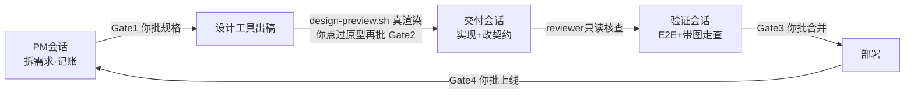

# Solobaton —— 一个人,一根指挥棒,一支 AI 会话乐团(OPC 协作总线 · 技能介绍)

> 一个人 + N 个并行 AI 会话,像一支小团队一样交付中大型项目。
> 本技能 = **方法论**(怎么协作不乱)+ **脚手架**(拷贝即用的文件模板与脚本)。
> 蒸馏自一个真实跑了多期迭代的项目:单人指挥 4 个 AI 会话,把含前端/BFF/多个后端服务/网关/审计的内部产品从零迭代、上线 30+ 次,踩坑、修坑、再把坑位固化成机制。

---

## 1. 它解决什么问题

当你用多个 AI 会话(Claude Code / Cursor 等)同时干一个项目时,必然撞上这五件事:

| 痛点 | 典型症状 |
|---|---|
| **信息差** | A 会话不知道 B 已经改了接口,在旧版本上干活 |
| **人肉总线** | 你不停在会话间复制粘贴"后端说……前端你注意……",自己成了瓶颈 |
| **假完成 / 漏验** | 会话说"做完了",实际没验;验收靠你肉眼,必漏 |
| **文档腐烂** | "当前版本/当前进度"写在五个文档里,三个互相矛盾 |
| **返工螺旋** | 你对着静态设计稿拍了板,见到真实现又推翻,整层 UI 重做 |

这套总线的回答:**信息走文件不走人嘴、完成必须带证据、决策点必须人拍板、会腐烂的事实只放一处。**

## 2. 核心思想:四根支柱

1. **真多会话隔离** —— 每个"域"是一个独立会话(独立 cwd、独立上下文、只写自己的文件)。天然抗上下文污染,天然实现"写者≠审者"。
2. **人在 Gate** —— 规格 / 设计 / 合并 / 上线 四个决策点必须人拍板,**不可自动跨过**。人只当节拍器和拍板者,不当传声筒。
3. **文件总线** —— 会话间交接全部走 repo 文件:`NOW.md`(指针)→ 看板 → 契约 → 各域状态。任何会话开工自取,不需要你转述。
4. **证据制完成** —— 任何域说"完成",必须给 commit hash + 可核验证据(测试命令 / 文件:行 / 线上实测 / 截图)。**无证据 = 没完成。**

## 3. 运转画面



日常你只需要对各会话说三句话:「开工」「看板上 X 该你了」「验收 X」。每个会话开工先跑 `bus-check.sh`,一屏看清:当前期、契约版本、最近三条拍板、各域进度、子仓是否落后、**线上真实版本**(实查部署平台,不信任何文档)、**生产漂移**(平台侧 env 指纹/镜像 tag↔git vs 基线)。

## 4. 四个最值钱的机制(别处少见)

- **单点事实(规则⑨)**:线上版本、用户拍板、换期——三类最容易腐烂的事实,各自只有一个登记/查询处,其它地方一律放指针。拍板先落 `decisions.md` 一行再回写,回写欠账全程可见。
- **Gate2 真渲染拍板(规则⑩)**:设计拍板对象必须是**浏览器里能点的真原型**,静态稿和截图不算数。这条规则的学费:一次改版上线 2 天就被推翻重做,根因全是"对着静态稿拍板,见到真东西才表真态"。
- **换期压缩仪式**:每期收尾强制归档看板、截断状态文件、清零 NOW 流水。没有这个仪式,协调文档三周内必然长成没人读的流水账。
- **生产漂移检测**:部署平台的 env/secret 与镜像不在 git 里,控制台一改就是第二事实源。对它做指纹基线(🔴只存 sha256 指纹不存值)+ 镜像 tag↔git tag 锚定,bus-check 开工自动比对红字报警——把「配置改了没部署」「线上镜像 git 里找不到」暴露在动手之前。

## 5. 文件构成

```
solobaton/
├── SKILL.md       # 给 agent 读的方法论主体:域模型 / 十条规则 / 四Gate+三轨 /
│                  #   三个仪式 / 红线 / 新项目 Bootstrap 七步
├── lessons.md     # 13 条反模式(症状→根因→解药),每条都真实发生过
├── README.md      # 本文(给人读的介绍)
└── templates/     # 拷到新项目根即可启动,改掉 <占位符> 就能跑
    ├── CLAUDE.md              # 会话路由 + 十条规则(每个会话自动装载)
    ├── Agent.md               # 全栈总图骨架(凭据只标位置不写值)
    ├── 指挥台.md               # 给你看的一页操作卡
    ├── pm/                    # NOW 薄指针 / 看板 / 拍板台账 / 状态分写 / 变更提案
    ├── contracts/PROTOCOL.md  # 跨边界契约唯一入口
    ├── .claude/agents/reviewer.md   # 只读核查门 subagent(写者≠审者)
    └── scripts/               # bus-check.sh(开工护栏) + drift-check.sh(生产漂移检测)
                               #   + design-preview.sh(真渲染)
```

## 6. 快速上手

**给新项目搭骨架**(详见 SKILL.md §8 七步 checklist):

```bash
# 1. 拷贝脚手架到新项目根,替换 <占位符>
cp -r "AI底座/solobaton/templates/"* <新项目根>/
# 2. meta 仓 git init;代码子仓各自独立 git;*.env 全部 gitignore
# 3. 在 CLAUDE.md §1 定域(默认 PM / 交付 / 验证 三域起步)
# 4. 任意会话开工仪式
bash scripts/bus-check.sh
```

**让 agent 自动用上这个技能**:把 `solobaton/` 复制或软链到 `~/.claude/skills/`(Claude Code)或 `~/.cursor/skills/`(Cursor);或开新项目时直接说——「按 `AI底座/solobaton/SKILL.md` 给我搭协作骨架」。

## 7. 适用边界(诚实版)

- **适合**:≥2 个仓或部署单元、多期迭代、一个人身兼 PM/开发/测试/运维、AI 会话之间需要交接的项目。
- **不适合**:单仓小任务、一次性脚本、一周内收尾的事——直接开一个会话干完,上总线纯属仪式负担。
- **已知局限**:人仍是编排瓶颈(这是特性不是 bug——人把关正是这套打法的护城河);流程只保证"做得对",不保证"做的是对的事",选题仍靠你对照风险清单自律(lessons.md 第 8 条)。

## 8. 十条规则速览

| # | 规则 | 一句话 |
|---|---|---|
| ① | 唯一看板指针 | 入口永远是 NOW.md,换期只改它一处,看板名不写死进别处 |
| ② | 契约落盘不喊话 | 先改 PROTOCOL.md 再动代码;对方的协议声明独立核查再信 |
| ③ | 交接靠 commit | 状态行带 hash,下游读 repo 即知进度 |
| ④ | 开工护栏 | 开工跑 bus-check;**不可逆动作前再跑一次** |
| ⑤ | 三轨制 | 快轨/标准轨/重轨,别用牛刀杀鸡 |
| ⑥ | 核查门 | 验收前 reviewer 核四方一致;完成 = hash + 证据 |
| ⑦ | 提案+状态分写 | 跨域变更走 delta 提案;各域只写自己的状态文件 |
| ⑧ | 视觉带图 | UI bug 必附实现⟷设计稿截图并排,纯文字不算证据 |
| ⑨ | 单点事实 | 线上版本只实查;拍板只记 decisions.md;换期必压缩 |
| ⑩ | Gate2 真渲染 | 设计拍板对着可点原型,静态稿不算数 |

---

*版本:v1(2026-06-10 首次蒸馏)· v1.1(2026-07-02 回灌三周实战:生产漂移检测机制 + 教训 11–13)。后续项目再踩出新坑,记得回填 lessons.md——这份技能本身也适用"证据制+单点事实":教训只在 lessons.md 登记一处。*
