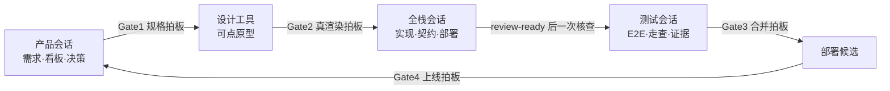

# Solobaton

**简体中文** | [English](README.en.md)

**一个 Builder，一根指挥棒，一支 AI 会话乐团。**

Solobaton 是一套面向 Solo Builder 的、**file-first、human-gated AI 软件交付协议与脚手架**。它不负责创建 Agent、管理模型或提供运行时编排；它解决的是多个独立 AI 编码会话共同交付项目时的上下文同步、职责边界、契约变更、完成证据和人工授权问题。

> **信息走文件，不走人嘴。完成必须有证据。规格、设计、合并和上线由人拍板。**

需求、看板、契约、决策、状态和验证证据都落在 Git 管理的文件中。会话可以关闭或替换，项目上下文不会跟着聊天窗口消失。

Solobaton 蒸馏自一个持续多期迭代的真实项目：一个人指挥 4 个 AI 会话，维护包含前端、BFF、多个后端服务、网关和审计的产品，并把实际踩过的坑固化为规则、模板和 Shell 护栏。

## 解决什么问题

当一个项目同时打开多个 AI Coding 会话，最容易失控的不是代码生成，而是交付状态：

- A 会话不知道 B 已经改了接口，继续基于旧上下文工作；
- 人在会话之间复制粘贴，自己变成消息总线；
- Agent 声称“完成”，却没有测试、commit 或线上证据；
- 一个子文档或 commit 完成后，会话过早停下等人说“继续”；
- 草案中的每个小选择都打断人，真正的阶段 Gate 被确认噪音淹没；
- 当前进度、线上版本和决策被重复写进多个文档，逐渐互相矛盾。

Solobaton 把这些问题收敛成四个支柱：

1. **独立会话**：默认产品、全栈、测试三个域，各自拥有明确写边界。
2. **文件总线**：`NOW → 看板 → contracts → status`，交接不依赖聊天记忆。
3. **人在 Gate**：规格、设计、合并、上线四个关键决策不允许自动跨过。
4. **证据制完成**：完成必须带 commit hash 和可核验证据；无证据，不算完成。

## 5 分钟开始

### 推荐：引导式 Bootstrap

把本仓库放到本机任意稳定位置，或放进 AI Coding 工具当前支持的本地 skill 目录。然后让会话读取 [`SKILL.md`](SKILL.md)，并说：

> 用 Solobaton 给我的项目搭协作骨架。

它会先自己检查代码和配置，识别仓库数量、部署单元、UI 和契约边界；只问 3–4 个无法从项目中查到的简单问题；给出一屏确认后，再生成已经填好项目事实的骨架并运行自检。

> 已经存在大量代码的项目不要直接套新项目模板。使用 `SKILL.md` §8.5 的**存量接管仪式**：先摸底、划新旧边界、补最小验证能力，再采用 `pm/scripts/` 紧凑布局，避免撞上原项目自己的 `scripts/`。

### CLI v0：npm 正式分发，项目仍只读

v1.16 新增零第三方运行时依赖的 Node.js 20+ CLI；从 `solobaton@1.16.1` 起通过 npm 正式分发。一次性检查建议固定最新已独立验证的包版本，便于复现：

```bash
npx --yes solobaton@1.16.1 doctor /path/to/project
npx --yes solobaton@1.16.1 init /path/to/project --dry-run
npx --yes solobaton@1.16.1 adopt /path/to/project --dry-run --json
```

需要长期使用时，可以显式管理全局 CLI：

```bash
npm install --global solobaton@1.16.1  # 安装最新已独立验证版本
solobaton doctor /path/to/project
npm install --global solobaton@latest  # 更新 CLI 包
npm uninstall --global solobaton       # 移除全局 CLI
```

这里的安装、更新、移除只管理 **CLI 包和 `solobaton` 可执行文件**，不会创建、升级或删除项目里的协作骨架。`doctor` 检查已有骨架的布局、版本、关键文件、占位符、Hook 与依赖降级；`init/adopt --dry-run` 分别规划默认/紧凑布局。省略 `--dry-run` 会明确拒绝且不创建任何文件，`solobaton upgrade/uninstall` 仍未开放。CLI 不替代 Skill 的代码理解、少量提问和一屏确认，完整边界见 [`docs/CLI.md`](docs/CLI.md)。源码 checkout 仍可使用 `node bin/solobaton.js ...`。

### 手动安装

只建议在你已经理解模板含义时使用：

```bash
git clone https://github.com/HaiYangBG1/solobaton.git
cp -R "solobaton/templates/." /path/to/new-project/
cd /path/to/new-project
```

接着必须：

1. 逐文件替换所有 `<占位符>`；
2. 将 `gitignore.template` 的规则合并进项目 `.gitignore`；
3. 为 `verify-status.sh` 配置真实测试命令；
4. 运行 `bash scripts/bus-check.sh`，确认骨架指针和能力边界；
5. 在 meta 仓和每个代码子仓分别安装 pre-commit 护栏：

```bash
cp scripts/pre-commit.sh .git/hooks/pre-commit
chmod +x .git/hooks/pre-commit
```

强烈建议同时安装 [`gitleaks`](https://github.com/gitleaks/gitleaks)。未安装时，pre-commit 仍会运行其它检查，但 Secret 扫描会降级成警告而不是阻断。Git hooks 不进入普通 Git 历史，新 clone 后需要重新安装，或显式配置版本化的 `core.hooksPath`。

## 日常怎么运行

第一次打开三个会话时，分别声明角色：

```text
你是产品会话，负责需求、看板和决策。开工。
```

```text
你是全栈会话，负责实现、契约和部署。看板上该你的工作包开工。
```

```text
你是测试会话，负责黑盒验收、E2E 和证据。验收当前候选。
```

每个会话开工先同步代码，再运行护栏：

```bash
git pull
bash scripts/bus-check.sh
```

多仓项目要在各子仓分别同步。修改契约、执行 migration、部署等不可逆动作前，再运行一次 `bus-check.sh`。

常用命令：

```bash
bash scripts/bus-check.sh --strict       # 腐烂、幽灵 hash、已确认漂移会非零退出
bash scripts/verify-status.sh --run       # 跑项目配置的真实测试套件并记录最近全绿
bash scripts/design-preview.sh 1          # 有 UI 时，Gate2 前打开真实可点原型
```

## 核心机制

- **工作包**：按一个可验收的用户级结果持续推进，不因单个文件、commit 或 reviewer 返回而提前结束。
- **三级审批**：`STOP_NOW` 处理越权、冻结语义和不可逆动作；`BATCH_AT_GATE` 集中可逆取舍；`NO_APPROVAL` 自主完成派生工作。
- **三轨制**：快轨、标准轨、重轨按风险选择流程重量，小事不上全套仪式。
- **单点事实**：`NOW.md` 只做薄指针，契约、决策、状态和线上查询各有唯一入口。
- **review-ready 核查门**：候选稳定、工作树干净、L3 证据已绿且没有已知待修项后，才启动一次独立 milestone reviewer。
- **机器护栏**：`bus-check --strict`、pre-commit、gitleaks 和项目测试把确定性规则变成可执行检查。
- **生产状态证据**：项目接入 `live-status.sh` / `live-config.sh` 后，可检查部署平台配置与基线的漂移；它不自动证明运行中容器已经加载最新配置。
- **存量接管**：先建立系统边界和最小验证能力，再把新地盘纳入完整总线，避免直接重写未知遗留行为。

完整规则、Bootstrap 和接管流程见 [`SKILL.md`](SKILL.md)；真实失败模式和设计理由见 [`lessons.md`](lessons.md)。

## 运转模型



人不负责在会话之间搬运上下文，只负责不能委托的判断。普通事实、归档、状态回写和已授权范围内的可逆实现继续自动推进。

## 适用边界

推荐用于：

- 至少 2 个仓库或部署单元；
- 会持续迭代数周或更久；
- 一个人同时承担产品、开发、测试和运维；
- 多个 AI Coding 会话需要稳定交接；
- 项目重视可核验记录，但不希望引入复杂 Agent Runtime。

不建议用于：

- 单仓小任务；
- 一次性脚本；
- 一周内即可收尾的工作；
- 没有验证能力、又不准备先补最小测试的项目。

已知边界：人仍是最终决策者；流程提高“按已定目标正确交付”的可信度，不保证产品方向本身正确。自动加载规则和 skill 目录也因 AI Coding 工具而异，正式宣称兼容前应以对应工具的当前文档和实测为准。

## 安装后的项目结构

```text
<项目根>/
├── AGENTS.md                       # 会话路由、总线规则和红线
├── CLAUDE.md                       # 兼容指针，不复制规则正文
├── ARCHITECTURE.md                 # 系统事实和子项目索引
├── contracts/PROTOCOL.md           # 跨边界契约入口
├── pm/
│   ├── NOW.md                      # 当前期薄指针
│   ├── <期>-看板.md
│   ├── decisions.md
│   ├── status/
│   ├── changes/
│   └── archive/<期>/evidence/
├── scripts/
│   ├── bus-check.sh
│   ├── verify-status.sh
│   ├── drift-check.sh
│   ├── design-preview.sh
│   └── pre-commit.sh
├── .claude/agents/reviewer.md      # 只读 milestone / risk-delta / closure 核查
├── 指挥台.md                        # 给人的一页操作卡
└── SOLOBATON.md                    # 所用 Solobaton 版本与升级记录
```

存量项目的紧凑布局会把脚本、指挥台和版本标记放进 `pm/`；具体规则见 `SKILL.md` §3。

## 能力与依赖

| 能力 | 依赖 | 缺失时 |
|---|---|---|
| 文件总线和基础检查 | Git、Bash | 无法使用核心流程 |
| 真渲染设计预览 | Python 3 | 不能使用自带预览脚本 |
| Secret 提交阻断 | gitleaks | 降级为警告，不能声称 Secret gate 已建立 |
| 生产配置漂移 | `jq`、SHA 工具、项目 `live-config.sh` | 明确跳过，不能外推生产状态 |
| 线上版本查询 | 项目 `live-status.sh` 和平台 CLI | 明确未配置，不引用文档版本冒充线上事实 |
| L3 测试证据 | 项目填写 `verify-status.sh` 的 `SUITES` | 只能报告未配置，不能声称自动化测试已绿 |
| CLI v0 检查/规划 | Node.js 20+、npm registry 或本仓库源码 | 回退到 Skill/手动流程；当前无项目写入、升级、卸载能力 |

## 继续阅读

- [`SKILL.md`](SKILL.md)：方法论与 Bootstrap 的唯一完整入口；
- [`example/`](example/)：虚构「简账」项目跑完一期后的完整文件快照；
- [`lessons.md`](lessons.md)：真实反模式、根因与解法；
- [`docs/CLI.md`](docs/CLI.md)：CLI 生命周期、文件所有权、manifest 和安全升级/卸载合同；
- [`docs/RELEASING.md`](docs/RELEASING.md)：npm 发布 Gate、验证与 Trusted Publishing 迁移；
- [`CHANGELOG.md`](CHANGELOG.md)：版本历史和拷出项目升级说明。

## 贡献

欢迎 Issue 和 Pull Request。修改流程语义时，请同时更新 `SKILL.md`、相关模板、中文/英文 README、示例和 CHANGELOG，并说明：

1. 解决了哪个真实失败模式；
2. 如何复现；
3. 哪些自动化检查证明没有回归。

提交前至少运行：

```bash
bash -n templates/scripts/*.sh tests/*.sh
bash tests/test-scripts.sh
bash tests/check-docs.sh
npm test
npm run pack:check
git diff --check
```

## License

[MIT](LICENSE) © 2026 HaiYangBG
