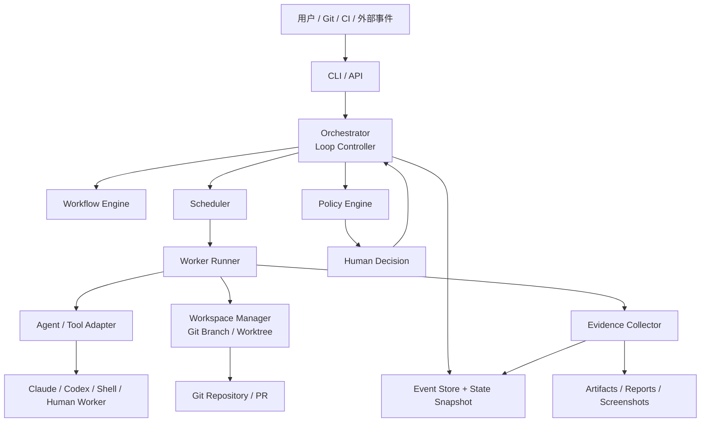
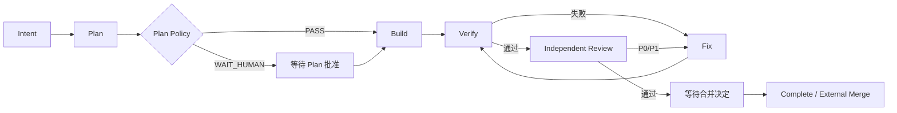

# BuildBeat v2：AI 原生软件交付控制平面
## 产品规划与落地计划书

**文档状态：** 已被 [`V2-PLAN.md`](V2-PLAN.md) 合并取代；仅作为报告 B 的运行时设计输入，不再单独执行，冲突以 `V2-PLAN.md` 为准
**编制日期：** 2026 年 8 月 27 日
**规划对象：** BuildBeat v2
**核心前提：** 不以 BuildBeat v1 的定位、固定 Gate、文件结构、角色模型和 CLI 边界为约束；从目标、核心模型和运行架构重新设计。本文的 Kernel-first 顺序、无 Spec 默认流、v1 Importer 等主张已被终版裁决改写，不得绕过 `V2-PLAN.md` 直接执行。

---

# 1. 一页结论

BuildBeat v2 不再被定义为“多 AI 会话之间的文件协作协议与脚手架”，而应升级为：

> **一个 AI 原生软件交付控制平面。它通过版本化工件、策略化 Gate、可恢复 Agent Loop 和可验证证据，持续推动工作从意图走向交付，并只在需要人类判断时暂停。**

其核心运行目标是：

```text
人提出或批准目标
        ↓
BuildBeat 自动规划、执行、验证、修复和审查
        ↓
证据不足则继续 Loop
风险或权限超出策略则暂停
        ↓
最终停在人类必须作出的决定前
```

MVP 首先实现：

```text
Plan
  ↓
Build
  ↓
Verify ──失败──→ Fix ──→ Verify
  ↓通过
Independent Review
  ↓发现问题
Fix ──→ Verify ──→ Review
  ↓通过
WAIT_HUMAN：等待合并决定
```

BuildBeat v2 的完整产品构成变为：

```text
BuildBeat Protocol
+ Deterministic Kernel
+ Workflow / Policy Engine
+ Agent Runner
+ Tool Adapters
+ Evidence & Event Ledger
```

v1 不再继续扩展成 v2，而是进入维护线；v2 使用新的核心模型、配置格式和运行时。

---

# 2. 为什么不能继续在 v1 上增加功能

## 2.1 当前 BuildBeat 的真实形态

当前 BuildBeat 将自身定义为 file-first、human-gated 的工程交付协议与脚手架，并明确不负责创建 Agent、管理模型或提供运行时编排。

当前 CLI 的主要职责是：

```text
doctor
init
adopt
upgrade
version
```

Gate、状态、证据、ADR 和规范工作流由 Skill、项目文件和脚本维护，CLI 不承担这些运行职责。

当前项目还将以下概念固化进核心协议：

- `NOW → 看板 → contracts → status/evidence`；
- 产品、全栈、测试三个 AI 视角；
- Gate1 需求、Gate2 设计、Gate3 合并、Gate4 上线；
- `pm/status/{视角}.md` 状态分写；
- review-ready 后调用一个独立 reviewer。

四个 Gate 目前是看板中的固定机器令牌。
Reviewer 已经具有独立上下文、固定 candidate、只读检查、closure 等合理机制，但它仍是主会话手动触发的单个 Subagent，不构成完整自动 Loop。

## 2.2 当前架构无法自然承载的能力

在现有结构上继续增加自动 Loop，会遇到以下根本冲突：

| v1 设计 | v2 自动运行需要 |
|---|---|
| CLI 是可选增强 | Runner 是自动 Loop 的必要组件 |
| 所有关键状态尽量进 Git | 高频运行状态、锁、重试和会话信息需要运行时存储 |
| Gate 是四个阶段令牌 | Gate 应附着在任意状态转换和危险动作上 |
| 产品/全栈/测试是默认视角 | Worker 应按能力和任务动态组合 |
| 人负责打开和接续会话 | 系统应自动调度下一 Worker |
| `status` 记录当前进展 | 当前状态应由事件和状态机派生 |
| reviewer 只在末期启动 | 构建、测试、修复、验证需要持续自动循环 |
| Skill-only 能力不能弱于 CLI | 自动运行能力无法在没有 Runtime 的情况下等价存在 |

因此，v2 不是在 v1 上增加几个命令或 Subagent，而是重建产品核心。

---

# 3. 新产品定位

## 3.1 产品定义

> **BuildBeat 是一个模型与工具无关的 AI 原生软件交付控制平面。它读取工作目标和项目策略，调用外部 Agent 或工程工具执行任务，根据证据和 Policy 推进状态，并在风险、权限或判断超出自动化边界时升级给人。**

## 3.2 核心输入与输出

### 输入

```text
项目仓库
工作目标
项目规则与约束
Workflow
Policy
可用 Worker / Adapter
预算和权限
```

### 输出

```text
可审查的交付候选
版本化工件
测试和验证证据
完整事件记录
需要人类处理的最小决策
```

## 3.3 目标用户

第一阶段面向：

- 使用 Claude Code、Codex、Cursor 等 AI Coding 工具的个人开发者；
- 一个开发者同时运行多个 AI Worker 的场景；
- 希望将 Build、Verify、Fix、Review 连成自动闭环的项目；
- 需要保留人类合并和发布权，但不希望人工调度每一个 AI 会话的团队。

后续可扩展到：

- 多人共享的远程 Runner；
- GitHub PR / CI 驱动交付；
- 多仓库和多部署单元；
- 生产异常到修复 PR 的自动闭环。

## 3.4 v2 的核心价值

1. **人不再充当 Agent 调度器。**
2. **Agent 不能用自然语言声明替代实际完成证据。**
3. **低风险步骤自动循环，高风险步骤才请求人类。**
4. **每次执行可以暂停、恢复、追踪和审计。**
5. **更换模型或 AI 工具不改变工作协议。**
6. **审批绑定精确工件和 candidate，不会因后续修改而继续有效。**

---

# 4. 产品边界

## 4.1 v2 要做

- 定义和运行软件交付 Workflow；
- 调度 Planner、Builder、Fixer、Verifier、Reviewer 等 Worker；
- 管理 Agent Loop；
- 建立状态机和事件日志；
- 管理 worktree、分支、candidate 和写入边界；
- 收集实际测试、命令、截图和审查证据；
- 根据 Policy 自动推进、重试、路由或暂停；
- 支持人类批准、拒绝、修改和恢复；
- 提供不同 AI 工具的 Adapter；
- 提供本地优先的完整运行能力。

## 4.2 MVP 暂不做

- 自动合并 PR；
- 自动生产部署；
- 自动接受安全或合规风险；
- 多人账号、RBAC、SSO；
- Web 管理后台；
- 远程多节点调度；
- 自研大模型或模型路由平台；
- Agent Marketplace；
- 多项目效能排行榜；
- 无限自主运行；
- 完整的生产 Incident 自动修复；
- 多仓事务式原子提交。

---

# 5. 核心设计原则

## 5.1 Kernel 决策，Worker 执行

BuildBeat Kernel 负责：

```text
状态
Workflow
Policy
权限
调度
重试
预算
证据要求
事件记录
```

Worker 负责：

```text
计划
编码
修复
验证
审查
```

Worker 可以提出建议，但不能自行决定是否进入下一状态。

---

## 5.2 Artifact-first，而不是 Status-first

系统不再围绕“某个会话做到哪一步”工作，而是围绕版本化工件工作：

```text
Intent
Spec
Plan
Patch / Candidate
Evidence
Review Findings
Decision
Release Record
```

下一个 Worker 只依赖被接受的工件，不依赖上一个聊天窗口。

---

## 5.3 Gate 是 Policy 结果，不是固定阶段

不再将 Gate1–Gate4 写死在核心模型中。

Gate 是：

> **针对某一次状态转换或危险动作执行的一组 Policy。**

例如：

```text
plan → build
verify → review
review → ready-to-merge
staging → production
incident → rollback
```

---

## 5.4 人类是升级目标，不是默认调度器

系统应尽量自动推进，只在以下情况暂停：

- 产品或方案存在真实取舍；
- 修改超出已批准范围；
- 需要接受安全或合规风险；
- 涉及合并、发布或不可逆外部动作；
- 证据不足；
- 多次重试仍无进展；
- 权威事实冲突；
- 预算或权限不足。

---

## 5.5 验证结果必须来自实际执行

测试是否通过，应由 Runner 记录真实命令结果，而不是相信 Worker 的描述。

同理：

- candidate 由 Git 回读；
- 工作树状态由 Git 回读；
- 测试结果由进程退出码和报告回读；
- 截图由实际渲染生成；
- Approval 绑定工件摘要；
- 外部状态无法回读时必须标记 `UNVERIFIED`。

---

## 5.6 运行必须可恢复

任何 Run 都必须能够：

```text
暂停
进程异常退出
重新启动 BuildBeat
读取事件记录
恢复到最近一个安全状态
继续执行
```

不能依赖某个 AI 会话仍然存在。

---

## 5.7 自动化必须有上限

所有 Loop 都必须具有：

```text
最大尝试次数
最大运行时间
最大成本或 Token 预算
连续相同失败检测
无进展检测
范围漂移检测
人类升级条件
```

---

## 5.8 本地优先，远程可扩展

MVP 先实现本地前台 Runner，但核心接口必须允许后续接入：

- GitHub Actions；
- 自托管 Runner；
- 远程事件存储；
- 团队共享控制面；
- Web UI。

---

# 6. 新核心模型

## 6.1 核心实体

| 实体 | 定义 |
|---|---|
| **Project** | 项目配置、仓库、Workflow、Policy 和 Adapter 集合 |
| **Work** | 一个要达成的用户级结果，生命周期可跨多个 Run |
| **Run** | 对一个 Work 的一次具体执行，可失败、重试或被替代 |
| **Workflow** | Step、Transition 和默认执行顺序的声明 |
| **Step** | 一次可调度执行单元，例如 plan、build、verify |
| **Worker** | 具有某种能力的逻辑执行者，例如 builder、reviewer |
| **Adapter** | 将 Worker 映射到 Claude、Codex、Shell 或其他执行环境 |
| **Artifact** | Worker 产生或消费的版本化工件 |
| **Evidence** | 对某个声明进行证明的机器或人工证据 |
| **Policy** | 判断某次转换或动作是否允许的规则 |
| **Decision** | 人类对精确工件或状态转换作出的决定 |
| **Event** | Run 中发生的不可变事实记录 |
| **Workspace** | 某个 Worker 实际工作的隔离目录、分支或 worktree |

---

## 6.2 Work 与 Run 的区别

### Work

表示长期目标：

```text
修复支付回调重复入账
增加订单导出功能
迁移鉴权服务
```

### Run

表示一次执行：

```text
RUN-001：第一次自动实现，验证失败
RUN-002：根据新计划重新执行
```

一个 Work 可以对应多个 Run，但只有一个最终 accepted candidate。

---

## 6.3 状态模型

### Work 状态

```text
OPEN
COMPLETED
CANCELLED
```

### Run 状态

```text
CREATED
QUEUED
RUNNING
WAITING_HUMAN
BLOCKED
SUCCEEDED
FAILED
CANCELLED
SUPERSEDED
```

### Step 状态

```text
PENDING
READY
RUNNING
SUCCEEDED
FAILED
SKIPPED
CANCELLED
```

核心状态机只识别通用运行状态；`plan`、`build`、`review` 等业务阶段由 Workflow 定义，不写死进 Kernel。

---

## 6.4 Gate 统一结果

```text
PASS
RETRY
ROUTE
WAIT_HUMAN
BLOCK
UNVERIFIED
```

| 结果 | 行为 |
|---|---|
| `PASS` | 进入下一 Step |
| `RETRY` | 重新运行当前 Step 或指定修复 Step |
| `ROUTE` | 转交给另一 Worker |
| `WAIT_HUMAN` | 持久化状态并暂停 |
| `BLOCK` | 确定性终止当前转换 |
| `UNVERIFIED` | 无法安全判断，按 Policy 升级、补证或暂停 |

`UNVERIFIED` 绝不能被隐式当成 `PASS`。

---

# 7. 总体架构



---

## 7.1 Deterministic Kernel

Kernel 必须保持确定性，包含：

- Workflow 解析；
- 状态迁移；
- Policy 组合；
- Event reducer；
- Retry 和 Budget；
- 锁和并发控制；
- Approval 有效性；
- Candidate 身份；
- Evidence 完整性；
- Run 恢复。

Kernel 不解释自然语言，不自行做产品判断。

---

## 7.2 Orchestrator

Orchestrator 是自动 Loop 的控制器，负责：

1. 读取当前 Run 状态；
2. 找到下一个可运行 Step；
3. 运行前置 Policy；
4. 分配 Workspace；
5. 调用 Worker Runner；
6. 收集结果和证据；
7. 运行后置 Policy；
8. 决定转换、重试、路由或暂停；
9. 将全部事件写入 Ledger。

---

## 7.3 Worker Runner

Runner 负责执行 Worker：

- 准备上下文；
- 固定输入工件版本；
- 设置允许写入的路径；
- 设置预算、超时和环境变量；
- 启动 Adapter；
- 捕获标准输出、错误输出和退出状态；
- 收集 Worker 结果；
- 终止超时或越权执行。

---

## 7.4 Adapter

MVP 首先提供：

1. **Mock Adapter**
   用于状态机、错误和恢复测试。

2. **Shell Adapter**
   执行配置化命令，可接入任意支持 CLI 的 Agent 工具。

3. **Manual Adapter**
   允许人或外部工具手动完成 Step，再由 BuildBeat 继续推进。

第一个专用 AI Adapter 在 Shell Loop 跑通后再选择，不提前绑定 Claude 或 Codex。

---

## 7.5 Workspace Manager

MVP 默认每个 Run 使用独立 worktree：

```text
.buildbeat/worktrees/<run-id>/
```

职责包括：

- 创建分支和 worktree；
- 检查基线 commit；
- 防止多个 Run 写同一 Workspace；
- 固定 candidate；
- 检测未提交修改；
- 回收失败 Workspace；
- 保留必要调试现场。

第一版只支持：

```text
一个 Project
一个 Repository
一个活动 Run
```

多仓和同项目多 Run 并发在后续阶段开放。

---

# 8. 默认软件交付 Workflow

核心引擎不写死阶段，但提供一个官方默认 Preset：



## 8.1 默认执行规则

### Intent

明确：

- 为什么做；
- 目标；
- 非目标；
- 范围；
- 约束；
- 验收条件。

### Plan

明确：

- 修改范围；
- 实现顺序；
- 契约或数据变化；
- 风险；
- 测试方法；
- 回滚方式。

### Build

Builder 只能修改 Workflow 授权的 Workspace 和路径。

### Verify

确定性运行：

- build；
- lint；
- unit test；
- integration test；
- 项目声明的其他检查。

### Fix

Fixer 输入必须包括：

- 失败命令；
- 退出码；
- 日志摘要；
- candidate；
- 允许修改的范围。

### Independent Review

Reviewer：

- 使用 fresh context；
- 默认只读；
- 不允许修改代码；
- 对照 Intent、Plan、Diff 和 Evidence；
- 产生结构化 findings。

### Merge Decision

MVP 到此暂停，不自动合并。

---

# 9. 三种 Loop

## 9.1 Step 内反馈 Loop

```text
Worker 修改
→ 运行快速检查
→ 失败
→ Worker 继续修
```

由 Adapter 或 Worker 内部完成，但仍受预算和超时限制。

## 9.2 Workflow 交付 Loop

```text
Build
→ Verify
→ Fix
→ Verify
→ Review
→ Fix
→ Verify
→ Review
```

这是 v2 MVP 的重点，由 Orchestrator 控制。

## 9.3 生命周期 Loop

```text
生产异常
→ Intent
→ Plan
→ Build
→ Verify
→ Review
→ Release
→ 生产验证
```

该能力作为后续版本目标，不进入 MVP。

---

# 10. Loop 终止和升级条件

以下任一情况发生时，自动 Loop 必须停止：

| 条件 | 处理 |
|---|---|
| 达到最大修复次数 | `WAIT_HUMAN` |
| 连续两次出现相同失败指纹 | `WAIT_HUMAN` |
| Candidate 无实质变化 | 判定无进展 |
| Worker 修改超出 Scope | `BLOCK` |
| 计划需要改变 | 返回 Plan Step 或请求人类 |
| 发现新的高风险语义 | 路由安全 Reviewer 或人类 |
| Token、时间或费用超预算 | `WAIT_HUMAN` |
| Workspace 不干净或锁冲突 | `BLOCK` |
| 证据收集不完整 | `UNVERIFIED` |
| Adapter 不支持必要的强制能力 | 降级或阻断 |
| 人类拒绝继续 | `CANCELLED` |

建议 MVP 默认：

```text
build/fix 最大尝试：4
review 修复轮次：2
连续相同失败：2
单 Step 超时：项目配置
总 Run 预算：项目配置
```

---

# 11. Gate 与 Policy 重构

## 11.1 删除固定 Gate1–Gate4

固定四 Gate 不再属于核心协议。

它们可以作为迁移 Preset：

```text
legacy-four-gates
```

但新 Workflow 可以没有设计 Gate，也可以拥有安全、数据迁移、发布窗口等更多 Gate。

---

## 11.2 四类 Policy

### 前置 Policy

判断某 Step 是否可以启动：

```text
Plan 是否已接受
Workspace 是否干净
依赖工件是否齐全
预算是否充足
```

### 后置 Policy

判断 Step 是否真正完成：

```text
测试是否通过
Evidence 是否齐全
Artifact 是否产生
Candidate 是否固定
```

### 转换 Policy

决定下一状态：

```text
Verify 失败 → Fix
Review P1 → Fix
Review 通过 → WAIT_HUMAN
```

### Action Policy

约束 Worker 内部危险动作：

```text
merge
push
deploy
publish
migration
删除远端资源
修改生产配置
```

---

## 11.3 Human Approval 必须绑定精确对象

Approval 不再是：

```text
Gate3: passed
```

而是：

```yaml
decision: approved
transition: review-to-ready-for-merge
subject:
  candidate: 7f3a12c
  planDigest: sha256:...
  evidenceDigest: sha256:...
approvedBy: human
approvedAt: 2026-08-27T...
```

只要 candidate、Plan 或必要 Evidence 发生变化，Approval 自动失效：

```text
APPROVAL_STALE
```

---

## 11.4 强制等级

每条 Policy 都应声明强制等级：

| 等级 | 含义 |
|---|---|
| `ADVISORY` | 通过 Prompt 或规则提示 Worker |
| `LOCAL_ENFORCED` | 由本地 Runner、Hook 或 Workspace 权限阻断 |
| `SERVER_ENFORCED` | 由 Branch Protection、CI 或部署平台阻断 |

MVP 不得宣称所有规则都被强制执行。Adapter 不支持确定性限制时，必须显示实际强制等级。

---

# 12. Worker 与 Adapter 合同

## 12.1 Worker 输入

```text
Project ID
Work ID
Run ID
Step ID
Objective
Scope
Base commit
Candidate commit
输入 Artifact
项目规则
允许工具
允许写入路径
预算
超时
前序 Evidence
```

## 12.2 Worker 输出

```yaml
status: succeeded | failed | blocked
summary: ...
artifacts:
  - kind: plan
    path: delivery/work/WORK-001/plan.md
changes:
  base: abc1234
  candidate: def5678
evidence:
  - kind: test
    ref: ...
findings: []
suggestedAction: verify
```

`suggestedAction` 只是一项建议。真正的下一状态由 Kernel 和 Policy 决定。

---

# 13. Evidence Contract

每份证据至少包含：

| 字段 | 含义 |
|---|---|
| `kind` | test、build、review、screenshot、deployment 等 |
| `subject` | 所证明的 Artifact 或 candidate |
| `producer` | Runner、Worker、外部系统或人 |
| `command` | 实际执行命令，适用时 |
| `exitCode` | 实际退出码 |
| `startedAt` / `finishedAt` | 执行时间 |
| `digest` | 证据内容摘要 |
| `location` | 本地路径或外部权威引用 |
| `coverage` | 已覆盖和未覆盖范围 |
| `status` | passed、failed、unverified |
| `adapter` | 证据来源 Adapter |

Worker 的自然语言总结不能单独作为测试通过证据。

---

# 14. 存储设计

## 14.1 双平面存储

### Git 中保存

- Workflow；
- Policy；
- Worker 定义；
- 项目标准；
- Intent、Spec、Plan；
- accepted candidate 引用；
- Review 报告；
- Human Decision；
- 需要长期保存的 Evidence manifest；
- Work 最终摘要。

### 本地 Runtime 保存

- 当前 Run 状态；
- Step 执行状态；
- Agent 进程和 session 信息；
- 锁；
- 重试次数；
- Budget；
- 临时日志；
- 未完成事件；
- Workspace 元数据。

---

## 14.2 MVP Runtime 格式

MVP 不先引入数据库服务，采用：

```text
append-only events.jsonl
+ atomic state snapshot
+ lock directory
```

目录建议：

```text
.buildbeat/runtime/
├── events.jsonl
├── state.json
├── locks/
├── sessions/
└── logs/
```

该目录默认进入 `.gitignore`。

状态必须可以完全由 Event Ledger 重建。`state.json` 只是加速快照，不是唯一真相源。

后续通过 `StateStore` 接口增加 SQLite 或远程存储。

---

# 15. 新项目目录

```text
<project>/
├── AGENTS.md
├── standards/
│   ├── STACK.md
│   ├── CODE.md
│   ├── REVIEW.md
│   └── DESIGN.md
├── .buildbeat/
│   ├── project.yaml
│   ├── workflows/
│   │   └── software-delivery.yaml
│   ├── policies/
│   │   ├── default.yaml
│   │   └── protected-actions.yaml
│   ├── workers/
│   │   ├── planner.yaml
│   │   ├── builder.yaml
│   │   ├── fixer.yaml
│   │   ├── verifier.yaml
│   │   └── reviewer.yaml
│   ├── adapters/
│   │   └── shell.yaml
│   └── runtime/                 # gitignored
└── delivery/
    └── work/
        └── WORK-001/
            ├── work.yaml
            ├── intent.md
            ├── spec.md
            ├── plan.md
            ├── decisions.jsonl
            ├── reviews/
            ├── evidence/
            └── summary.md
```

## 15.1 `AGENTS.md` 的新职责

`AGENTS.md` 继续承担项目级 AI 规则入口，但不再保存：

- 当前工作包状态；
- 调度顺序；
- Gate 状态；
- Agent handoff；
- Run 状态。

Adapter 应显式将当前 Work、Artifact 和 Scope 传给 Worker，不再依赖工具是否自动加载某个文件。

---

# 16. CLI 规划

## 16.1 项目与环境

```bash
buildbeat init
buildbeat doctor
buildbeat workflow validate
buildbeat adapter list
buildbeat adapter doctor
```

## 16.2 Work

```bash
buildbeat work create
buildbeat work list
buildbeat work show WORK-001
buildbeat work close WORK-001
```

## 16.3 Run

```bash
buildbeat run start WORK-001
buildbeat run status RUN-001
buildbeat run inspect RUN-001
buildbeat run resume RUN-001
buildbeat run retry RUN-001
buildbeat run stop RUN-001
```

## 16.4 人类决定

```bash
buildbeat approve RUN-001 --transition plan-to-build
buildbeat reject RUN-001 --transition plan-to-build
buildbeat approve RUN-001 --transition review-to-ready-for-merge
```

命令执行前必须展示：

- 当前状态；
- 将批准的精确对象；
- candidate；
- Evidence；
- 风险；
- 批准后将发生的动作。

## 16.5 调试和审计

```bash
buildbeat events RUN-001
buildbeat evidence RUN-001
buildbeat explain RUN-001
buildbeat replay RUN-001 --dry-run
```

---

# 17. v1 概念迁移

## 17.1 保留、转换和删除

| v1 概念 | v2 处理 |
|---|---|
| Evidence-based completion | 保留并升级为 Evidence Contract |
| 独立 reviewer | 保留并升级为标准 Worker |
| fail-closed / unverified | 保留 |
| Git 版本化事实 | 保留，但不承载全部运行时状态 |
| `AGENTS.md` | 保留为项目规则入口 |
| `STACK/CODE/REVIEW/DESIGN` | 保留为 Policy 输入工件 |
| 固定 Gate1–Gate4 | 从核心删除，作为 Legacy Preset |
| 产品/全栈/测试视角 | 从核心删除，转换为可选 Worker Preset |
| `NOW.md` | 删除为必需入口，可提供生成式兼容视图 |
| 当期看板 | 不再是状态权威，可转换为 Work 列表视图 |
| `pm/status/{视角}.md` | 删除为核心状态源 |
| `pm/changes/` | 转换为 Work + Artifact |
| `decisions.md` | 转换为 Decision Event 和导出视图 |
| `bus-check.sh` | 拆为确定性 Evidence Provider 和 Policy Check |
| `verify-status.sh` | 转换为 Verify Provider |
| `drift-check.sh` | 转换为 Runtime / Production Evidence Provider |
| CLI 不调用 Agent | 修改为 Kernel 确定性、Runner 可调用外部 Agent |
| Skill-only 完整等价 | 取消；手工模式是降级兼容，不承诺自动能力等价 |

---

## 17.2 运行模式变化

### v1

```text
Skill-only 是完整模式
CLI 是可选增强
```

### v2

```text
Runtime Mode：
完整自动 Loop，需要 BuildBeat Runner

Manual Mode：
文件和 Workflow 仍可人工执行，
但不具备自动调度、重试和恢复能力
```

Manual Mode 是兼容和故障降级能力，不再与 Runtime Mode 功能等价。

---

# 18. v1 与 v2 发布策略

## 18.1 版本线

- `1.x`：维护线，只修安全问题和严重缺陷；
- `2.0.0-alpha`：核心模型和本地 Runner；
- `2.0.0-beta`：真实 Agent Loop 和迁移试点；
- `2.0.0`：完成规定的真实项目验收后发布。

当前项目已经有较完整的 v1 CLI、模板和测试资产，应保留作为稳定基线，不在同一主干中边维护旧协议边重写全部语义。当前源码主要集中在 CLI、项目扫描、规划、写入和升级模块，可在代码审计后选择性复用底层工具，但不沿用其领域模型。

## 18.2 分支建议

```text
v1-maintenance
    维护 1.x

v2
    v2 开发和试点

main
    在 v2 达到 Beta 退出条件后切换
```

npm 使用：

```text
latest → 稳定 v1
next   → v2 alpha/beta
```

在 v2 Beta 前不让 `latest` 自动指向新架构。

---

# 19. v2 MVP 范围

## 19.1 MVP 必须具备

1. 一个项目、一个仓库、一个活动 Run；
2. Workflow 加载和校验；
3. Policy Engine；
4. Event Ledger 和恢复；
5. Mock Adapter；
6. Shell Adapter；
7. worktree 隔离；
8. Builder、Fixer、Verifier、Reviewer Worker 合同；
9. Build–Verify–Fix 自动 Loop；
10. Review–Fix–Verify 自动 Loop；
11. Retry、Budget、Timeout、无进展检测；
12. Human Approval；
13. Approval stale 检测；
14. Evidence manifest；
15. `run start/status/inspect/resume/stop`；
16. 前台运行；
17. 最终停在合并批准前。

## 19.2 MVP 明确不具备

- 多仓；
- 多 Run 并发；
- 后台 daemon；
- Web UI；
- 自动 PR 合并；
- 自动部署；
- 远程团队共享；
- Agent Marketplace；
- 自动动态生成任意 Workflow；
- 生产 Incident Loop。

---

# 20. MVP Definition of Done

在一个真实 Git 项目中，执行：

```bash
buildbeat run start WORK-001
```

系统必须能够：

1. 读取被接受的 Intent 和 Plan；
2. 创建独立 worktree；
3. 启动 Builder；
4. 固定 candidate；
5. 运行真实测试；
6. 测试失败时自动路由 Fixer；
7. 在限定次数内重新测试；
8. 测试通过后启动 fresh-context Verifier；
9. Verifier 发现问题时自动路由 Fixer；
10. 再次执行验证；
11. 启动只读 Reviewer；
12. P0/P1 存在时进入修复闭环；
13. 无阻断后进入 `WAITING_HUMAN`；
14. 展示 candidate、Plan、Review 和 Evidence；
15. 不自动 merge；
16. 中途终止进程后可以恢复；
17. 每一次执行和状态转换均可通过 Event Ledger 解释；
18. Approval 在 candidate 改变后自动失效；
19. 达到重试或预算上限后不会继续死循环；
20. 所有未验证范围被明确暴露。

---

# 21. 落地路线图

以下周期为单人主导、AI 辅助开发的建议基线，不作为不可调整的发布日期。

| 里程碑 | 建议周期 | 目标 | 退出条件 |
|---|---:|---|---|
| **M0 核心重置** | 1 周 | 完成新定位、模型和协议 RFC | 核心名词、MVP 和非目标不再存在歧义 |
| **M1 Deterministic Kernel** | 2 周 | 状态机、事件、Workflow、Policy | Mock Workflow 可确定性模拟和重放 |
| **M2 Runner 与隔离** | 2 周 | Workspace、Shell/Mock Adapter、Evidence | 无 AI 情况下完整跑通模拟 Loop |
| **M3 自动 Agent Loop** | 3 周 | Build–Verify–Fix–Review | 一个真实项目可自动推进到 WAITING_HUMAN |
| **M4 Policy 与人工控制** | 2 周 | Approval、stale、预算、危险动作 | 无法绕过 candidate 绑定和重试上限 |
| **M5 Eval 与真实试点** | 3 周 | 行为 Eval、自托管、外部项目试点 | 达到 Pilot 指标，关键失败模式关闭 |
| **M6 Beta 与迁移** | 2 周 | v1 importer、文档、npm next | 发布 `2.0.0-beta.1` |

建议总窗口：**15 周左右**。

---

# 22. 分阶段工作包

## M0：核心重置

### WP0.1 产品定位 RFC

交付：

```text
docs/v2/RFC-0001-product-definition.md
```

必须回答：

- BuildBeat 是什么；
- 不是什么；
- 谁使用；
- Runner 是否核心；
- 手工模式是什么地位；
- v1 是否继续演进。

### WP0.2 领域模型 RFC

交付：

```text
docs/v2/RFC-0002-domain-model.md
```

定义：

```text
Project
Work
Run
Workflow
Step
Worker
Adapter
Artifact
Evidence
Policy
Event
Decision
Workspace
```

### WP0.3 Workflow 与 Policy RFC

交付：

```text
docs/v2/RFC-0003-workflow-policy.md
```

明确：

- GateResult；
- 转换顺序；
- Human Approval；
- stale；
- retry；
- route；
- block；
- unverified。

### WP0.4 v1 冻结

- 创建 `v1-maintenance`；
- 标记 v1 功能冻结；
- v1 新需求默认转入 v2 评估；
- 不再向固定 Gate 和 status 体系增加新能力。

### M0 退出标准

- 通过三个 RFC；
- MVP 需求稳定；
- 所有旧概念已标记为保留、转换或删除；
- 不开始真实 Adapter 开发。

---

## M1：Deterministic Kernel

### WP1.1 Schema

建立：

```text
project.schema.json
workflow.schema.json
policy.schema.json
worker.schema.json
artifact.schema.json
evidence.schema.json
event.schema.json
```

用户配置使用 YAML，内部验证使用 JSON Schema。

### WP1.2 Event Store

实现：

- append-only JSONL；
- 单调 event sequence；
- hash 或 checksum；
- 原子追加；
- Event replay；
- snapshot 重建；
- corrupted log 检测。

### WP1.3 State Reducer

根据 Event 计算：

- Run 状态；
- Step 状态；
- attempts；
- budgets；
- current candidate；
- pending human request；
- evidence coverage。

### WP1.4 Workflow Engine

实现：

- Step；
- Transition；
- entry；
- terminal；
- retry route；
- branch；
- skip；
- loop detection。

### WP1.5 Policy Engine

第一版支持：

```text
all
any
not
evidence.exists
artifact.accepted
attempts.lt
budget.remaining
candidate.clean
human.approved
finding.maxSeverity
```

### WP1.6 Simulator

```bash
buildbeat workflow simulate
```

不调用 Worker，只输入模拟事件并输出状态变化。

### M1 退出标准

- 任何状态都可以由事件重建；
- 非法转换被拒绝；
- `UNVERIFIED` 不会变成 `PASS`；
- Retry 不会超过上限；
- 终态不能被普通事件重新打开；
- 100% 核心转换有单元测试。

---

## M2：Runner 与执行隔离

### WP2.1 Workspace Manager

- 创建 worktree；
- 基线校验；
- 分支命名；
- 锁；
- candidate 回读；
- dirty 检测；
- cleanup policy。

### WP2.2 Worker Contract

实现标准输入输出 envelope。

### WP2.3 Mock Adapter

支持：

- 成功；
- 失败；
- 超时；
- 输出非法；
- 修改超 Scope；
- 进程崩溃；
- 相同失败重复。

### WP2.4 Shell Adapter

配置示例：

```yaml
adapter:
  type: shell
  command: agent-cli
  args:
    - run
    - --input
    - "{input}"
    - --output
    - "{output}"
```

### WP2.5 Evidence Collector

第一版收集：

- command；
- exit code；
- stdout/stderr digest；
- test report path；
- Git diff；
- base/candidate；
- working tree 状态。

### WP2.6 Runtime CLI

实现：

```text
run start
run status
run inspect
run resume
run stop
events
evidence
```

### M2 退出标准

- Mock Adapter 可以完整执行多 Step Workflow；
- 进程被中止后可以恢复；
- 两个进程不能同时占用同一 Run；
- Worker 无法将自然语言声明伪装成命令成功；
- candidate 与证据均来自实际回读。

---

## M3：自动 Agent Loop

### WP3.1 Planner Worker

输出结构化 Plan，并明确：

- Scope；
-文件或模块；
-风险；
-验证；
-非目标。

### WP3.2 Builder Worker

- 只消费 accepted Plan；
- 只能写 Workspace；
- 不能修改 Policy 和 Workflow；
- 输出 candidate。

### WP3.3 Fixer Worker

输入必须包含失败 Evidence，不接受泛化的“再检查一下”。

### WP3.4 Verifier Worker

- fresh context；
- 默认只读分析；
- 可运行声明的检查；
- 输出结构化 verdict；
- 不直接推进状态。

### WP3.5 Reviewer Worker

将当前 reviewer 的合理机制迁入通用 Worker Contract：

- candidate 固定；
- 只读；
- fresh context；
- findings 分级；
- 不允许自己批准合并。

### WP3.6 Loop Controller

实现：

```text
build → verify
verify failed → fix
fix → verify
verify passed → review
review blocked → fix
review passed → wait human
```

### WP3.7 无进展检测

失败指纹至少结合：

```text
Step
command
exit code
关键错误摘要
candidate diff digest
```

### M3 退出标准

- 在一个真实测试项目中，系统可自动修复预埋 Bug；
- 测试失败不会进入 Review；
- Reviewer 不能修改代码；
- Reviewer findings 可自动进入 Fix Loop；
- 最终停在 `WAITING_HUMAN`。

---

## M4：Policy、权限与人类控制

### WP4.1 Approval

批准对象绑定：

```text
transition
artifact revision
candidate
evidence digest
```

### WP4.2 Stale Detection

任何受保护输入发生改变：

```text
approval → stale
run → WAITING_HUMAN
```

### WP4.3 Risk Profile

提供三个官方 Preset：

#### Fast

```text
自动 Plan
自动 Build/Verify/Review
人工 Merge
```

#### Standard

```text
人工批准 Plan
自动 Build/Verify/Review
人工 Merge
```

#### Controlled

```text
人工批准 Intent
人工批准 Plan
自动 Build/Verify/Review
人工 Merge
人工 Release
```

这些是 Preset，不是核心固定 Gate。

### WP4.4 Protected Actions

MVP 禁止 Worker 执行：

```text
merge
deploy
publish
force push
remote delete
production mutation
```

最可靠的方式不是提示词阻止，而是不给 Worker 相应凭据和能力。

### WP4.5 Budget

支持：

```text
maxAttempts
maxDuration
maxCost
maxTokens
maxNoProgress
```

### M4 退出标准

- candidate 改变后旧 Approval 无效；
- Worker 无法直接到达合并或发布；
- 所有 Loop 均有终止上限；
- Policy 决策可解释；
- 人工决定后 Run 可以安全恢复。

---

## M5：Eval 与试点

当前 CI 已经覆盖文档、Shell、CLI 和打包等确定性行为，但还没有验证 Agent 是否真正遵循协议。

### WP5.1 Deterministic Test Suite

覆盖：

- 状态机；
- Event replay；
- crash recovery；
- Policy；
- Approval stale；
- retry；
- Budget；
- lock；
- candidate；
- Evidence；
- Adapter failure。

### WP5.2 Agent Behavior Eval

建立：

```text
evals/
├── plan-scope/
├── gate-cannot-self-pass/
├── failing-test-first/
├── fix-loop/
├── reviewer-readonly/
├── stale-approval/
├── protected-action/
├── no-progress/
└── evidence-required/
```

每个 Eval 包含：

```text
fixture repository
task
expected artifacts
allowed actions
forbidden actions
machine checks
semantic rubric
```

### WP5.3 Self-host Pilot

BuildBeat v2 使用自己的 Runner 开发 BuildBeat v2：

```text
BuildBeat builds BuildBeat
```

该试点用于发现：

- Runtime 恢复问题；
- Agent 输出协议问题；
- Scope 漂移；
- Prompt injection；
- Review 自证；
- Event 和 Git 不一致。

### WP5.4 外部 Pilot

至少选择：

1. 一个小型单仓项目；
2. 一个具有真实自动化测试的现有项目；
3. 一个包含 UI 或接口变更的项目。

### M5 退出指标

| 指标 | Beta 目标 |
|---|---:|
| 所有状态转换可追溯 | 100% |
| stale Approval 被复用 | 0 |
| 超预算后继续运行 | 0 |
| 无上限 Loop | 0 |
| 自动到达 `WAITING_HUMAN` 的 Pilot Run | ≥70% |
| 完成 Run Evidence 完整率 | ≥95% |
| 失败 Run 有明确终止原因 | 100% |
| 人工手动切换 Agent 的次数 | 相比 v1 显著减少 |
| Reviewer 自行修改代码 | 0 |

---

## M6：迁移与 Beta

### WP6.1 v1 Importer

新增：

```bash
buildbeat migrate-v1 --dry-run
```

可识别：

- 工作包；
- `pm/changes`；
- decisions；
- standards；
- reviewer；
- verify scripts；
- 当前 candidate 引用。

不得自动猜测：

- 哪个旧状态仍有效；
- 哪个 Gate 仍应通过；
- 哪份文档是 accepted Plan；
- 哪个 status 是权威。

无法确定的内容输出 migration gap。

### WP6.2 迁移策略

1. 只读分析 v1；
2. 生成 v2 Work 和 Artifact 草稿；
3. 人工确认当前活动 Work；
4. 冻结旧看板；
5. 新工作只进入 v2；
6. 历史 v1 文件归档，不双写；
7. 完成一个真实 Run 后才正式切换。

### WP6.3 文档

必须完成：

- 5 分钟快速开始；
- Workflow 编写指南；
- Policy 指南；
- Adapter 指南；
- Worker 合同；
- Evidence 指南；
- Human Approval 指南；
- v1 迁移指南；
- 安全和权限边界；
- 故障恢复手册。

### WP6.4 Beta Release

发布：

```text
@haiyangbg/buildbeat@2.0.0-beta.1
npm dist-tag: next
```

---

# 23. 技术实施建议

## 23.1 语言和工程结构

建议 v2 Kernel 使用：

```text
TypeScript
Node.js 20+
ESM
JSON Schema
YAML 用户配置
Node 原生测试框架或现有测试体系
```

第一阶段不立即拆多个 npm 公共包，先在同一仓库形成稳定模块合同：

```text
src/v2/
├── domain/
├── schemas/
├── engine/
├── policy/
├── runtime/
├── adapters/
├── workspace/
├── evidence/
├── storage/
└── cli/
```

Adapter 合同稳定后，再拆为独立包。

---

## 23.2 模块边界

```text
domain/
  纯类型和不变量

engine/
  Workflow、状态机、Scheduler

policy/
  Policy 解析和求值

runtime/
  Orchestrator、Budget、Retry、恢复

adapters/
  Mock、Shell、Manual

workspace/
  Git、worktree、锁、candidate

evidence/
  Evidence 收集、摘要和验证

storage/
  Event Store、Snapshot、Artifact index

cli/
  用户命令和展示
```

任何 `adapter/` 代码不得直接修改 Kernel 状态；只能返回结构化结果，由 Orchestrator 写入 Event。

---

# 24. 必须测试的系统不变量

1. 未通过前置 Policy 的 Step 永远不能启动。
2. Worker 永远不能直接修改 Run 状态。
3. 人类 Approval 必须绑定精确对象。
4. 对象改变后 Approval 必须失效。
5. 每次状态转换必须对应一个 Event。
6. 每个成功 Step 必须有满足合同的 Evidence。
7. `UNVERIFIED` 不得自动转为通过。
8. Retry 不得超过预算。
9. Reviewer 默认不能写代码。
10. 同一 Workspace 不得被两个活动 Worker 同时占用。
11. Run 终态默认不可逆。
12. Event Ledger 必须能够重建 State。
13. Snapshot 损坏不能导致 Event 丢失。
14. Worker 输出非法时不得推进状态。
15. Adapter 异常退出必须留下失败事实。
16. candidate 改变后旧 Review 和 Approval 不得冒充当前结论。
17. Worker 不得修改自身 Workflow、Policy 或 Evidence 记录。
18. 未配置强制能力时必须公开降级级别。
19. BuildBeat 进程退出不得导致安全边界消失。
20. Merge 和 Release 在 MVP 中没有可调用能力。

---

# 25. 风险与应对

| 风险 | 影响 | 应对 |
|---|---|---|
| v2 范围过大 | 长期停留在架构设计 | 只做单仓、单 Run、前台 Build–Verify–Fix |
| 过早绑定某个 Agent 工具 | 被厂商 CLI 变化牵制 | Mock + Shell 先行，专用 Adapter 后置 |
| Agent 无限修复 | 成本和时间失控 | attempts、budget、无进展检测 |
| Agent 修改控制文件 | 绕过 Workflow 和 Policy | 控制文件只读、隔离 Workspace |
| Worker 伪造证据 | 错误候选被放行 | Runner 回读真实命令和 Git 状态 |
| Approval 过期 | 人批的不是当前代码 | Approval 绑定 digest 和 candidate |
| Runtime 状态损坏 | 无法恢复 | Event sourcing + 原子 Snapshot |
| worktree 管理复杂 | 残留分支和目录 | 明确 lifecycle 和 cleanup policy |
| Semantic Reviewer 不稳定 | 误判或漏判 | 确定性检查优先，语义结论不可独立批准高风险动作 |
| v1/v2 双写 | 新旧事实冲突 | 单向迁移，禁止长期双写 |
| 过早支持多仓 | 状态和事务复杂度骤增 | 多仓延后到单仓 MVP 稳定后 |
| 自动化权限过大 | 产生不可逆损失 | MVP 不提供 merge/deploy capability |

---

# 26. 前两周立即执行清单

## 第 1 周

1. 创建 `v1-maintenance` 分支；
2. 创建 `v2` 分支；
3. 新建 `docs/v2/`；
4. 完成产品定位 RFC；
5. 完成领域模型 RFC；
6. 完成 Workflow / Policy RFC；
7. 删除“Skill-only 必须与 Runtime 等价”的 v2 约束；
8. 将固定 Gate1–Gate4 标记为 Legacy Preset；
9. 冻结 v1 新功能；
10. 建立 v2 决策记录。

## 第 2 周

1. 创建 TypeScript v2 目录；
2. 定义所有核心 Schema；
3. 实现 Event 类型；
4. 实现 append-only Event Store；
5. 实现 State reducer；
6. 实现最小 Workflow parser；
7. 实现 GateResult；
8. 实现 Mock Adapter；
9. 编写第一个软件交付 Workflow；
10. 完成纯模拟的 Build–Verify–Fix Loop。

在第 2 周结束前，不接真实 Claude 或 Codex Adapter。先证明 Kernel、事件和 Loop 本身正确。

---

# 27. Beta 发布前的最终决策点

以下问题在对应阶段必须形成明确结论：

| 决策 | 最晚时间 |
|---|---|
| v2 是否正式采用“交付控制平面”定位 | M0 |
| Artifact 和 Runtime 的存储边界 | M0 |
| Workflow / Policy Schema | M1 |
| Event Store 格式 | M1 |
| 一个 Run 是否强制独立 worktree | M2 |
| 第一个专用 Agent Adapter | M3 |
| 默认 Risk Preset | M4 |
| v1 Importer 的自动化边界 | M5 |
| `main` 何时切换至 v2 | M6 |
| v1 `latest` 何时停止维护 | 2.0 稳定版后单独决定 |

---

# 28. 最终产品形态

BuildBeat v2 的核心不再是：

```text
给项目生成几份规则文件
让多个会话按看板和 status 协作
```

而是：

```text
接受一个工作目标
        ↓
建立版本化工件
        ↓
由确定性 Kernel 推进 Workflow
        ↓
自动调用适合的 Worker
        ↓
根据实际 Evidence 继续、修复或暂停
        ↓
在人类必须判断的地方请求最小决策
        ↓
产生可审查、可恢复、可追溯的交付结果
```

最终产品公式为：

```text
BuildBeat v2
=
Artifact Protocol
+ Deterministic Workflow Kernel
+ Policy-based Gates
+ Agent Loop Runtime
+ Execution Adapters
+ Evidence Ledger
+ Human Escalation
```

## 核心定位语

> **BuildBeat 是一个 AI 原生软件交付控制平面：它让外部 Agent 围绕版本化工件持续计划、构建、验证、修复和审查，并通过策略、证据和人类升级机制控制每一次状态转换。**

## MVP 核心承诺

> **给 BuildBeat 一个已批准的目标和计划，它会自动完成 Build–Verify–Fix–Review 循环，并携带完整证据停在合并决定前。**
