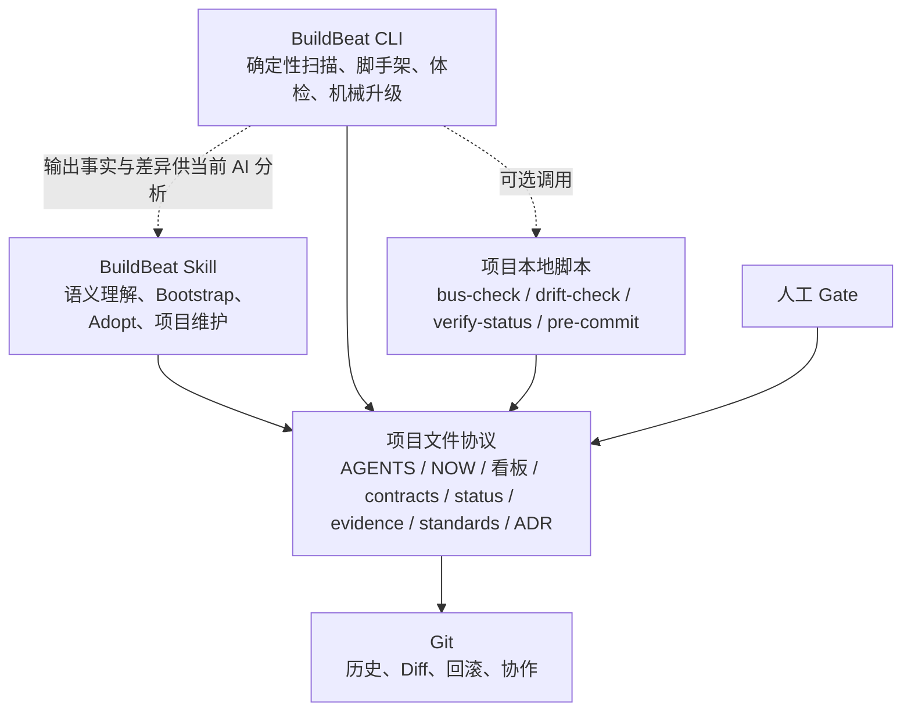

# BuildBeat 新版演进规划书：面向人和 AI 会话的工程交付协议

> 文档状态：方向基线（受下述 2026-08-24 执行修订约束）
> 基线日期：2026-08-23
> 适用项目：BuildBeat 后续产品设计、协议演进与 CLI 开发
> 本文替代此前《BuildBeat 演进规划书：从单人工具到尺度无关的工程协议》。旧规划中的团队激活层、Preset/extends、emit 编译层及相应路线不再执行。

> **2026-08-24 执行修订（生效）**
> 本文保留产品方向与问题定义；交付范围、顺序和验收以 [`EXECUTION-PLAN.md`](EXECUTION-PLAN.md) v3 的 §0 为准，冲突时由执行计划覆盖本文。CLI 仅选择性解冻 `init` / `adopt` 脚手架写入与 `upgrade` 机械升级，`doctor` 保持只读；`gate` / `adr` / `standards` / `check` 等命令面扩张、三方合并引擎和项目卸载引擎继续冻结。具体覆盖关系如下：
>
> - §3.2、§10.2：不再以“完整操作入口”为目标；合法主命令锁定为 `doctor / init / adopt / upgrade / version`，`diff / uninstall` 仅保留为明确的不可用保留名。
> - §10.4：写入采用“哑脚手架 + AI 会话渲染”、干净 Git 工作区、逐文件原子写与失败回删；不实现三方合并或独立 journal。
> - §10.6：Skill-only 始终完整可用；机械升级只接管 schema 2 manifest 管理的文件，旧项目不猜测所有权，继续走手册迁移或经确认后重建基线。
> - §11 Phase 2：技术栈判断、Gate 理由和 standards/ADR 起草归 Skill；CLI 只填项目名、日期、版本等确定项并显式保留待 AI 渲染的占位符。
> - §11 Phase 3/4 与 §17：Phase 3 缩减为机械 `upgrade`、Gate/证据和多仓增强；不再建设完整 CLI 命令面、三方合并、自动卸载或中断恢复。实施顺序以执行计划的工作包依赖为准。

> **2026-08-25 品牌决策（生效）**
> 产品正式更名为 **BuildBeat**。新源码、模板、CLI、Skill 与 Claude plugin 使用 `buildbeat`、`BUILDBEAT.md`、`.buildbeat/manifest.json` 和 `buildbeat-stack-baseline:v1`；旧 `Solobaton` 文件、manifest、marker 与可执行名只作为只读/调用兼容入口。已发布 npm 包 `solobaton` 与当前 GitHub 仓库地址暂作为 legacy distribution/repository ID 保留，任何远端改名、发布或 scoped package 选择仍需独立授权。旧名试点是历史兼容证据，不替代 BuildBeat namespace 的新试点。

---

## 0. 一页结论

| 决策项 | 新结论 |
|---|---|
| 产品定位 | 一套面向人和 AI 会话的工程交付协议，不以单人或团队人数定义产品 |
| 首要问题 | 多个 AI 上下文和长期迭代过程中，项目事实、契约、状态、Gate 与证据容易失去同步 |
| 核心机制 | Git 中的文件总线 + 人工 Gate + 证据制完成 + 可执行检查 |
| 第一优先级 | 执行过程同步：`NOW → 看板 → contracts → status/evidence` 必须持续一致 |
| 第二优先级 | 新项目 Bootstrap 与存量项目 Adopt |
| 后续同级能力 | Gate/证据强化、多仓一致性、完整生命周期 |
| 通用 AI 入口 | `AGENTS.md` 是唯一人工维护的通用 AI 指令入口 |
| 工具适配 | 不做 `emit`；工具专属文件只能是极薄兼容桥或真正的工具专属增量 |
| 工程规范 | 可选的 `STACK.md`、`CODE.md`、`REVIEW.md`；UI 项目可选 `DESIGN.md` |
| 安全规范 | 并入 `CODE.md`，不单独增加 `SECURITY.md` |
| 规范检查 | 文件不存在时跳过；存在时由 `bus-check`/CLI 检查可机器验证部分 |
| 技术栈 | `STACK.md` 是当前项目批准采用的技术栈与工程约束单点，默认对 AI 只读 |
| 决策体系 | 重大、长期架构决策使用独立 ADR；方案比较和规则例外继续进入 `decisions.md` |
| Gate | 固定规格、设计、合并、上线四类；允许按项目类型标记 `N/A`，但必须写理由 |
| CLI | 仅承担确定性脚手架、只读体检与 schema 2 机械升级；不内置或调用大模型 |
| Skill | 不安装 CLI 时仍保留完整能力；CLI 只能增强，不能成为运行前提 |
| 数据与后端 | 项目文件和 Git 仍是核心持久化；不引入账号、数据库、远程后台或遥测 |
| 项目管理 | 不建模成员、岗位、Owner、任务分配或审批矩阵，不做项目管理系统 |
| 暂不做 | 个人/团队默认配置、Preset、extends、跨项目规则继承与同步 |
| 品牌 | 正式名称为 BuildBeat；本地 namespace 迁移先完成，外部分发标识另行决策 |

### 新定位语

> **一套面向人和 AI 会话的工程交付协议。它通过 Git 中的文件总线、人工 Gate 和可验证证据，让项目在长期迭代、多个仓库和多个 AI 上下文之间保持同步、可控、可核验。**

英文草案：

> **An engineering delivery protocol for humans and AI sessions. It uses a Git-based file bus, human gates, and verifiable evidence to keep projects synchronized, controlled, and auditable across long-running iterations, multiple repositories, and multiple AI contexts.**

---

## 1. 产品定义与边界

### 1.1 BuildBeat 是什么

BuildBeat 是项目内的工程交付协议与配套工具，解决以下问题：

1. 不同 AI 会话读取到的项目上下文不一致；
2. 当前目标、工作范围和实际进度发生漂移；
3. 跨仓库或跨服务契约被实现先行、文档滞后；
4. “已完成”缺少测试、渲染、部署或回滚证据；
5. AI 会话在规格、设计、合并和上线等关键节点越权；
6. 新项目或存量项目需要重复建立一套交付纪律；
7. 项目规则存在，但无法被持续检查和维护。

BuildBeat 不负责替代开发者、项目负责人或 AI Coding 工具。它负责让这些参与者围绕同一组项目事实工作。

### 1.2 BuildBeat 不是什么

BuildBeat 不做：

- 项目管理系统；
- 团队成员、岗位、Owner 或任务分配管理；
- 账号、登录、组织后台、RBAC 或 SSO；
- Agent Runtime、模型路由或模型调用平台；
- 实时协作数据库、聊天或通知系统；
- 团队效能评分、个人产出排行或行为遥测；
- 业务代码生成器；
- 跨 AI 工具规则编译器；
- 企业技术栈默认配置平台。

一个人可以使用 BuildBeat，多个人也可以共同使用同一套项目文件，但产品不对“团队”本身建模。

### 1.3 人数与产品模型解耦

项目中可以存在：

- 一个真人调度多个 AI 会话；
- 多个真人分别使用一个或多个 AI 会话；
- 真人专家只参与某次 Review、黑盒测试或最终验收。

这些都只作为具体交付事实出现，例如某次决策的拍板人、某份 evidence 的验收人，而不形成成员目录、岗位模型或审批矩阵。

协作的基本单元是**需求/功能工作包**，不是人类岗位流水线。一个 Builder 对一个工作包端到端负责：产品判断、实现、测试、合并与发布证据都属于同一交付边界；产品、全栈、测试可以是该 Builder 调用的不同 AI 专业视角，但不是必须交接给不同人类角色。多个 Builder 共享同一 Git 项目时，默认按项目或工作包切分，每个 Builder 仍端到端闭环自己的结果；只有共享契约、公共架构或安全边界冲突时才线下协调，并把最终收敛事实落回文件总线。

---

## 2. 不可退让的设计原则

### 2.1 文件是总线，Git 是历史

项目的当前目标、契约、状态、决策和证据继续存放在普通文本文件中，并由 Git 记录历史。任何新能力优先扩展现有协议，不引入远程数据库作为核心依赖。

### 2.2 先解决执行同步，再增加模板

BuildBeat 的首要价值不是“生成更多文档”，而是保证项目执行期间的关键事实持续一致。新增模板必须服务于同步、决策或验证，否则不进入核心范围。

### 2.3 管交付事实，不管项目管理

可以记录：

- 当前项目目标；
- 当前工作包的事实状态；
- 某次 Gate 是否通过；
- 某项验收由谁完成；
- 某个重大决策由谁确认。

不记录：

- 人员组织关系；
- 固定岗位；
- 任务分派体系；
- 团队权限模型；
- 人员绩效或协作统计。

### 2.4 `AGENTS.md`-first

`AGENTS.md` 是唯一需要人工维护的通用 AI 指令入口，负责：

- 开工读取顺序；
- 文件总线路由；
- 核心红线；
- Gate 边界；
- 受保护文件的写入规则；
- 指向详细项目事实和规范文件。

它不复制 `STACK.md`、`CODE.md`、`DESIGN.md`、`REVIEW.md` 或契约全文。

### 2.5 Skill-only 必须完整可用

未安装 CLI 时，BuildBeat Skill 仍必须支持完整的 Bootstrap、Adopt、文件维护、Gate、ADR、状态和证据流程。任何核心能力不得只存在于 CLI 私有状态中。

### 2.6 CLI 有界且可选

CLI 只作为确定性、可选的脚手架/体检/机械升级入口，不能成为项目协议的运行时依赖。项目语义理解、同步检查、Gate、ADR、standards 和冲突合并仍由 BuildBeat Skill、项目脚本与当前 AI Coding 会话分工承担。

### 2.7 默认 fail-closed

无法可靠判断时必须明确报告“未验证”或“扫描不完整”，不得假装已检查；存在冲突时停止自动修改，提供差异和下一步操作。

### 2.8 规则是负债

规范文件全部可选。文件不存在不报错；文件存在才检查。规则应区分 `MUST / SHOULD / MAY`，其中 `MAY` 不得单独阻断合并。

---

## 3. 当前基线与主要缺口

### 3.1 当前承重结构

现有 BuildBeat 已具备以下核心：

```text
AGENTS.md / SKILL.md
        ↓
pm/NOW.md
        ↓
当期看板
        ↓
contracts / decisions / status / evidence
        ↓
规格、设计、合并、上线四类人工 Gate
```

配套脚本负责文件总线、一致性、状态、生产漂移和提交前检查；Node.js CLI 已具备项目扫描、安装状态识别、依赖探测、冲突规划和保守的生命周期元数据基础。

### 3.2 当前 CLI 状态

legacy `solobaton@1.16.3` CLI v0 只承担检查和只读规划，`init/adopt` 必须带 `--dry-run`，所有项目写入 fail-closed。当前 scoped BuildBeat 候选已将 Phase 0–3 合并为 package `@haiyangbg/buildbeat@1.20.0` / bundle `v1.20`：Wave 1 `init/adopt`、schema 2、Confirmed STACK、机械 `upgrade`、Gate/证据强关联、多仓 join、扫描边界和 marketplace plugin 均已完成源码/沙箱回归；Wave 1 有 BuildBeat canonical 真实目录与 Gate3 证据，Wave 2 又完成真实 schema 2 `v1.16 → v1.20` 升级。真实多仓只读刷新能精确区分业务仓断链与未验证范围。scoped registry artifact、provenance 与仓库改名仍属于外部分发执行，不因源码/项目试点自动成立。项目 `uninstall`、`diff`、工作流命令扩张与三方合并引擎继续冻结。Skill 仍承担项目语义和人工 Gate。

### 3.3 主要缺口

| 缺口 | 影响 |
|---|---|
| scoped artifact 尚未发布回读 | 源码和真实项目试点不等于 registry artifact；Trusted Publisher、provenance、签名、integrity 与隔离安装必须独立验证 |
| 真实业务仓仍可有自身冲突 | 多仓刷新已完成，但目标仓存在真实 `lessons.md` 断链、未登记 map 和未升级适配器；检查器必须保持 blocked/unverified，不能替业务仓修事实 |
| 外部分发迁移执行中 | GitHub 改名、push、受保护 tag、Release、legacy deprecation 与旧 URL 重定向须逐项完成和回读 |

---

## 4. 目标架构



### 4.1 核心关系

- **项目文件协议是中心**：Skill 和 CLI 都读写同一套普通文件；
- **Skill 是语义入口**：理解产品、架构、范围和模糊上下文；
- **CLI 是有界的确定性入口**：执行可预测的扫描、脚手架、体检和 schema 2 机械升级；
- **项目脚本是无安装基础能力**：CLI 可以调用，但不能将其私有化；
- **人工 Gate 保持独立**：CLI 或 AI 都不能自行替代人工确认。

### 4.2 禁止的依赖方向

```text
Skill → 必须安装 CLI → 才能工作        禁止
项目事实 → 仅存在 CLI 私有数据库         禁止
AGENTS.md → 要求先运行某个 CLI 命令       禁止
CLI 升级 → 覆盖项目拥有的事实文件          禁止
```

---

## 5. 目标文件结构

以下为目标结构。`standards/` 和 `pm/adr/` 均按需生成，不作为安装完整性的硬要求。

```text
project/
├── AGENTS.md                         # 通用 AI 协议唯一入口
├── ARCHITECTURE.md                   # 架构事实与部署单元
├── BUILDBEAT.md                      # BuildBeat 版本/安装标记
├── standards/                        # 可选工程规范
│   ├── STACK.md                      # 当前项目技术栈与工程约束
│   ├── CODE.md                       # 代码、依赖、安全与工程规则
│   ├── REVIEW.md                     # Review 标准
│   └── DESIGN.md                     # 仅 UI 项目按需生成
├── contracts/
│   └── PROTOCOL.md                   # 跨边界契约 SSOT
├── pm/
│   ├── NOW.md                        # 当前期薄指针
│   ├── <当前期看板>.md               # 当前范围、状态、Gate
│   ├── decisions.md                  # 普通决策、方案比较、规则例外
│   ├── adr/                          # 重大长期架构决策
│   │   └── ADR-<id>-<slug>.md
│   ├── status/                       # 各执行上下文的事实状态
│   ├── changes/                      # 变更提案或增量事实
│   └── archive/.../evidence/         # 验证与交付证据
└── scripts/
    ├── bus-check.sh
    ├── verify-status.sh
    ├── drift-check.sh
    └── pre-commit.sh
```

明确不增加：

```text
team/
policy/
presets/
emit 输出目录
成员、岗位或审批矩阵文件
```

---

## 6. 第一优先级：执行过程同步

### 6.1 开工同步

每个 AI 会话开始工作前，按以下顺序建立上下文：

1. 读取 `AGENTS.md`；
2. 读取 `pm/NOW.md`；
3. 读取当前期看板；
4. 读取与当前工作相关的 `contracts/PROTOCOL.md` 片段；
5. 读取相关 `status` 和最近决策；
6. 若存在相应 standards，则读取；
7. 若项目脚本可运行，则执行 `bus-check`；无法运行时明确说明未检查项。

### 6.2 执行中同步

工作过程中遵守：

- 当前范围变化先更新看板或决策，再扩大实现；
- 跨服务、跨仓或公共接口变化先更新契约事实；
- 关键实现阶段更新对应 status，不把会话记忆当作项目状态；
- 技术栈、核心架构或受保护规范不得为解决局部问题而被顺手修改；
- 发现项目文件彼此冲突时，先报告冲突，不自动选择一方作为真相。

### 6.3 收工同步

结束工作前必须完成：

1. 实际进度写入 status；
2. 看板状态与 status 一致；
3. 标记完成的工作具备相应 evidence；
4. 契约或架构变化已同步；
5. Gate 状态已更新，或明确仍待人工确认；
6. `NOW.md` 仍指向真实当前期；
7. 再次运行可用的一致性检查。

### 6.4 文件总线不变量

`bus-check`、Skill 和 CLI 应共同维护以下不变量：

| 不变量 | 违规示例 |
|---|---|
| `NOW.md` 只能指向一个有效当前期 | 指向已归档或不存在的看板 |
| 当前期看板、status 与实际工作状态一致 | 看板“完成”，status 仍“进行中” |
| 完成必须有证据 | 工作包已完成但没有测试、渲染、部署或验收记录 |
| 跨边界变更必须同步契约 | API 已改变但 `PROTOCOL.md` 未更新 |
| Gate 通过必须可追溯 | 只有“已通过”文字，没有确认或证据引用 |
| Gate `N/A` 必须有理由 | 直接跳过设计或上线 Gate |
| 指针和引用必须有效 | AGENTS、NOW、决策或证据引用了不存在的文件 |
| 无法检查必须显式暴露 | 扫描被截断却报告“全部正常” |

### 6.5 检查结果分级

建议统一为：

```text
confirmed   已从可观测事实确认
warning     存在风险或信息不足，但尚不能确认冲突
unverified  当前工具无法可靠判断
conflict    项目声明与可观测事实冲突
error       协议结构损坏或阻断继续执行
```

`--strict` 可以将选定的 warning/conflict 转为非零退出，但不得把自然语言规范伪装成机器已验证。

---

## 7. 可选工程规范

### 7.1 通用规则

- standards 默认不强制生成；
- 文件不存在时 `bus-check` 跳过，不报错；
- 文件存在时检查结构、占位符、引用和可观测冲突；
- `AGENTS.md` 只放摘要和文件指针，不复制正文；
- 可机器引用的规则使用稳定 Rule ID；纯说明内容可不编号；
- 规范正文由项目拥有，升级不得无条件覆盖。

### 7.2 `STACK.md`

#### 定位

`STACK.md` 记录：

> 当前项目经确认采用的技术栈、版本约束、基础设施和工程硬约束。

它不是跨项目默认配置，也不继承个人或团队 Preset。新项目可以在 Bootstrap 中按自身需求填写或覆盖扫描/建议结果，但这些覆盖只属于当前项目。

#### 声明与观测分离

```text
STACK.md
= 项目批准采用什么
= 预期状态 / 工程约束

package.json、lockfile、Dockerfile、部署配置等
= 项目实际上正在使用什么
= 可观测状态
```

两者冲突时，不自动修改代码，也不自动修改 `STACK.md`，而是报告漂移。

#### 写入边界

- AI 默认只读；
- 安装依赖、修复构建或完成普通需求不得顺手修改；
- 只有用户明确要求技术栈变化时，才可提出变更；
- 替换运行时、框架、数据库、包管理器、部署平台等重大变化必须建立 ADR；
- 修改后必须同时验证项目实际配置和回滚路径；
- BuildBeat 提供规则和漂移检查，不提供访问控制；需要强制防篡改时由 Git 分支保护、Review 规则或 CODEOWNERS 等外部机制承担。

#### 可检查事实

包括但不限于：

- Runtime 与版本文件；
- 包管理器与 lockfile；
- 语言、框架和测试依赖；
- 数据库驱动和容器配置；
- 部署平台配置；
- CI 配置；
- License、lockfile、安全等明确硬约束。

无法可靠识别的内容标记为 `unverified`，不做猜测。

### 7.3 `CODE.md`

包含：

- 代码结构和命名；
- 依赖治理；
- 测试要求；
- 错误处理；
- 数据与兼容性规则；
- 安全与 Secret 底线；
- 许可证和供应链要求；
- 项目特有的禁止事项。

规则等级：

| 等级 | 语义 | 是否可阻断 |
|---|---|---:|
| `MUST` | 安全、数据、兼容和项目统一底线 | 是 |
| `SHOULD` | 默认最佳实践，有理由时可偏离 | 视 Review 结论 |
| `MAY` | 建议或风格偏好 | 否 |

安全规范并入本文件，不新增独立 `SECURITY.md`。

### 7.4 `REVIEW.md`

用于 AI Reviewer 和真人 Review，最小检查维度：

1. 设计与架构一致性；
2. 功能与验收范围；
3. 测试与 evidence；
4. 安全、兼容和数据风险；
5. 可维护性与复杂度；
6. 契约、文档和状态同步。

该文件不定义团队岗位、响应 SLA 或审批人。

### 7.5 `DESIGN.md`

仅在存在 UI、视觉或交互交付时按需生成。推荐结构：

```text
Principles
→ Tokens
→ Components
→ Interaction Patterns
→ States（loading / empty / error / disabled）
→ Accessibility
→ Project-specific exceptions
```

无 UI 项目不生成，也不因缺失而告警。

---

## 8. 决策与 ADR

### 8.1 `decisions.md` 继续负责

- 普通产品或工程拍板；
- 有限方案比较；
- 临时规则例外；
- Gate 相关确认；
- 短期且可逆的技术选择。

不新增独立的 `TRADE-STUDY.md` 或 `EXCEPTION.md` 文件体系。

### 8.2 独立 ADR 负责

满足任一条件时建议使用 ADR：

- 改变核心运行时、框架、数据库或部署方式；
- 改变跨服务或跨仓架构；
- 改变关键数据模型或公共接口策略；
- 形成长期、难以回退的技术约束；
- 推翻或替代此前 ADR。

最小字段：

```text
Title
Status: Proposed / Accepted / Rejected / Superseded
Context
Decision
Consequences
Alternatives considered
Related contracts / work packages / evidence
```

ADR 记录决策事实，不用于管理谁属于哪个团队。

---

## 9. Gate 模型

### 9.1 固定四类 Gate

1. **Gate 1：规格**——目标、范围、非目标和验收条件明确；
2. **Gate 2：设计**——视觉、交互或关键设计方案完成确认；
3. **Gate 3：合并**——实现、Review、测试和必要文档达到合并条件；
4. **Gate 4：上线**——生产发布、回滚和最终证据满足要求。

### 9.2 允许 `N/A`

项目可以将某个 Gate 标记为：

```text
pending
passed
blocked
n/a
```

`n/a` 必须包含理由，例如：

```markdown
Gate 2: N/A
Reason: 本项目为无 UI 的命令行工具，不存在视觉或交互设计交付。
```

### 9.3 不增加自定义 Gate 系统

不提供任意创建第五、第六道 Gate 的工作流配置器。特殊检查可写入当前工作包、`CODE.md`、`REVIEW.md` 或 evidence 要求中。

### 9.4 不建模审批人

Gate 仍要求人工确认，但 BuildBeat 不建立 Owner 或审批矩阵。实际确认人可以记录在该次决策或证据中。

---

## 10. Skill 与 CLI 双路径

### 10.1 Skill-only 路径

没有安装 CLI 时，Skill 必须能够：

- 分析新项目和存量项目；
- 执行 Bootstrap 与 Adopt；
- 创建、更新并检查文件总线；
- 创建可选 standards；
- 创建 ADR；
- 更新 Gate、status 和 evidence；
- 使用项目内脚本完成检查；
- 完成完整交付流程。

### 10.2 CLI 路径

CLI 的目标命令面固定为：

```text
buildbeat doctor
buildbeat init
buildbeat adopt
buildbeat upgrade
buildbeat version
```

`diff` / `uninstall` 只保留不可用名并明确返回 `command_not_available`；`check/status/gate/adr/standards` 属 Skill 与项目脚本边界，不加入 CLI。已发布 v0 仅开放 `doctor`、`init/adopt --dry-run` 和 `version`；未发布 WP2.4–WP2.6 源码候选已实现 `init/adopt` 受控写入、脚本侧 STACK 漂移检查与 Claude plugin marketplace 打包，但只有完成真实项目试点、发布门禁与 registry 回读后才能宣称 npm 写能力可用。

### 10.3 CLI 智能边界

CLI：

- 不内置大模型；
- 不调用模型 API；
- 不管理 API Key；
- 不依据模糊语义自行作产品或架构决定；
- 可以输出结构化事实、差异和待确认项，供当前 AI Coding 工具或 Skill 继续处理。

### 10.4 CLI 写入安全

所有多文件或破坏性写入必须：

1. 支持完整计划预览 / dry-run；
2. 展示变更摘要、冲突与待渲染占位符；
3. 检查工作区脏状态和路径冲突；
4. 采用逐文件原子写入与进程内回滚，manifest 最后写；
5. 遇到不确定合并时 fail-closed；
6. schema 1 只读兼容历史 `three-way-only`；schema 2 只接受 `replace-if-unmodified`、`project-owned`、`merge-only`；
7. 写入普通、可读、Git 可追踪的文件；
8. 不把项目事实藏入不可读缓存或远程状态。

### 10.5 manifest 的边界

`.buildbeat/manifest.json` 可以记录：

- 安装版本；
- 模板基线 hash；
- 文件生命周期策略；
- 机械升级基线与手动移除盘点信息。

但它不能成为：

- 当前目标、状态、契约、Gate 或规范的唯一来源；
- Skill 工作的必要条件；
- 项目协议损坏后的不可替代数据库。

### 10.6 双向兼容

必须保证：

```text
CLI 创建或升级的项目
→ 在无 CLI、只有 Skill 的环境中可完整维护

Skill 创建或维护的项目
→ CLI doctor 可保守识别和检查；无 schema 2 基线时不猜测所有权或机械升级
```

---

## 11. 新路线图

路线图按“执行同步 > Bootstrap/Adopt > Gate/证据、多仓、生命周期”的已定优先级推进。CLI 能力分阶段补齐，但每一阶段都必须保持 Skill-only 可用。

### Phase 0：基线收敛与兼容契约

**目标**：先统一产品定义和协议边界，不急于增加文件。

交付：

- 重写 README 中英文定位；
- 用本文替代旧演进规划；
- 从路线图删除团队层、Preset/extends 和 `emit`；
- 在 `SKILL.md`、`AGENTS.md` 和文档中写明 CLI 可选、Skill-only 完整；
- 定义执行同步不变量、Gate `N/A` 语义和检查结果分级；
- 建立 Skill-only 与 CLI 交叉兼容测试框架。

验收：

- 文档不存在互相矛盾的产品定位；
- 不安装 CLI 的现有流程不受影响；
- 旧项目无需迁移即可继续使用。

### Phase 1：执行过程同步

**目标**：解决真实使用中最核心的上下文和状态漂移。

Skill/协议侧：

- 固化开工、执行中和收工同步流程；
- 明确 NOW、看板、status、contracts、evidence 的更新责任和顺序；
- 完成状态必须引用证据；
- 冲突时停止自动修正并报告。

脚本/CLI 侧：

- 增强 `bus-check` 和 `verify-status`；
- 检查过期 NOW 指针、失效引用、状态不一致、完成无证据、契约漂移和 Gate 缺失；
- 输出统一 finding code、严重级别和机器可读结果；
- 对扫描截断、符号链接或无法访问路径明确标记 `unverified`。

验收：

- 人工制造的关键不一致能被稳定发现；
- 无法检查的范围不会被报告为已通过；
- Skill-only 与 CLI 检查结果语义一致；
- 至少在一个活跃多仓项目和一个普通项目中完成试点。

### Phase 2：Bootstrap / Adopt 与可选规范

**目标**：降低新项目建立协议和存量项目接管的成本。

Skill 侧：

- 新项目扫描并只询问无法推断的项目事实；
- 存量项目输出实际现状、历史债务和接管边界；
- 按需创建 `STACK.md`、`CODE.md`、`REVIEW.md`；
- 识别 UI 项目后才建议 `DESIGN.md`；
- 识别 Gate 是否适用并生成 `N/A` 理由草案；
- 重大技术选择建立 ADR。

CLI 侧：

- `init` 和 `adopt` 从 dry-run 扩展到安全写入；
- 只填项目名、日期、版本和布局等确定项，将其余占位符明示交给 AI 会话渲染；
- 写入前展示完整文件计划，要求目标根 Git 工作区干净，任何碰撞都停止；
- 默认排除可选 standards/ADR，不安装 Hook，不初始化 Git；
- 全部文件落盘后最后写 schema 2 manifest。

验收：

- 一个新项目和一个存量项目分别走通；
- standards 不存在时不报警；存在时可被检查；
- Skill 与 CLI 生成的结构兼容；
- `STACK.md` 与实际配置冲突时只报告，不自动改写。

### Phase 3：机械升级 + Gate/多仓增强

**目标**：在 Wave 1 的 schema 2 基线上补齐有边界的机械升级，并完善多仓和 Gate 检查，不扩张工作流命令面。

当前进度：WP3.1–WP3.4 的机械 upgrade、Gate/证据强关联、多仓漂移与扫描边界报告源码及 disposable Git 沙箱候选已完成；真实 schema 2 `v1.16 → v1.20` upgrade 和真实四子仓只读刷新也已归档。WP4.1–WP4.2 的示例/迁移、能力矩阵、双语终校与硬门槛归档已完成；WP4.3 已决定 scoped package + 新仓库名并进入外部分发执行。

交付：

- schema 2 `upgrade`：baseline hash 未变才替换，本地改写则报冲突；`--force` 也不触碰 project-owned；
- 同 major 机械升级，跨 major 需显式 `--major`；不做三方合并、自动删除或项目 uninstall；
- Gate 令牌/evidence 关联、多仓契约/版本/漂移诊断与扫描覆盖面报告；
- 项目本地脚本继续是同步检查唯一权威，CLI doctor 不复制其结论。

验收：

- 脏工作区、schema 1、本地改写、版本跨度和 `.gitignore` marker 异常全部 fail-closed；
- 多仓漂移能定位到具体仓库、文件和事实来源；
- CLI 创建/升级的项目可在 Skill-only 环境继续完整交付。

### Phase 4：稳定、发布与品牌收尾

**目标**：在 BuildBeat 名称已拍板的前提下，基于真实使用结果完成公开定位、兼容声明与外部分发标识决策。

交付：

- 示例项目和迁移指南；
- Skill-only / CLI 能力矩阵；
- 双语文档和发布检查；
- 兼容性声明；
- 完成 BuildBeat 外部分发标识决策：继续沿用 legacy `solobaton` 包/仓库地址，或另行批准 scoped package 与远端改名。

品牌名与外部分发标识均已在 2026-08-25 拍板：`@haiyangbg/buildbeat` + `HaiYangBG1/BuildBeat`。远端仓库、npm 包和发布动作不由本地改名自动成立，仍按独立回读确认。

当前进度：WP4.1 已补齐 schema 2 教学 manifest 与 legacy 指南；WP4.2 已完成能力矩阵、双语终校、双向互操作回归与§15 归档；真实升级和多仓刷新已补证。WP4.3 的 package/repository/版本序列决策已完成，当前执行远端改名、Trusted Publishing 和 scoped `1.20.0` 首发回读。

---

## 12. 实现影响范围

| 文件/模块 | 主要改动 |
|---|---|
| `README.md` / `README.en.md` | 新定位、双路径使用方式、非目标 |
| `SKILL.md` | 执行同步协议、可选 standards、Gate N/A、CLI 可选原则 |
| `templates/AGENTS.md` | 唯一通用入口、路由、受保护文件、Skill-only 路径 |
| `templates/pm/NOW.md` | 当前期指针与有效性要求 |
| 当前期看板模板 | Gate 状态、N/A 理由、完成与证据关系 |
| `templates/pm/decisions.md` | 普通方案比较和例外记录 |
| `templates/pm/adr/` | 新增最小 ADR 模板 |
| `templates/standards/` | 四个可选规范模板 |
| `templates/scripts/bus-check.sh` | 执行同步、引用、Gate、standards 结构与 Confirmed STACK 可观测漂移检查 |
| `templates/scripts/verify-status.sh` | 看板/status/evidence 一致性 |
| `src/constants.js` | 新文件路径、所有权策略和生命周期规则 |
| `src/project.js` | standards/ADR/Gate/多仓事实扫描与安全边界 |
| `src/planner.js` | 从只读计划逐步演进为可执行变更计划 |
| `src/upgrader.js` | schema 2 机械升级计划、所有权/version/Git 门控、原子事务与回滚 |
| `src/doctor.js` | 新 finding code、结构与漂移诊断 |
| `src/cli.js` | 有界的 init/adopt 写入与 upgrade 编排 |
| `.buildbeat/manifest.json` | 仅作为机械升级基线与手动移除盘点 |
| `tests/*` | Skill-only、CLI、交叉兼容、脚本、生命周期和文档一致性 |

---

## 13. 测试矩阵

至少覆盖以下组合：

| 维度 | 场景 |
|---|---|
| 安装方式 | 仅 Skill；Skill + CLI；仅对已有项目运行 CLI |
| 项目来源 | 新项目 Bootstrap；存量项目 Adopt |
| 项目类型 | UI；无 UI；有部署；无部署 |
| 仓库结构 | 单仓；多仓/多部署单元 |
| standards | 全部缺失；部分存在；全部存在；内容冲突 |
| Gate | 正常通过；blocked；N/A 有理由；N/A 无理由 |
| STACK | 声明与事实一致；无法验证；真实冲突；被非预期修改 |
| 生命周期 | clean；dirty；用户修改模板；升级冲突；手动移除盘点 |
| 扫描能力 | 正常；目录过大；符号链接；权限不足；工具缺失 |
| 交叉兼容 | CLI 创建后 Skill 维护；Skill 创建后 CLI 接管 |

必须建立两个长期回归测试：

### Skill-only compatibility test

在没有全局 CLI 的环境中完成 Bootstrap、Adopt、规范、ADR、Gate、状态、证据和检查流程。

### CLI/Skill interoperability test

验证任一路径产生的项目都能被另一条路径继续读取和维护。

---

## 14. 主要风险与缓解

| 风险 | 表现 | 缓解 |
|---|---|---|
| 同步规则变成额外负担 | 会话频繁维护文档，交付反而变慢 | 只维护承重事实；检查真实使用率；无价值字段删除 |
| standards 官僚化 | 每个项目被迫生成四个空模板 | 全部可选；不存在即跳过；按项目类型建议 |
| `bus-check` 过度承诺 | 自然语言规则被错误报告为“已验证” | 只验证结构和可观测事实；其余标记 unverified |
| `STACK.md` 被误改 | AI 为解决局部问题修改栈声明，继而错误改代码 | 默认只读；重大变化需明确请求和 ADR；代码事实交叉校验 |
| CLI 反向削弱 Skill | 新能力只通过命令或 manifest 可用 | 每项能力必须有 Skill/manual 等价路径；持续 Skill-only 回归 |
| CLI 写入破坏项目 | 覆盖项目事实或在冲突中强行合并 | preview、diff、原子写入、文件所有权、fail-closed |
| SSOT 重复 | AGENTS、standards、工具文件重复正文 | AGENTS 只做路由；不做 emit；兼容桥不复制规则 |
| 多仓扫描不完整 | 部分仓库未访问却宣称无漂移 | 输出扫描覆盖范围和 unverified 项，不做全局保证 |
| 项目管理范围回流 | 重新出现成员、Owner、审批矩阵、Dashboard | 以“交付事实，不管人员组织”为产品边界审查每项需求 |
| 新旧 namespace 混用 | 新骨架误写旧标识，或旧项目被强制迁移 | 新生成内容只用 BuildBeat；读取层保留 legacy 兼容；外部迁移独立授权并做新试点 |

---

## 15. 发布硬门槛

任何宣称“新版协议稳定”或“已规划的 CLI 能力可用”的版本，至少满足：

1. 执行同步不变量有明确文档和自动检查；
2. 完成状态不能在无 evidence 时静默通过 strict 检查；
3. Gate `N/A` 必须有理由；
4. standards 缺失不会报错，存在时能检查可观测部分；
5. `STACK.md` 冲突不会触发自动改栈或自动改代码；
6. CLI 所有写入可预览，冲突时 fail-closed；
7. 不安装 CLI 时 Skill 保留完整能力；
8. CLI 创建或升级的项目可由 Skill-only 环境继续维护；
9. 项目本地脚本仍可独立运行；
10. 不引入账号、遥测、远程数据库、团队模型或 `emit`；
11. 真实项目试点通过，而不仅是模板测试通过；
12. README、SKILL、AGENTS、示例和 CLI 帮助不存在相互矛盾的定位。

2026-08-25 的逐条归档见 [`PHASE4-STABILITY-AUDIT-2026-08-25.md`](PHASE4-STABILITY-AUDIT-2026-08-25.md)，真实试点补证见 [`PHASE4-V1.20-PILOT-2026-08-25.md`](PHASE4-V1.20-PILOT-2026-08-25.md)。当前 12/12 达到源码/真实试点候选口径；这仍不宣称新版协议已稳定发布或写入式 CLI 已在 npm 可用，必须等 scoped registry artifact 和外部分发链独立回读。

---

## 16. 当前明确删除、暂缓与待决事项

### 16.1 从产品规划中删除

- `team/TEAM.md`；
- `team/APPROVALS.md`；
- Working Agreement、Owner、岗位和审批矩阵；
- 项目管理和人员协作模块；
- `emit` 及所有跨工具规则编译；
- emit 生成物同步和漂移检查；
- 团队 Dashboard、绩效或人员报告。

### 16.2 当前路线图暂不包含

- 个人全局默认配置；
- 多场景 Preset；
- 团队 Preset；
- `extends`；
- 跨项目规则继承和同步；
- 技术雷达产品化；
- 远程服务或云端协作。

### 16.3 尚未拍板

- legacy npm 包 `solobaton` 是长期兼容分发 ID，还是迁移到新的 scoped package；
- 当前 GitHub 仓库何时改名，以及重定向、文档和 Trusted Publishing 如何迁移。

该事项不阻塞当前路线图。

---

## 17. 下一步执行清单

1. [x] 用本文替换旧《演进规划书》；
2. [x] 更新 README 中英文定位，去除“团队激活”和 `emit` 等旧方向；
3. [x] 为执行同步不变量建立独立设计说明和测试用例；
4. [x] 改造 `SKILL.md` 与 `AGENTS.md` 的开工/收工协议；
5. [x] 增强 `bus-check`、`verify-status`，再增加新的模板；
6. [x] 建立 Skill-only compatibility test；
7. [x] 建立 CLI/Skill 双向 interoperability test；
8. [x] 在执行同步稳定后实现 Bootstrap/Adopt 的安全写入；
9. [x] 加入可选 standards 与 ADR；
10. [x] 完成 schema 2 机械升级、多仓增强、真实版本增量 upgrade 和真实多仓只读刷新；项目卸载继续走手册；
11. [x] 完成 BuildBeat 本地 namespace、能力矩阵、双语文档与硬门槛归档；
12. [x] 人工决定 WP4.3 外部标识：`@haiyangbg/buildbeat` 与 `HaiYangBG1/BuildBeat`，Phase 0–3 合并首发 `1.20.0`；
13. [ ] 逐项完成远端改名、push、Trusted Publisher、受保护 tag、npm publish、registry/provenance/签名/隔离安装回读、GitHub Release 与 legacy deprecation。

---

## 附录 A：本规划的决策来源

本规划综合了外部研究原始稿、旧版规划和逐项复核后的用户决策。外部原始稿仅保存在本地 `演进规划书参考的文档/` 目录，不进入公开仓库；可公开复核的 CLI 对照与官方来源见 [`CLI-STRATEGY-2026-08.md`](CLI-STRATEGY-2026-08.md)。

源报告中关于团队 Policy Pack、成员/Owner、Preset/extends 和 `emit` 的建议均已被本轮决策明确否决或暂缓；2026-08-24 之后的 CLI 边界以本文开头的执行修订和 [`EXECUTION-PLAN.md`](EXECUTION-PLAN.md) 为准。
